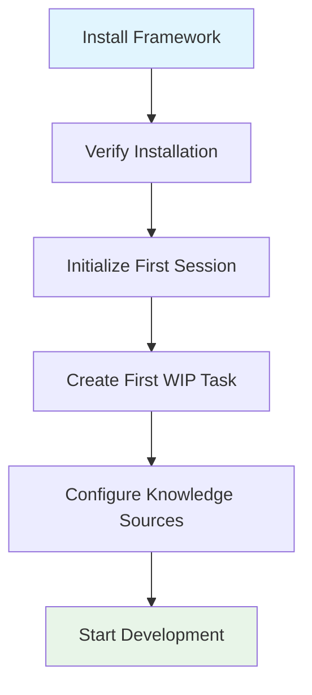
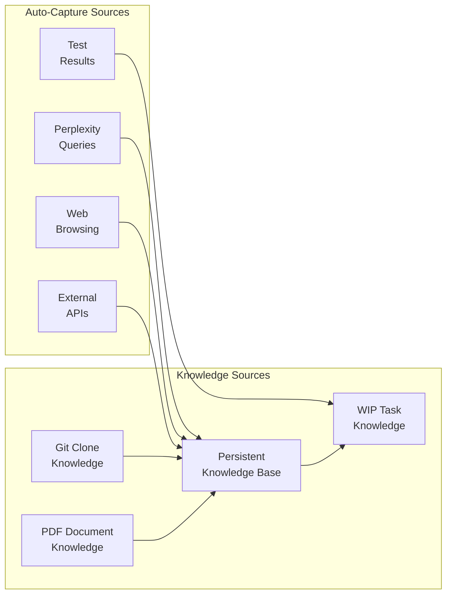
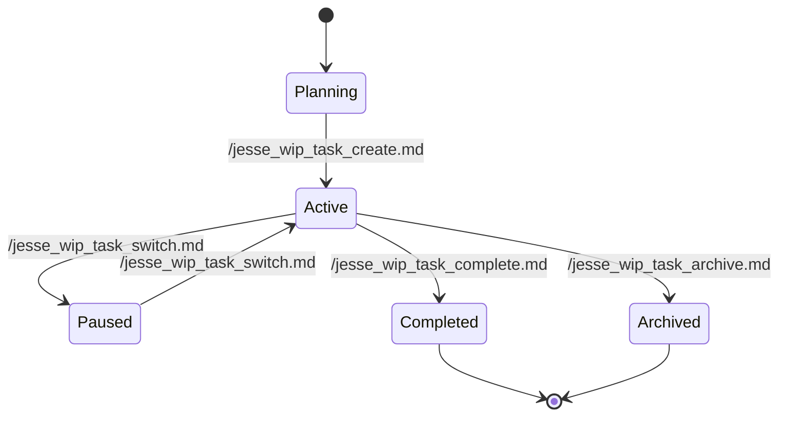
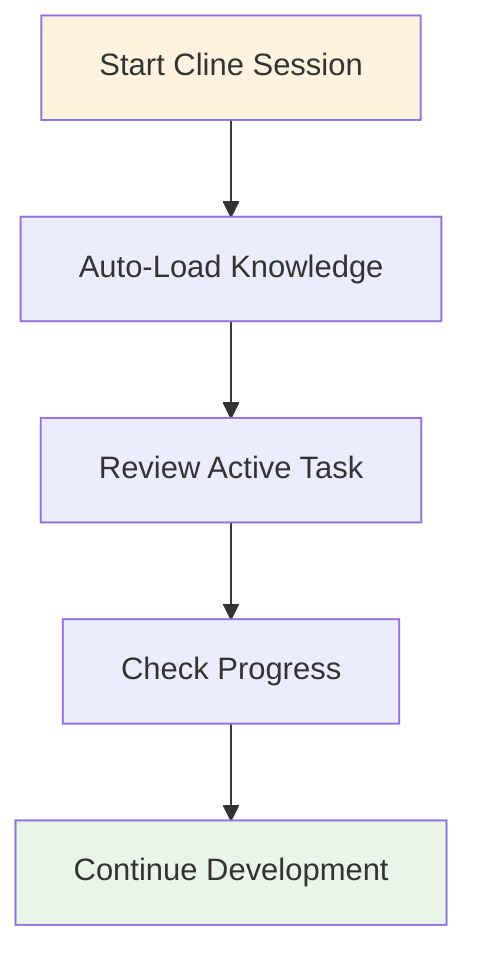
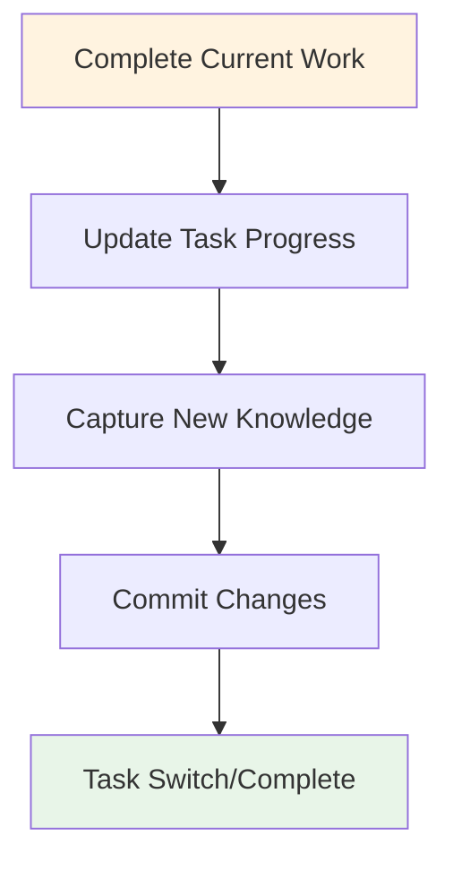
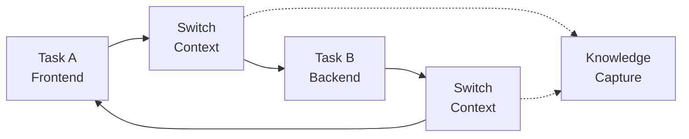

# JESSE AI Best Practices Framework - Usage Guide

Complete guide to using the JESSE AI Best Practices Framework for enhanced AI-assisted development with persistent knowledge management, automated workflows, and enforced coding standards.

## 🚀 Getting Started

### Prerequisites
- [Cline](https://github.com/cline/cline) or compatible AI coding assistant
- Git (for repository integration)
- Bash shell (for automated workflows)

### Initial Setup Workflow



#### 1. Installation Verification
After completing the AI-guided installation process from README.md, verify your setup:

```bash
# Check global installation
ls -la "${HOME}/Cline/Rules/" && ls -la "${HOME}/Cline/Workflows/"

# OR check project-level installation
ls -la ".clinerules/" && ls -la ".clinerules/workflows/"
```

#### 2. First Session Initialization
When you start a new [Cline](https://github.com/cline/cline) session, the framework automatically:
- Loads knowledge management rules
- Reads persistent knowledge base
- Loads any active WIP task context
- Displays session initialization summary

**Manual initialization (if needed)**:
```bash
# Force session reinitialization
/jesse_session_init
```

#### 3. Create Your First Task
```bash
# Create a new work-in-progress task
/jesse_wip_task_create.md
```

This will prompt you for:
- Task name and objective
- Scope and timeline
- Success criteria
- Dependencies

## 📚 Core System Components

### Knowledge Management System

The framework maintains several types of knowledge:



#### Persistent Knowledge Base Location
- **Global Install**: `${HOME}/Cline/Rules/JESSE_KNOWLEDGE_MANAGEMENT.md`
- **Project Install**: `<project>/.clinerules/JESSE_KNOWLEDGE_MANAGEMENT.md`
- **Always Available**: `<project>/.knowledge/persistent-knowledge/KNOWLEDGE_BASE.md`

#### Knowledge Capture Methods

**Automatic Capture** (No manual action required):
- Perplexity search results
- Web browsing discoveries
- Test execution results
- External API learnings

**Manual Capture**:
```bash
# Capture current knowledge
/jesse_wip_task_capture_knowledge.md

# Remember specific information
"Remember this: [your knowledge]"
```

### Work-in-Progress (WIP) Task System

#### Task Lifecycle



#### Task Management Commands

**Create New Task**:
```bash
/jesse_wip_task_create.md
```

**Switch Between Tasks**:
```bash
/jesse_wip_task_switch.md
```

**Complete Task** (with knowledge extraction):
```bash
/jesse_wip_task_complete.md
```

**Archive Task** (without processing):
```bash
/jesse_wip_task_archive.md
```

### External Resource Integration

#### Git Repository Integration

**Import External Repository**:
```bash
/jesse_wip_kb_git_clone_import.md
```

This workflow:
1. Prompts for repository URL and focus areas
2. Clones repository to `.knowledge/git-clones/[repo-name]/`
3. Creates knowledge base file `[repo-name]_kb.md`
4. Indexes important files and patterns
5. Updates main knowledge base with reference

**Usage Example**:
```bash
# Import React documentation
/jesse_wip_kb_git_clone_import.md
# Enter: https://github.com/facebook/react.git
# Focus: Hook patterns, component architecture, testing
```

#### PDF Document Integration

**Import PDF Document**:
```bash
/jesse_wip_kb_pdf_import.md
```

This workflow:
1. Processes PDF into readable chunks
2. Creates indexed knowledge base
3. Enables LLM-powered understanding
4. Links chunks for deep-dive access

**Knowledge Base Structure**:
```
.knowledge/pdf-knowledge/[doc-name]/
├── [doc-name]_kb.md          # Indexed knowledge
├── pdf_chunks/               # Processed chunks
│   ├── [doc-name]_pages_001_020.pdf
│   └── [doc-name]_pages_021_040.pdf
└── metadata.json             # Processing info
```

## 🔄 Essential Workflows

### Daily Development Workflows

#### Starting Your Day


#### Ending Your Day


### Quality Assurance Workflows

#### Code Commit Process
```bash
# Standard commit with compliance checking
/jesse_wip_task_commit.md
```

This enforces:
- Proper commit message format
- Documentation standards compliance
- Knowledge base consistency
- Task progress updates

#### Consistency Checking
```bash
# Verify knowledge base integrity
/jesse_wip_task_check_consistency.md
```

Checks for:
- Cross-reference validity
- Knowledge duplication
- File standard compliance
- Task status consistency

### Knowledge Management Workflows

#### Research and Discovery
```bash
# Process large external files
/jesse_wip_task_process_large_file.md

# Capture chat conversations
/jesse_capture_our_chat.md
```

#### Knowledge Organization
```bash
# Import external resources
/jesse_wip_kb_git_clone_import.md
/jesse_wip_kb_pdf_import.md

# Extract task learnings
/jesse_wip_task_complete.md
```

## 📖 Advanced Usage Patterns

### Multi-Task Development

#### Parallel Task Management
When working with multiple tasks, the framework provides risk assessment:

```bash
# Create additional task (triggers warning)
/jesse_wip_task_create.md
```

**Risk Mitigation Options**:
1. **File Restrictions**: Limit task to specific files/directories
2. **Sequential Processing**: Complete current task before starting new one
3. **Careful Coordination**: Manual tracking of cross-task dependencies

#### Task Switching Strategy


### Knowledge Base Optimization

#### Lazy Loading Strategy
The framework uses lazy loading to optimize context window usage:

- **Always Loaded**: Essential knowledge base, current WIP task
- **On-Demand**: Git clone knowledge bases, PDF knowledge bases
- **Conditional**: Historical tasks, archived knowledge

#### Context Window Management
```bash
# Disable WIP task auto-loading for current session
/jesse_wip_task_disable.md

# Process large files in dedicated sessions
/jesse_wip_task_process_large_file.md
```

### Custom Workflow Development

#### Creating Custom Workflows
1. Create workflow file in appropriate directory:
   - Global: `${HOME}/Cline/Workflows/`
   - Project: `<project>/.clinerules/workflows/`

2. Follow workflow template structure:
```markdown
# Workflow Purpose
[Description]

## Execution Steps
### 1. [Step Name]
[Details]

## Workflow Completion
[Verification steps]

## Error Handling
[Recovery procedures]
```

3. Use workflow with `/[workflow-name].md` command

## 🎯 Topic-Specific Guides

For detailed information on specific topics, see the `howtos/` directory:

### Knowledge Management
- **[Knowledge Management Guide](howtos/KNOWLEDGE_MANAGEMENT.md)**: Complete knowledge system usage
- **[External Resources Guide](howtos/EXTERNAL_RESOURCES.md)**: Git clones and PDF integration

### Development Standards
- **[Coding Standards Guide](howtos/CODING_STANDARDS.md)**: Understanding and applying framework rules
- **[Documentation Standards](howtos/DOCUMENTATION_STANDARDS.md)**: File headers and documentation patterns

### Task and Workflow Management
- **[Task Management Guide](howtos/TASK_MANAGEMENT.md)**: WIP task system deep dive
- **[Workflow Reference](howtos/WORKFLOW_REFERENCE.md)**: Complete workflow catalog and usage

### Advanced Integration
- **[AI Assistant Integration](howtos/AI_ASSISTANT_INTEGRATION.md)**: Framework integration patterns
- **[Team Collaboration](howtos/TEAM_COLLABORATION.md)**: Multi-developer usage patterns

## 🐛 Troubleshooting

### Common Issues

#### Session Initialization Problems
**Symptom**: Knowledge not loading automatically
**Solution**:
```bash
# Manual initialization
/jesse_session_init

# Check file permissions
ls -la "${HOME}/Cline/Rules/" || ls -la ".clinerules/"
```

#### Knowledge Base Inconsistency
**Symptom**: Conflicting information across knowledge files
**Solution**:
```bash
# Run consistency check
/jesse_wip_task_check_consistency.md

# Manual resolution if needed
```

#### Workflow Execution Failures
**Symptom**: Workflow commands not recognized
**Solution**:
1. Verify installation location
2. Check workflow file permissions
3. Ensure proper naming convention

#### Context Window Overload
**Symptom**: Session performance issues
**Solution**:
```bash
# Disable auto-loading for current session
/jesse_wip_task_disable.md

# Use lazy loading for external resources
# Process large files in dedicated sessions
```

### Getting Help

#### Within [Cline](https://github.com/cline/cline) Sessions
```bash
# Report issues
/reportbug

# Access documentation
# Check README.md and HOWTO_USE.md
```

#### Self-Diagnosis
1. **Check Installation**: Verify files exist in expected locations
2. **Review Logs**: Check [Cline](https://github.com/cline/cline) output for error messages
3. **Test Commands**: Try basic workflows like `/jesse_wip_task_create.md`
4. **Verify Dependencies**: Ensure git and bash are available

## 🔧 Configuration and Customization

### Global vs Project-Level Behavior

#### Global Installation Customization
- **System Rules**: Remain unchanged at `${HOME}/Cline/Rules/`
- **Project Knowledge**: Customized in each project's knowledge files
- **Workflow Sharing**: Available across all projects

#### Project-Level Installation Customization  
- **Complete Control**: All files within project directory
- **Version Control**: Framework rules can be version controlled
- **Project Isolation**: Independent of other projects

### Advanced Configuration

#### Custom Knowledge Sources
Add custom knowledge sources by extending the knowledge base structure:

```markdown
## Custom Knowledge Sources
### [Your Custom Source]
**Purpose**: [Description]
**Location**: [File path or URL]
**Usage**: [When and how to use]
```

#### Workflow Extensions
Create project-specific workflows by:
1. Adding workflow files to appropriate directory
2. Following framework naming conventions
3. Using established workflow patterns

### Integration with Development Tools

#### Version Control Integration
The framework automatically:
- Ignores temporary files and git clones
- Preserves knowledge base files
- Enforces commit message standards

#### IDE Integration
- Works seamlessly with VSCode + [Cline](https://github.com/cline/cline)
- Maintains file visibility and navigation
- Preserves syntax highlighting and formatting

---

## 🎉 Next Steps

Now that you understand the framework:

1. **Start Your First Task**: Use `/jesse_wip_task_create.md`
2. **Import Resources**: Add external repositories or PDFs relevant to your work
3. **Develop Iteratively**: Let the framework capture knowledge as you work
4. **Explore Advanced Features**: Dive into specific topic guides in `howtos/`
5. **Customize**: Adapt the framework to your specific development patterns

**Happy coding with enhanced AI assistance!** 🚀

The framework grows smarter with every session, capturing your discoveries and patterns to make future development more efficient and consistent.
