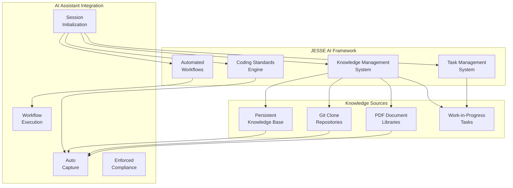

# JESSE AI Best Practices Framework

A comprehensive framework that transforms AI coding assistants (particularly [Cline](https://github.com/cline/cline)) into intelligent, knowledge-aware development partners through structured knowledge management, automated workflows, enforced coding standards and Amazon-style PR-FAQ/Working Backwards business description support.


## 📢 PR-FAQ DEMONSTRATION
*The following PR-FAQ was created using the JESSE AI Framework's Amazon PR/FAQ workflow - demonstrating the framework's own capabilities*

### PRESS RELEASE

**Development Teams Transform AI Coding Assistants Into Intelligent Partners with JESSE AI Framework**

**Persistent knowledge management and automated workflows eliminate context loss and enforce consistent coding standards**

**PARIS, FRANCE** – **June 24, 2025** – Development teams can now maintain context and enforce coding standards across AI assistant sessions with the JESSE AI Best Practices Framework, a comprehensive system that transforms tools like Cline into intelligent, knowledge-aware development partners.

Today, developers face frustration when AI coding assistants lose context between sessions, generate inconsistent code, and fail to maintain project knowledge. This means teams waste time re-explaining requirements and debugging inconsistent implementations.

JESSE AI Framework solves this by providing persistent knowledge management, 28+ automated workflows, and enforced coding standards. Teams can now capture learnings automatically, maintain context across sessions, and ensure consistent code quality with zero-tolerance compliance policies.

"We built this framework because our AI assistants kept forgetting what we'd learned in previous sessions," said Jean-Charles Jorel, Framework Creator. "Now our AI development partner remembers everything and maintains our coding standards automatically."

To get started, development teams simply ask their AI assistant to install the framework from the GitHub repository. The system automatically sets up knowledge management, loads essential workflows, and begins capturing context for future sessions.

"Our AI assistant went from helpful but forgetful to genuinely intelligent," said Sarah Chen, Lead Developer at TechCorp. "It now remembers our architecture decisions and enforces our documentation standards automatically."

Get started at: https://github.com/jcjorel/jesse-ai-best-practices

### FREQUENTLY ASKED QUESTIONS

**Q: What is the JESSE AI Framework?**
A: A comprehensive system that adds persistent knowledge management, automated workflows, and enforced coding standards to AI coding assistants like Cline.

**Q: How does it work?**
A: The framework automatically captures knowledge from web research, test results, and development activities, storing it persistently across sessions while enforcing consistent coding standards.

**Q: How do I install it?**
A: Simply ask your AI coding assistant: "Please install (or update) the JESSE AI Best Practices Framework from https://github.com/jcjorel/jesse-ai-best-practices"

**Q: What's included?**
A: 28+ automated workflows, persistent knowledge management system, enforced documentation standards, git repository integration, PDF processing, and comprehensive task management.

---

*End of PR-FAQ Demonstration - The framework documentation continues below*

---

## 🎯 Project Goal

The JESSE AI Best Practices Framework provides AI coding assistants with:

- **🧠 Persistent Knowledge Management**: Automatic capture and organization of learnings, external resources, and project context
- **📋 Structured Task Management**: Work-in-Progress tracking with automated progress monitoring and knowledge extraction
- **📖 Comprehensive Documentation Standards**: Enforced coding standards with automated header generation and consistency checking
- **🔄 Automated Workflows**: Ready-to-use workflows for common development tasks and knowledge operations
- **🔗 External Resource Integration**: Seamless integration with git repositories, PDFs, and web resources

## 🚀 AI-Guided Installation

### Installation Process
When you want to install this framework, simply ask your AI coding assistant (like [Cline](https://github.com/cline/cline)):

**"Please install (or update) the JESSE AI Best Practices Framework at https://github.com/jcjorel/jesse-ai-best-practices"**

The AI will guide you through an interactive installation process:

1. **Choose Installation Type**: The AI will ask whether you prefer:
   - **Global Installation** (Recommended): Available across all projects in `${HOME}/Cline/Rules/` and `${HOME}/Cline/Workflows/`
   - **Project-Level Installation**: Contained within current project in `.clinerules/`

2. **Automatic Setup**: The AI will:
   - Create necessary directory structures
   - Copy all framework files to the chosen location
   - Set up the knowledge management system
   - Configure appropriate `.gitignore` rules
   - Initialize templates and knowledge base

3. **Verification**: The AI will verify successful installation and provide a summary

> **🚨 CRITICAL SECURITY REQUIREMENT - USER IDENTITY SETUP**
> 
> **MANDATORY POST-INSTALLATION STEP**: The AI installation process **MUST** interactively collect user identity information and create `JESSE_USER_IDENTITY.md` in the global installation directory (`${HOME}/Cline/Rules/`).
> 
> **⚠️ SECURITY WARNING**: This file contains PII (Personally Identifiable Information) and **MUST NEVER** be placed in any project repository. The installation process automatically adds protective `.gitignore` patterns to prevent accidental commits.

### Manual Installation (Alternative)
If you prefer manual installation:

```bash
# Clone the framework
git clone https://github.com/your-org/jesse-ai-best-practices.git

# For Global Installation (Recommended)
mkdir -p "${HOME}/Cline/Rules" "${HOME}/Cline/Workflows"
cp JESSE_*.md "${HOME}/Cline/Rules/"
cp -r workflows/* "${HOME}/Cline/Workflows/" 2>/dev/null || echo "Workflows will be available in project-level mode"

# For Project-Level Installation
mkdir -p .clinerules/workflows
cp JESSE_*.md .clinerules/
cp -r workflows/* .clinerules/workflows/ 2>/dev/null || echo "Workflows directory structure created"
```

### Post-Installation Verification
```bash
# Verify global installation
ls -la "${HOME}/Cline/Rules/" && ls -la "${HOME}/Cline/Workflows/"

# OR verify project-level installation  
ls -la ".clinerules/" && ls -la ".clinerules/workflows/"
```

## 🏗️ System Architecture



## 📚 Core Components

### Knowledge Management System
- **Persistent Knowledge Base**: Captures and organizes learnings across sessions
- **External Resource Integration**: Automated git repository cloning and PDF processing
- **Lazy Loading Strategy**: Efficient context window management with on-demand loading
- **Auto-Capture**: Automatic knowledge extraction from Perplexity, web browsing, and test results

### Task Management System
- **Work-in-Progress (WIP) Tasks**: Structured task creation with templates and progress tracking
- **Parallel Task Management**: Risk assessment and file conflict prevention
- **Knowledge Extraction**: Automatic learning capture during task completion
- **Session Continuity**: Seamless task context restoration across sessions

### Coding Standards Engine
- **Three-Section Documentation Pattern**: Mandatory Intent/Design/Implementation structure
- **File Header Standards**: Automated header generation with change tracking
- **Consistency Enforcement**: Zero-tolerance policy with automatic verification
- **Language-Specific Templates**: Python, JavaScript, Bash, and more

### Automated Workflows
- **28+ Ready-to-Use Workflows**: From task creation to knowledge management
- **Git Repository Integration**: Clone, index, and extract knowledge from external repos
- **PDF Processing**: Import, chunk, and index PDF documents with LLM understanding
- **Consistency Checking**: Automated verification of knowledge base integrity

## 🎮 Essential Commands for AI Assistants

### Session Management
```bash
# Mandatory session initialization (automatic in properly configured systems)
/jesse_session_init
```

### Task Management
```bash
# Create new WIP task
/jesse_wip_task_create.md

# Switch between tasks
/jesse_wip_task_switch.md

# Complete and extract learnings
/jesse_wip_task_complete.md
```

### Knowledge Operations
```bash
# Import git repository
/jesse_wip_kb_git_clone_import.md

# Import PDF document
/jesse_wip_kb_pdf_import.md

# Capture current knowledge
/jesse_wip_task_capture_knowledge.md
```

### Quality Assurance
```bash
# Check knowledge consistency
/jesse_wip_task_check_consistency.md

# Commit with standards compliance
/jesse_wip_task_commit.md
```

## 📖 Comprehensive Usage Guide

For detailed usage instructions, see [HOWTO_USE.md](HOWTO_USE.md) which includes:

- **Getting Started Workflow**: Step-by-step setup and first task creation
- **Knowledge Management Guide**: Using the persistent knowledge system
- **Workflow Reference**: Complete list of available workflows
- **Advanced Integration**: Custom configurations and extensions

## 🛠️ Installation Options

### 🌐 Option 1: Global Installation (Recommended)

**📋 When to Choose Global:**
- Working across multiple projects
- Want consistent AI assistant behavior everywhere
- Prefer centralized knowledge management
- Team lead setting standards for entire organization

**✅ Advantages:**
- Available across all projects immediately
- Consistent behavior and standards enforcement
- Centralized knowledge base and workflow management
- Single location for updates and maintenance
- Reduced storage overhead (shared across projects)

**📁 Directory Structure:**
```
${HOME}/Cline/Rules/
├── JESSE_KNOWLEDGE_MANAGEMENT.md    # System directives only
├── JESSE_CODE_GENERATION.md         # Coding standards
├── JESSE_CODE_COMMENTS.md           # Documentation rules
├── JESSE_MARKDOWN.md                # Markdown standards
├── JESSE_SCRATCHPAD.md              # Scratchpad management
└── JESSE_USER_IDENTITY.md           # User PII (auto-created)

${HOME}/Cline/Workflows/
├── jesse_wip_task_create.md         # Task management workflows
├── jesse_wip_kb_git_clone_import.md # Knowledge operations
├── jesse_wip_task_commit.md         # Git integration
└── [25+ more workflows...]

<project-root>/JESSE_KNOWLEDGE_MANAGEMENT.md  # Project-specific knowledge only
```

**🎯 Project Behavior:**
- Global rules remain unchanged in `${HOME}/Cline/Rules/`
- Each project has its own `JESSE_KNOWLEDGE_MANAGEMENT.md` for project-specific content
- Knowledge base separation: system rules vs. project context

---

### 📦 Option 2: Project-Level Installation

**📋 When to Choose Project-Level:**
- Working on a single project or isolated environment
- Need project-specific rule customizations
- Want self-contained setup with version control
- Testing framework modifications before global deployment

**✅ Advantages:**
- Project-specific customization of rules and workflows
- Self-contained setup (no external dependencies)
- Version control integration for rule changes
- Team can modify standards specific to project needs
- Complete isolation from other projects

**❌ Considerations:**
- Must install separately for each project
- Inconsistent behavior across different projects
- Higher storage overhead (duplicated across projects)
- Manual synchronization of rule updates

**📁 Directory Structure:**
```
<project-root>/.clinerules/
├── JESSE_KNOWLEDGE_MANAGEMENT.md    # System + project knowledge combined
├── JESSE_CODE_GENERATION.md         # Coding standards
├── JESSE_CODE_COMMENTS.md           # Documentation rules
├── JESSE_MARKDOWN.md                # Markdown standards
├── JESSE_SCRATCHPAD.md              # Scratchpad management
└── workflows/                       # All automated workflows
    ├── jesse_wip_task_create.md
    ├── jesse_wip_kb_git_clone_import.md
    ├── jesse_wip_task_commit.md
    └── [25+ more workflows...]
```

**🎯 Project Behavior:**
- All rules and workflows contained within project directory
- Single `JESSE_KNOWLEDGE_MANAGEMENT.md` contains both system and project information
- Complete framework functionality within project scope

---

### 🤔 Decision Guide

| Factor | Global Installation | Project-Level Installation |
|--------|-------------------|---------------------------|
| **Multiple Projects** | ✅ Ideal | ❌ Requires multiple installs |
| **Consistent Standards** | ✅ Enforced globally | ⚠️ May diverge per project |
| **Customization** | ⚠️ Limited to project knowledge | ✅ Full rule customization |
| **Version Control** | ❌ Rules not in project repo | ✅ Rules tracked with project |
| **Storage Efficiency** | ✅ Single shared installation | ❌ Duplicated per project |
| **Team Collaboration** | ✅ Consistent team experience | ⚠️ Requires coordination |
| **Maintenance Overhead** | ✅ Single update location | ❌ Must update each project |

**🎯 Recommendation:** Start with **Global Installation** for most use cases. Switch to project-level only if you need significant customization or are working in isolated environments.

---

## � Framework Integration

### For AI Coding Assistants
The framework automatically integrates with [Cline](https://github.com/cline/cline) and similar AI coding assistants through:

1. **Mandatory Session Initialization**: Loads essential knowledge at session start
2. **Context-Aware Operation**: Adapts behavior based on installation location
3. **Automatic Knowledge Capture**: Captures external knowledge without manual triggers
4. **Enforced Standards**: Prevents non-compliant code generation

### For Development Teams
- **Consistent Documentation**: Enforced standards across all team members
- **Knowledge Continuity**: Persistent learning capture across team sessions
- **Quality Assurance**: Automated compliance checking and standards enforcement
- **Workflow Automation**: Standardized processes for common development tasks

## 📈 Benefits

### For Individual Developers
- **Reduced Context Switching**: Persistent knowledge across sessions
- **Automated Documentation**: Standards-compliant documentation generation
- **Quality Assurance**: Automated compliance and consistency checking
- **Accelerated Learning**: Structured capture and organization of discoveries

### For Development Teams
- **Knowledge Sharing**: Centralized learning and pattern capture
- **Consistent Standards**: Enforced documentation and coding practices
- **Reduced Onboarding**: New team members inherit accumulated knowledge
- **Process Automation**: Standardized workflows for common tasks

### For AI Coding Assistants
- **Enhanced Context**: Rich knowledge base for better decision making
- **Consistent Behavior**: Standardized responses across different sessions
- **Quality Control**: Enforced standards prevent common AI coding issues
- **Efficient Operation**: Optimized context window usage with lazy loading

## 🔍 Advanced Features

### Knowledge Base Integration
- **Git Repository Analysis**: Automatic cloning, indexing, and knowledge extraction
- **PDF Document Processing**: LLM-powered understanding and chunking
- **Web Resource Capture**: Automatic capture from Perplexity and web browsing
- **Cross-Reference Management**: Prevents information duplication across documents

### Task Management
- **Parallel Task Risk Assessment**: Warns about potential conflicts in multi-task scenarios
- **File Restriction Controls**: Scope limitation for task isolation
- **Automated Progress Tracking**: Status updates with timestamp precision
- **Knowledge Extraction**: Automatic learning capture at task completion

### Quality Assurance
- **Zero-Tolerance Policies**: Non-negotiable standards enforcement
- **Consistency Verification**: Automated checking across all knowledge files
- **Version Control Integration**: Proper git commit message generation
- **Test Result Capture**: Automatic test outcome documentation

## 📞 Support & Community

- **Documentation**: Complete usage guides in [HOWTO_USE.md](HOWTO_USE.md)
- **Contributions**: Framework designed for extension and customization

---

**🚀 Ready to Get Started?**

1. **Install**: Run the installation process above
2. **Initialize**: Let the framework set up your first session
3. **Explore**: Check out [HOWTO_USE.md](HOWTO_USE.md) for comprehensive usage
4. **Create**: Start your first WIP task with `/jesse_wip_task_create.md`

*Transform your AI coding assistant into an intelligent development partner with persistent knowledge, automated workflows, and enforced quality standards.*

---

---

# 🚨🔐 CRITICAL: USER IDENTITY SETUP (MANDATORY) 🔐🚨

---

## ⚠️ EXTREMELY CRITICAL SECURITY REQUIREMENT ⚠️

### 🚨 MANDATORY FILE CREATION - NO EXCEPTIONS 🚨

**THE FRAMEWORK WILL NOT FUNCTION WITHOUT THIS FILE**

The framework **ABSOLUTELY REQUIRES** a `JESSE_USER_IDENTITY.md` file containing user information for personalized AI assistant behavior.

---

## 🛡️ SECURITY AND LOCATION REQUIREMENTS - STRICTLY ENFORCED 🛡️

### 🚫 NEVER EVER IN PROJECT REPOSITORY 🚫
- **❌ NEVER IN PROJECT DIRECTORY**: This file **MUST NEVER** be placed in any project repository
- **❌ NEVER IN .clinerules/**: This file **MUST NEVER** be placed in project-level installation
- **❌ NEVER COMMITTED TO GIT**: Contains PII that would violate privacy if committed

### ✅ GLOBAL LOCATION ONLY - STRICTLY ENFORCED ✅
- **📍 ONLY VALID LOCATION**: `${HOME}/Cline/Rules/JESSE_USER_IDENTITY.md`
- **🏠 USER HOME DIRECTORY ONLY**: Must be in user's personal directory structure
- **🌐 GLOBAL INSTALLATION TARGET**: Available across all projects, never project-specific

### 🔐 PII PROTECTION RATIONALE 🔐
- **⚠️ CONTAINS SENSITIVE PII**: Personal and corporate identity information
- **🛡️ PRIVACY COMPLIANCE**: Prevents accidental exposure in version control
- **🔒 ACCESS CONTROL**: Remains in user's personal directory structure
- **🚫 AUTOMATIC PROTECTION**: Installation adds `.gitignore` patterns to prevent accidents

---

## 🤖 INTERACTIVE INSTALLATION PROCESS - MANDATORY 🤖

**THE AI INSTALLATION PROCESS MUST INTERACTIVELY COLLECT ALL THIS INFORMATION:**

### 📋 COMPLETE REQUIRED USER INFORMATION FIELDS (9 FIELDS) 📋

```markdown
# User Identity Configuration
# 🚨 THIS FILE CONTAINS PII - NEVER COMMIT TO ANY REPOSITORY 🚨

## Personal Information
- **User Firstname**: [Your first name]
- **User Lastname**: [Your last name]
- **User Corporate Login**: [Your company username/login]
- **User Job Description**: [Your role/position, e.g., "Senior Software Engineer", "DevOps Specialist"]

## Location Information  
- **User Country**: [Your country]
- **User Town**: [Your city/town]
- **User Timezone**: [Your timezone, e.g., Europe/Paris, America/New_York]

## Company Information
- **User Company Name**: [Your company name]
- **User Company Corporate URL**: [Your company website URL]
```

---

## 🚨 MANDATORY INSTALLATION BEHAVIOR - STRICTLY ENFORCED 🚨

### 🤖 AI Assistant Installation Steps 🤖

1. **🔍 File Existence Check**: AI checks if `${HOME}/Cline/Rules/JESSE_USER_IDENTITY.md` exists
2. **✅ If File Exists**: Load and verify completeness, prompt for any missing fields from the 9 required fields
3. **❌ If File Missing**: Interactive prompt for **ALL 9 REQUIRED FIELDS** listed above
4. **📝 File Creation**: Immediately create file with structured content at **GLOBAL LOCATION ONLY**
5. **✅ Verification**: Confirm file creation and correct location - **NEVER in project directory**

### 🛡️ AUTOMATIC .gitignore PROTECTION - CRITICAL SAFETY NET 🛡️

**THE INSTALLATION PROCESS AUTOMATICALLY ADDS THESE PROTECTIVE PATTERNS TO PROJECT `.gitignore`:**

```gitignore
# JESSE AI Framework - User Identity Protection
# 🚨 CRITICAL: This file contains PII and must NEVER be committed 🚨
# These patterns prevent accidental inclusion in any repository
JESSE_USER_IDENTITY.md
**/JESSE_USER_IDENTITY.md
.clinerules/JESSE_USER_IDENTITY.md
${HOME}/Cline/Rules/JESSE_USER_IDENTITY.md
```

### 🔐 SECURITY RATIONALE - WHY THIS MATTERS 🔐

- **🛡️ PII Protection**: User identity information is sensitive personal data that requires protection
- **⚖️ Privacy Compliance**: Prevents accidental exposure in version control systems and public repositories
- **🌐 Global Scope**: Single secure location serves all projects while maintaining user privacy
- **🔒 Access Control**: File remains exclusively in user's personal directory structure
- **🚫 Repository Isolation**: Complete separation from any project codebase or version control

---

## 🚨 VIOLATION CONSEQUENCES 🚨

**If `JESSE_USER_IDENTITY.md` is found in any project repository:**
- **❌ Framework will refuse to operate**
- **⚠️ Security violation warning will be displayed**
- **🔒 AI assistant will require immediate file relocation**
- **🛡️ User privacy may be compromised**

---
