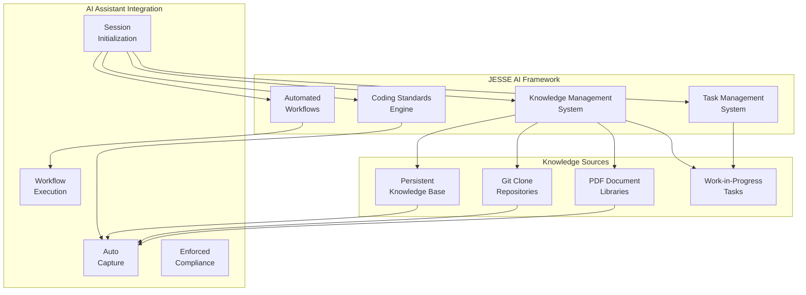

# JESSE AI Best Practices Framework

A comprehensive framework that transforms AI coding assistants (particularly Cline) into intelligent, knowledge-aware development partners through structured knowledge management, automated workflows, and enforced coding standards.

## 🎯 Project Goal

The JESSE AI Best Practices Framework provides AI coding assistants with:

- **🧠 Persistent Knowledge Management**: Automatic capture and organization of learnings, external resources, and project context
- **📋 Structured Task Management**: Work-in-Progress tracking with automated progress monitoring and knowledge extraction
- **📖 Comprehensive Documentation Standards**: Enforced coding standards with automated header generation and consistency checking
- **🔄 Automated Workflows**: Ready-to-use workflows for common development tasks and knowledge operations
- **🔗 External Resource Integration**: Seamless integration with git repositories, PDFs, and web resources

## 🚀 AI-Guided Installation

### Installation Process
When you want to install this framework, simply ask your AI coding assistant (like Cline):

**"Please install the JESSE AI Best Practices Framework"**

The AI will guide you through an interactive installation process:

1. **Choose Installation Type**: The AI will ask whether you prefer:
   - **Global Installation** (Recommended): Available across all projects in `${HOME}/Cline/Rules/`
   - **Project-Level Installation**: Contained within current project in `.clinerules/`

2. **Automatic Setup**: The AI will:
   - Create necessary directory structures
   - Copy all framework files to the chosen location
   - Set up the knowledge management system
   - Configure appropriate `.gitignore` rules
   - Initialize templates and knowledge base

3. **Verification**: The AI will verify successful installation and provide a summary

### Manual Installation (Alternative)
If you prefer manual installation:

```bash
# Clone the framework
git clone https://github.com/your-org/jesse-ai-best-practices.git

# For Global Installation (Recommended)
mkdir -p "${HOME}/Cline/Rules" "${HOME}/Cline/Workflows"
cp JESSE_*.md "${HOME}/Cline/Rules/"
cp -r workflows/* "${HOME}/Cline/Workflows/" 2>/dev/null || echo "Workflows will be available in project-level mode"

# For Project-Level Installation
mkdir -p .clinerules/workflows
cp JESSE_*.md .clinerules/
cp -r workflows/* .clinerules/workflows/ 2>/dev/null || echo "Workflows directory structure created"
```

### Post-Installation Verification
```bash
# Verify global installation
ls -la "${HOME}/Cline/Rules/" && ls -la "${HOME}/Cline/Workflows/"

# OR verify project-level installation  
ls -la ".clinerules/" && ls -la ".clinerules/workflows/"
```

## 🏗️ System Architecture



## 📚 Core Components

### Knowledge Management System
- **Persistent Knowledge Base**: Captures and organizes learnings across sessions
- **External Resource Integration**: Automated git repository cloning and PDF processing
- **Lazy Loading Strategy**: Efficient context window management with on-demand loading
- **Auto-Capture**: Automatic knowledge extraction from Perplexity, web browsing, and test results

### Task Management System
- **Work-in-Progress (WIP) Tasks**: Structured task creation with templates and progress tracking
- **Parallel Task Management**: Risk assessment and file conflict prevention
- **Knowledge Extraction**: Automatic learning capture during task completion
- **Session Continuity**: Seamless task context restoration across sessions

### Coding Standards Engine
- **Three-Section Documentation Pattern**: Mandatory Intent/Design/Implementation structure
- **File Header Standards**: Automated header generation with change tracking
- **Consistency Enforcement**: Zero-tolerance policy with automatic verification
- **Language-Specific Templates**: Python, JavaScript, Bash, and more

### Automated Workflows
- **28+ Ready-to-Use Workflows**: From task creation to knowledge management
- **Git Repository Integration**: Clone, index, and extract knowledge from external repos
- **PDF Processing**: Import, chunk, and index PDF documents with LLM understanding
- **Consistency Checking**: Automated verification of knowledge base integrity

## 🎮 Essential Commands for AI Assistants

### Session Management
```bash
# Mandatory session initialization (automatic in properly configured systems)
/jesse_session_init
```

### Task Management
```bash
# Create new WIP task
/jesse_wip_task_create.md

# Switch between tasks
/jesse_wip_task_switch.md

# Complete and extract learnings
/jesse_wip_task_complete.md
```

### Knowledge Operations
```bash
# Import git repository
/jesse_wip_kb_git_clone_import.md

# Import PDF document
/jesse_wip_kb_pdf_import.md

# Capture current knowledge
/jesse_wip_task_capture_knowledge.md
```

### Quality Assurance
```bash
# Check knowledge consistency
/jesse_wip_task_check_consistency.md

# Commit with standards compliance
/jesse_wip_task_commit.md
```

## 📖 Comprehensive Usage Guide

For detailed usage instructions, see [HOWTO_USE.md](HOWTO_USE.md) which includes:

- **Getting Started Workflow**: Step-by-step setup and first task creation
- **Knowledge Management Guide**: Using the persistent knowledge system
- **Workflow Reference**: Complete list of available workflows
- **Advanced Integration**: Custom configurations and extensions

## 🛠️ Installation Options

### Global Installation (Recommended)
**Benefits**: Available across all projects, consistent behavior, centralized management

**Structure**:
```
${HOME}/Cline/Rules/
├── JESSE_KNOWLEDGE_MANAGEMENT.md
├── JESSE_CODE_GENERATION.md
├── JESSE_CODE_COMMENTS.md
├── JESSE_MARKDOWN.md
└── JESSE_SCRATCHPAD.md

${HOME}/Cline/Workflows/
├── jesse_wip_task_create.md
├── jesse_wip_kb_git_clone_import.md
└── [26 more workflows...]
```

### Project-Level Installation
**Benefits**: Project-specific customization, self-contained setup, version control integration

**Structure**:
```
<project-root>/.clinerules/
├── JESSE_*.md                    # All framework rules
├── workflows/                    # All automated workflows
└── JESSE_KNOWLEDGE_MANAGEMENT.md # Combined system + project knowledge
```

## 🔧 Framework Integration

### For AI Coding Assistants
The framework automatically integrates with Cline and similar AI coding assistants through:

1. **Mandatory Session Initialization**: Loads essential knowledge at session start
2. **Context-Aware Operation**: Adapts behavior based on installation location
3. **Automatic Knowledge Capture**: Captures external knowledge without manual triggers
4. **Enforced Standards**: Prevents non-compliant code generation

### For Development Teams
- **Consistent Documentation**: Enforced standards across all team members
- **Knowledge Continuity**: Persistent learning capture across team sessions
- **Quality Assurance**: Automated compliance checking and standards enforcement
- **Workflow Automation**: Standardized processes for common development tasks

## 📈 Benefits

### For Individual Developers
- **Reduced Context Switching**: Persistent knowledge across sessions
- **Automated Documentation**: Standards-compliant documentation generation
- **Quality Assurance**: Automated compliance and consistency checking
- **Accelerated Learning**: Structured capture and organization of discoveries

### For Development Teams
- **Knowledge Sharing**: Centralized learning and pattern capture
- **Consistent Standards**: Enforced documentation and coding practices
- **Reduced Onboarding**: New team members inherit accumulated knowledge
- **Process Automation**: Standardized workflows for common tasks

### For AI Coding Assistants
- **Enhanced Context**: Rich knowledge base for better decision making
- **Consistent Behavior**: Standardized responses across different sessions
- **Quality Control**: Enforced standards prevent common AI coding issues
- **Efficient Operation**: Optimized context window usage with lazy loading

## 🔍 Advanced Features

### Knowledge Base Integration
- **Git Repository Analysis**: Automatic cloning, indexing, and knowledge extraction
- **PDF Document Processing**: LLM-powered understanding and chunking
- **Web Resource Capture**: Automatic capture from Perplexity and web browsing
- **Cross-Reference Management**: Prevents information duplication across documents

### Task Management
- **Parallel Task Risk Assessment**: Warns about potential conflicts in multi-task scenarios
- **File Restriction Controls**: Scope limitation for task isolation
- **Automated Progress Tracking**: Status updates with timestamp precision
- **Knowledge Extraction**: Automatic learning capture at task completion

### Quality Assurance
- **Zero-Tolerance Policies**: Non-negotiable standards enforcement
- **Consistency Verification**: Automated checking across all knowledge files
- **Version Control Integration**: Proper git commit message generation
- **Test Result Capture**: Automatic test outcome documentation

## 📞 Support & Community

- **Documentation**: Complete usage guides in [HOWTO_USE.md](HOWTO_USE.md)
- **Issue Reporting**: Use `/reportbug` command within Cline sessions
- **Contributions**: Framework designed for extension and customization
- **Feedback**: Knowledge management system captures usage patterns for improvement

## 📄 License

[Your chosen license - MIT, Apache 2.0, etc.]

---

**🚀 Ready to Get Started?**

1. **Install**: Run the one-command installation above
2. **Initialize**: Let the framework set up your first session
3. **Explore**: Check out [HOWTO_USE.md](HOWTO_USE.md) for comprehensive usage
4. **Create**: Start your first WIP task with `/jesse_wip_task_create.md`

*Transform your AI coding assistant into an intelligent development partner with persistent knowledge, automated workflows, and enforced quality standards.*
