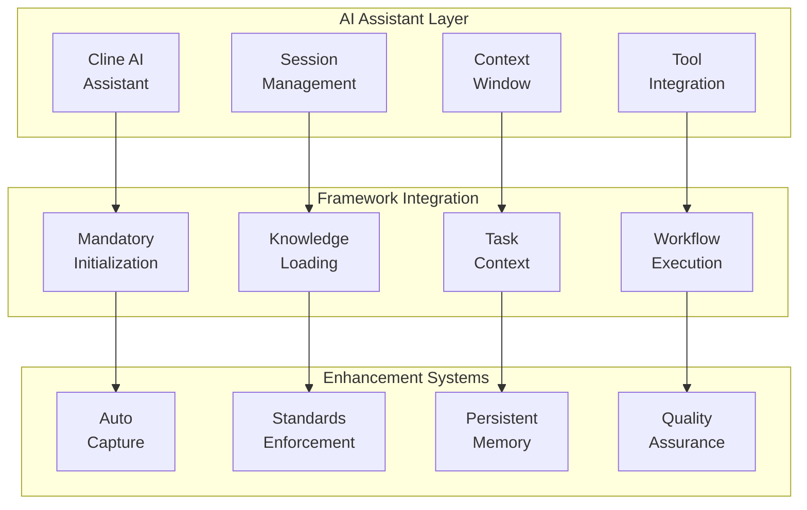
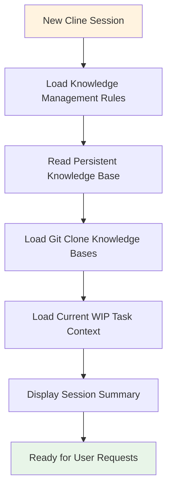
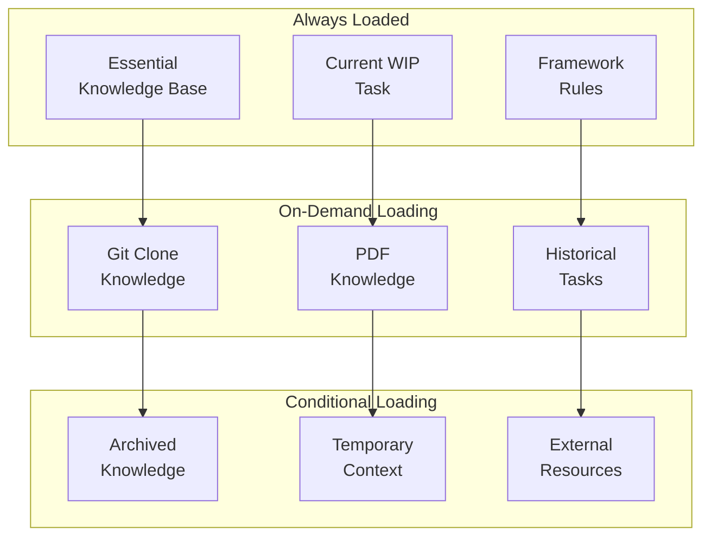
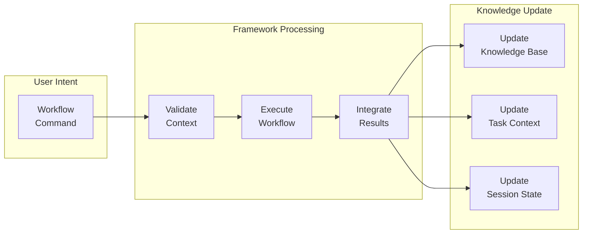
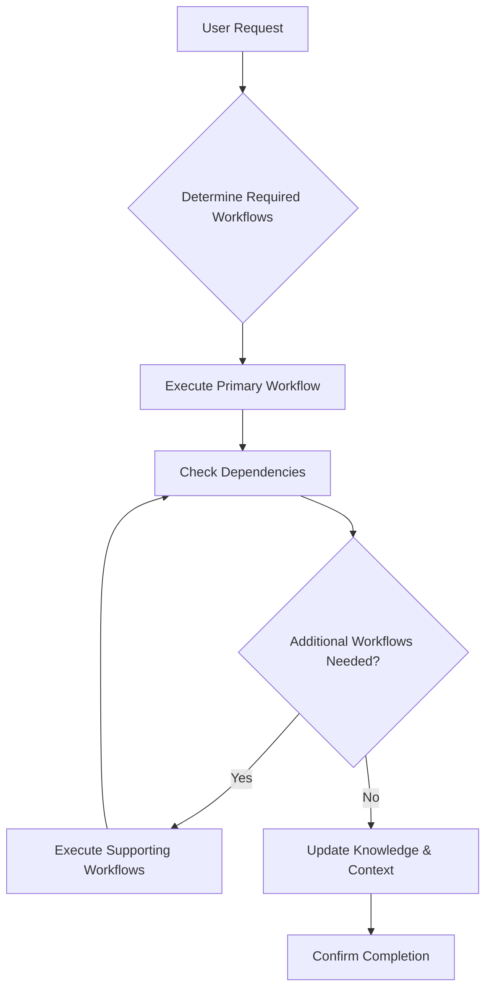

# AI Assistant Integration Guide

Complete guide to the JESSE AI Best Practices Framework's integration with AI coding assistants, focusing on [Cline](https://github.com/cline/cline) integration patterns, session management, and AI-enhanced development workflows.

## 🤖 AI Assistant Integration Overview

The framework transforms AI coding assistants from session-based tools into persistent, knowledge-aware development partners through deep integration patterns and automated workflows.



## 🔄 Session Integration Patterns

### Mandatory Session Initialization

The framework enforces mandatory session initialization to ensure consistent AI assistant behavior across all development sessions.

#### Initialization Sequence


#### Critical System Requirements
**🚨 MANDATORY**: These steps MUST execute before processing ANY user request:

1. **MANDATORY STEP 1**: Load knowledge management rules
   - **Verification**: Confirm rules are loaded
   - **Failure Action**: Stop and report initialization error

2. **MANDATORY STEP 2**: Read persistent knowledge base
   - **Verification**: Confirm knowledge content loaded
   - **Failure Action**: Create basic structure if missing

3. **MANDATORY STEP 3**: Load referenced external knowledge bases
   - **Verification**: All git clone and PDF knowledge bases loaded
   - **Failure Action**: Report missing knowledge files

4. **MANDATORY STEP 4**: Load current WIP task context (if active)
   - **Verification**: Task context properly loaded
   - **Failure Action**: Report WIP task loading issues

5. **MANDATORY STEP 5**: Display session summary
   - Current task status and resources
   - Loaded knowledge bases count
   - Active task information

### Session Boundary Detection

The framework automatically detects new sessions through multiple indicators:

#### Detection Mechanisms
```python
# Session boundary indicators:
# - No previous knowledge of Essential Knowledge Base content
# - No awareness of current WIP task status
# - First interaction in new Cline conversation thread
# - Context reset or cleared state
```

#### Self-Enforcement Protocol
```bash
# If session initialization wasn't completed:
# 1. STOP current processing immediately
# 2. EXECUTE complete initialization sequence
# 3. REPORT to user: "Session initialization incomplete. Executing mandatory sequence..."
# 4. COMPLETE all steps before resuming
# 5. CONFIRM successful initialization
```

## 🧠 Knowledge Integration Patterns

### Lazy Loading Strategy

The framework optimizes context window usage through intelligent knowledge loading:

#### Loading Tiers


#### Context Window Optimization
```python
# Loading priorities:
# 1. Session-critical knowledge (always loaded)
# 2. Task-relevant knowledge (loaded when needed)
# 3. Reference knowledge (loaded on demand)
# 4. Historical knowledge (loaded for specific queries)
```

### Automatic Knowledge Capture

The framework captures knowledge automatically without manual intervention:

#### Auto-Capture Sources
```bash
# Automatic capture triggers:
# 1. Perplexity MCP server queries -> Current WIP task or Persistent KB
# 2. Web browsing activities -> Persistent Knowledge Base
# 3. Test execution results -> Current WIP task PROGRESS.md
# 4. External API interactions -> Relevant knowledge location
```

#### Capture Integration Pattern
```python
def auto_capture_knowledge(source, content, context):
    """
    [Function intent]
    Automatically capture external knowledge without manual intervention based on current session context.
    
    [Design principles]
    Context-aware routing ensures knowledge goes to most relevant location.
    Zero-manual-intervention approach maintains development flow.
    
    [Implementation details]
    Routes to current WIP task if active, otherwise to persistent knowledge base.
    Maintains trust sources and cross-references automatically.
    """
    if current_wip_task_active():
        append_to_wip_task(content, source)
    else:
        append_to_persistent_kb(content, source)
    
    update_cross_references(source, content)
    log_capture_event(source, timestamp)
```

## 🛠️ Tool Integration Patterns

### MCP Server Integration

The framework leverages Model Context Protocol (MCP) servers for enhanced capabilities:

#### Available MCP Integrations
```bash
# Cost Analysis MCP Server
# - AWS service cost analysis
# - Pricing information retrieval
# - Architecture pattern cost estimation

# AWS Documentation MCP Server  
# - Official AWS documentation access
# - Real-time documentation search
# - Comprehensive reference integration

# Perplexity MCP Server
# - Web search and research
# - Automatic knowledge capture
# - Context-aware information retrieval

# Git MCP Server
# - Version control operations
# - Repository management
# - Commit workflow integration

# Nova Canvas MCP Server
# - Image generation capabilities
# - Visual content creation
# - Diagram and illustration support
```

#### MCP Integration Pattern
```python
# Framework automatically uses MCP servers when available:
# 1. Detects available MCP servers at session start
# 2. Integrates server capabilities into workflows
# 3. Routes appropriate requests to specialized servers
# 4. Captures results in knowledge management system
```

### Workflow Tool Integration

The framework provides 29+ automated workflows accessible through simple commands:

#### Workflow Execution Pattern
```bash
# User command: /jesse_wip_task_create.md
# Framework response:
# 1. Validates current session state
# 2. Executes workflow steps sequentially
# 3. Provides status updates and confirmations
# 4. Integrates results into knowledge system
# 5. Updates session context appropriately
```

#### Tool Chain Integration


## 📋 Standards Enforcement Integration

### Zero-Tolerance Policy Implementation

The framework enforces coding standards through AI assistant integration:

#### Documentation Enforcement
```python
# When AI assistant generates code:
# 1. MANDATORY three-section documentation pattern
# 2. Automatic file header generation and updates
# 3. Consistency checking against existing documentation
# 4. Zero-tolerance for missing documentation
```

#### Error Handling Enforcement
```python
# Defensive programming requirements:
# 1. All functions must implement "throw on error" behavior
# 2. No silent failures or fallback mechanisms without approval
# 3. Descriptive error messages with component and reason
# 4. No null returns for error conditions
```

#### DRY Principle Enforcement
```python
# Code duplication prevention:
# 1. Automatic detection of duplicate patterns
# 2. Refactoring suggestions for common functionality
# 3. Cross-reference maintenance in documentation
# 4. Proactive identification of repeated logic
```

### Consistency Protection Mechanisms

#### Documentation-Code Alignment
```python
def consistency_protection(proposed_code, existing_docs):
    """
    [Function intent]
    Prevent code changes that contradict existing documentation through automatic checking.
    
    [Design principles]
    Fail-fast approach stops contradictory implementations before they're committed.
    Clear option presentation allows informed decision making.
    
    [Implementation details]
    Compares proposed changes against documented behavior and requirements.
    Provides exact options for resolution when conflicts detected.
    """
    if conflicts_detected(proposed_code, existing_docs):
        stop_implementation()
        quote_conflicting_documentation()
        present_resolution_options()
        await_user_decision()
```

#### Resolution Options Pattern
```bash
# When conflicts detected:
# Documentation states: "Function returns user object with validated email"
# Proposed code: return None
#
# REQUIRED RESPONSE:
# OPTION 1 - ALIGN WITH DOCS: return User(email=validated_email, ...)
# OPTION 2 - UPDATE DOCS: Change documentation to reflect new behavior
```

## 🔄 Workflow Automation Integration

### Automatic Workflow Triggers

The framework automatically triggers workflows based on context and user actions:

#### Trigger Patterns
```python
# Automatic triggers:
trigger_patterns = {
    'git_commit_request': '/jesse_wip_task_commit.md',
    'test_execution': 'auto_update_progress_md',
    'external_knowledge_access': 'auto_capture_knowledge',
    'session_start': 'mandatory_initialization',
    'task_completion_request': '/jesse_wip_task_complete.md'
}
```

#### Context-Sensitive Automation
```bash
# Framework adapts behavior based on context:
# - Current WIP task status affects knowledge routing
# - Available external resources influence loading decisions
# - Session state determines initialization requirements
# - Project configuration affects workflow selection
```

### Workflow Coordination

The framework coordinates multiple workflows seamlessly:

#### Workflow Chain Execution


## 🎯 Context Management Patterns

### Session Context Continuity

The framework ensures seamless context preservation across sessions:

#### Context Preservation Strategy
```python
# Before session end:
# 1. Capture current session knowledge
# 2. Update WIP task progress and learnings
# 3. Save session state to persistent storage
# 4. Update cross-references and timestamps

# At session start:
# 1. Load preserved context automatically
# 2. Restore WIP task state and progress
# 3. Reconnect external resource references
# 4. Display context summary for continuity
```

#### Context Window Optimization
```bash
# Efficient context usage:
# - Priority loading of session-critical information
# - Lazy loading of reference materials
# - Intelligent chunking of large resources
# - Dynamic context adjustment based on usage
```

### Multi-Task Context Management

The framework handles multiple WIP tasks with context isolation:

#### Task Context Switching
```python
def switch_task_context(current_task, target_task):
    """
    [Function intent]
    Switch AI assistant context between WIP tasks while preserving session knowledge.
    
    [Design principles]
    Clean context switching prevents task confusion and knowledge mixing.
    Preservation ensures no knowledge loss during transitions.
    
    [Implementation details]
    Captures current session state, loads target task context, updates session pointers.
    """
    capture_current_session_knowledge(current_task)
    unload_current_task_context()
    load_target_task_context(target_task)
    update_session_essential_knowledge(target_task)
    display_context_switch_summary()
```

## 🔧 Advanced Integration Patterns

### Custom AI Assistant Behaviors

The framework enables customization of AI assistant behavior:

#### Behavioral Customization
```python
# Framework customization points:
# 1. Session initialization behavior
# 2. Knowledge capture routing logic
# 3. Workflow execution preferences
# 4. Quality assurance thresholds
# 5. Context loading strategies
```

#### Project-Specific Adaptation
```bash
# Framework adapts to project characteristics:
# - Language-specific coding standards
# - Project-specific workflow templates
# - Domain-specific knowledge sources
# - Team collaboration patterns
```

### Integration with Development Tools

The framework integrates with broader development ecosystem:

#### IDE Integration
```bash
# VSCode + [Cline](https://github.com/cline/cline) integration:
# - File visibility and navigation maintained
# - Syntax highlighting preserved
# - Auto-formatting compatibility
# - Extension ecosystem cooperation
```

#### Version Control Integration
```bash
# Git integration patterns:
# - Automatic .gitignore management
# - Standards-compliant commit messages
# - Change history tracking in file headers
# - Knowledge base version control
```

## 🚀 Best Practices for AI Integration

### Effective AI Assistant Usage

#### Communication Patterns
```bash
# Effective communication with AI assistant:
# 1. Use framework workflows for structured operations
# 2. Leverage automatic knowledge capture capabilities
# 3. Trust framework quality assurance mechanisms
# 4. Follow established session management patterns
```

#### Task Delegation
```python
# Optimal task delegation to AI assistant:
# - Complex implementations with framework standards
# - Knowledge consolidation and organization
# - Quality assurance and consistency checking
# - Workflow execution and coordination
```

### Performance Optimization

#### Context Window Management
```bash
# Optimize AI assistant performance:
# 1. Use lazy loading for large knowledge bases
# 2. Process large files in dedicated sessions
# 3. Disable task auto-loading when not needed
# 4. Regular consistency checking for maintenance
```

#### Session Management
```python
# Effective session management:
# - Regular session reinitialization for cleanup
# - Context switching for task isolation
# - Knowledge capture before major context changes
# - Consistent workflow usage patterns
```

### Quality Assurance Integration

#### AI-Generated Code Quality
```bash
# Framework ensures AI-generated code quality:
# 1. Mandatory documentation standards enforcement
# 2. Automatic error handling implementation
# 3. DRY principle compliance checking
# 4. Consistency verification across codebase
```

#### Knowledge Quality Maintenance
```python
# Framework maintains knowledge quality:
# - Automatic trust source validation
# - Cross-reference integrity checking
# - Duplication detection and prevention
# - Regular consistency verification
```

## 🔍 Troubleshooting AI Integration

### Common Integration Issues

#### Session Initialization Problems
**Symptoms**: Knowledge not loading, context confusion
**Solutions**:
```bash
# Resolution steps:
1. Force session reinitialization
2. Check file permissions and accessibility
3. Verify framework installation integrity
4. Review initialization error messages
```

#### Context Window Overload
**Symptoms**: Performance degradation, incomplete responses
**Solutions**:
```bash
# Optimization strategies:
1. Use /jesse_wip_task_disable.md to reduce auto-loading
2. Process large files in dedicated sessions
3. Use lazy loading for external resources
4. Regular context cleanup and maintenance
```

#### Workflow Execution Failures
**Symptoms**: Workflows not completing, partial execution
**Solutions**:
```bash
# Troubleshooting steps:
1. Verify workflow file accessibility
2. Check prerequisite conditions
3. Review file system permissions
4. Validate framework configuration
```

### AI Assistant Behavior Issues

#### Inconsistent Standards Application
**Symptoms**: Variable code quality, missing documentation
**Solutions**:
```bash
# Correction methods:
1. Reinforce zero-tolerance policies
2. Review and apply consistency checking
3. Update framework rules if needed
4. Verify mandatory initialization completion
```

#### Knowledge Integration Problems
**Symptoms**: Knowledge not captured, inconsistent references
**Solutions**:
```bash
# Resolution approaches:
1. Run consistency checking workflow
2. Verify knowledge capture configuration
3. Check cross-reference validity
4. Update trust sources as needed
```

## 🎉 AI Integration Excellence

Effective AI assistant integration with the JESSE AI framework provides:

1. **Persistent Intelligence**: AI assistant maintains context and knowledge across sessions
2. **Quality Assurance**: Automatic enforcement of coding standards and best practices
3. **Knowledge Amplification**: Continuous learning and pattern recognition
4. **Workflow Automation**: Streamlined development processes with intelligent coordination
5. **Context Continuity**: Seamless work resumption and task management

The framework transforms AI coding assistants from reactive tools into proactive development partners that actively contribute to project success through persistent knowledge, automated quality assurance, and intelligent workflow coordination.

---

**The integration patterns described in this guide enable AI assistants to become true development partners**, providing not just code generation but comprehensive project intelligence, quality assurance, and process optimization that compounds value over time.
