# Amazon PR/FAQ Coach Guide

Complete guide to using the Amazon Working Backwards methodology and PR/FAQ coach workflow to create compelling product announcements and strategic vision documents.

## 🎯 Overview

The Amazon PR/FAQ Coach implements the authentic Amazon Working Backwards methodology, guiding you through creating professional PR/FAQ documents using real Amazon templates, examples, and coaching frameworks extracted from internal Amazon sources.

### What is Working Backwards?

```mermaid
graph LR
    A[Traditional Approach] --> A1[Build → Market → Hope]
    B[Working Backwards] --> B1[Customer → Problem → Solution]
    
    A1 --> A2[❌ Product-Centric]
    B1 --> B2[✅ Customer-Centric]
    
    style A fill:#ffebee
    style B fill:#e8f5e8
```



**Amazon's Philosophy**: Start with the customer and work backwards to the technology. Write the press release before building the product to ensure customer value and clarity of vision.

### The 5 Customer Questions Framework

Amazon's Working Backwards process centers on answering 5 fundamental questions:

```mermaid
graph TD
    A[🎯 WHO is the customer?] --> B[❗ WHAT is the problem?]
    B --> C[💡 WHAT is the solution?]
    C --> D[✨ WHAT is the experience?]
    D --> E[📊 HOW do we measure success?]
    
    A1[Specific segment<br/>Data-driven insights<br/>Research-backed] -.-> A
    B1[Today, customer have to...<br/>Quantified impact<br/>Evidence-based] -.-> B
    C1[3-5 evaluated options<br/>Clear differentiation<br/>Amazon advantages] -.-> C
    D1[End-to-end journey<br/>Concrete and visual<br/>Integration points] -.-> D
    E1[Quantitative + Qualitative<br/>Business + Behavioral<br/>Unintended consequences] -.-> E
```



## 🚀 Getting Started

### When to Use the PR/FAQ Coach

#### Ideal Use Cases
- **New Product/Feature Vision**: Creating strategic vision documents
- **Customer-Focused Solutions**: Developing customer-obsessed proposals
- **Stakeholder Communication**: Preparing documents for leadership review
- **Strategic Planning**: Clarifying project vision and customer value
- **Learning Amazon Methodology**: Understanding Working Backwards approach

#### Before You Start
```bash
# Launch the Amazon PR/FAQ Coach
/jesse_amazon_prfaq_coach.md
```

**Pre-Coaching Preparation**:
- Have a general idea of your product/feature concept
- Gather any existing customer research or data
- Identify key stakeholders who will review the document
- Block sufficient time (2-4 hours for comprehensive coaching)

### Coach Experience Levels

The coach adapts to your experience level:

```mermaid
graph TD
    A[Experience Assessment] --> B[📚 NEW TO WORKING BACKWARDS]
    A --> C[🔄 SOME EXPERIENCE]
    A --> D[🎯 EXPERIENCED]
    A --> E[📖 LEARN FROM EXAMPLES]
    A --> F[🔍 REVIEW EXISTING DOCUMENT]
    
    B --> B1[Methodology Learning Mode]
    C --> C1[Coached Document Creation]
    D --> D1[Advanced Coaching & Review]
    E --> E1[Examples Library & Analysis]
    F --> F1[Quality Assessment]
    
    style B1 fill:#e3f2fd
    style C1 fill:#e8f5e8
    style D1 fill:#fff3e0
    style E1 fill:#f3e5f5
    style F1 fill:#fce4ec
```



#### Path Selection Guide
- **New to Working Backwards**: Start with methodology learning to understand the approach
- **Some Experience**: Jump directly to coached document creation
- **Experienced**: Get advanced coaching and quality review
- **Learn from Examples**: Explore 20+ real Amazon examples with analysis
- **Review Existing**: Improve current PR/FAQ document

## 📚 Learning the Methodology

### The 5-Stage Working Backwards Process

#### Stage 1: LISTEN - Customer Understanding
**Core Question**: WHO is the customer?


**Key Activities**:
- **Research Method Selection**: Choose appropriate data collection approaches
- **Customer Persona Development**: Create specific, research-backed customer profiles
- **Insight Validation**: Test assumptions with actual customer data
- **Language Capture**: Document how customers describe their problems

**Success Criteria**:
- Customer segment is specific enough to contact 10 of them
- Insights are quantified with actual data points
- Multiple research methods validate findings
- You can quote specific customer language about pain points

#### Stage 2: DEFINE - Problem Crystallization
**Core Question**: WHAT is the problem?

**Amazon's Problem Definition Template** (Mandatory Format):
```
Today, [specific customer segment] have to [current limitation/friction/manual process] 
when [specific triggering situation]. 

This means [quantified impact/consequence for customer], making it difficult to 
[specific customer goal/desired outcome].

Customers need a way to [specific needed capability] so they can 
[desired business/personal result].

Supporting Evidence:
- Data Source 1: [Specific evidence with numbers]
- Data Source 2: [Quantified impact or frequency]  
- Data Source 3: [Customer quotes or research findings]
```

**Validation Framework**:
- **Specificity Test**: Is the problem narrow enough to solve completely?
- **Data Validation**: What evidence supports this problem's existence?
- **Customer Language**: Are we using their words, not internal terms?
- **Impact Assessment**: What's the quantified consequence?

#### Stage 3: INVENT - Solution Development
**Core Question**: WHAT is the solution?

**Mandatory Multi-Solution Generation** (Minimum 3-5 Options):


**Amazon's Evaluation Matrix**:
```
                    Option 1  Option 2  Option 3  Option 4  Option 5
Customer Impact     H/M/L     H/M/L     H/M/L     H/M/L     H/M/L
Implementation      H/M/L     H/M/L     H/M/L     H/M/L     H/M/L
Time to Market      F/M/S     F/M/S     F/M/S     F/M/S     F/M/S
Our Advantages      H/M/L     H/M/L     H/M/L     H/M/L     H/M/L
Strategic Value     H/M/L     H/M/L     H/M/L     H/M/L     H/M/L
```

**Selection Criteria**:
- **Customer Value**: Does this solve the problem completely?
- **Differentiation**: Why is this better than existing alternatives?
- **Amazon Advantages**: How does this leverage unique capabilities?
- **Most Lovable Product (MLP)**: What's the minimum version customers will love?

#### Stage 4: REFINE - Experience Design
**Core Question**: WHAT is the experience?

**End-to-End Experience Mapping**:


**The ONE Benefit Identification**:
Every solution must have ONE primary benefit that customers care about most. This becomes your headline value proposition.

**Customer Vignette Creation**:
```
Meet [Customer Name], [Customer Role/Context].

Current State Challenge:
[Customer Name] needs to [core job-to-be-done] but currently faces 
[specific problem] when [triggering situation].

With [Your Solution]:
[2-3 sentences describing the improved experience]

Result: "[Authentic customer quote expressing satisfaction/benefit]"
```

#### Stage 5: TEST & ITERATE - Success Definition
**Core Question**: HOW do we measure success?

**Comprehensive Metrics Framework**:


**Unintended Consequences Planning**:
- **Risk Identification**: What could go wrong?
- **Mitigation Strategies**: How to prevent problems?
- **Long-term Responsibilities**: Ongoing commitments required?

## 📝 Creating Your PR/FAQ Document

### Amazon's 7-Paragraph Press Release Structure

#### Document Structure Overview


#### Paragraph-by-Paragraph Coaching

**PARAGRAPH 1 - The Summary (Don't Bury the Lede)**:
```
Template: "[Customer type] can now [main benefit] with [product name], 
[brief description]. Starting [date], customers can [call to action]."

✅ Requirements:
- Lead with customer benefit, NOT company announcement
- Include clear call to action
- Compelling enough to stand alone

❌ Avoid:
- "Amazon is pleased to announce..." (company-centric)
- Technical jargon or internal product names
- Burying customer benefit in middle of paragraph
```

**PARAGRAPH 2 - The Problem (The Setup)**:
```
Template: "Today, [specific customers] face [specific problem] when [situation]. 
This means [quantified impact], making it difficult to [customer goal]."

✅ Requirements:
- Factual but compelling problem description
- Use specific customer language
- Include quantified impact where possible

❌ Avoid:
- Criticizing existing solutions or competitors
- Vague problems like "it's hard" or "time-consuming"
```

**PARAGRAPH 3 - The Solution (The Knockdown)**:
```
Template: "[Product] addresses this by [approach]. Customers can now 
[specific capability] which means [customer benefit]. This differs from 
existing approaches because [key differentiation]."

✅ Requirements:
- Address each problem directly
- Focus on customer benefits, not technical features
- Make differentiation clear and compelling

❌ Avoid:
- Feature lists without customer benefits
- Technical implementation details
```

**PARAGRAPH 4 - Amazon Leader Quote**:
```
Template: "We [built/created] [product] because [customer insight/motivation]," 
said [Name], [Title]. "[Customer-focused vision statement showing passion 
for solving the problem]."

✅ Requirements:
- Shows genuine passion for customer impact
- Focuses on "why we built this" not "what we built"
- Professional but conversational tone

❌ Avoid:
- Generic corporate speak
- Repeating product features
- Overly formal marketing language
```

**PARAGRAPH 5 - Customer Experience**:
```
Template: "To get started, customers [simple action]. They can then [process] 
to [outcome]. The experience integrates with [existing tools] to [benefit]."

✅ Requirements:
- Walk through actual discovery and usage flow
- Make it concrete and visual
- Show integration with existing workflows

❌ Avoid:
- Abstract descriptions of capabilities
- Complex onboarding processes
```

**PARAGRAPH 6+ - Customer Testimonials**:
Each testimonial gets its own paragraph with specific requirements:
```
Template: "[Problem/situation]. '[Customer quote with specific benefit],' 
said [Name], [Title] at [Company]. '[Additional impact detail].'"

Quality Tests:
- Believability: Does this sound like a real person?
- Specificity: Includes concrete details?
- Variety: Different use cases shown?
- Language: Conversational, not corporate?
```

### Amazon's Comprehensive FAQ System

#### Customer-Facing FAQs (External Focus)
Essential questions customers ask first:

1. **What is [product name]?** - Clear, jargon-free explanation
2. **How does it work?** - High-level process flow
3. **What does it cost?** - Pricing model and value justification
4. **How do I get started?** - Step-by-step onboarding
5. **What are the requirements?** - Technical and access prerequisites
6. **How is this different from [competitor]?** - Key differentiators
7. **What if I have problems?** - Support options
8. **Can I integrate with [common tools]?** - Integration capabilities

#### Internal/Stakeholder FAQs (Deep Questions)
Amazon's 11 Essential Internal FAQs:

1. **What decisions/guidance do we need today?**
2. **What customer problems are we solving and why should they care?**
3. **Why us? How does this leverage our competitive advantages?**
4. **How big could this opportunity be?**
5. **What are our MLP (Most Lovable Product) features?**
6. **What will disappoint customers most?**
7. **What alternatives did we consider and reject?**
8. **What are the hotly debated topics?**
9. **What are the biggest risks?**
10. **What's our timeline and roadmap?**
11. **What would be worst-case scenario?**

## 🎯 Amazon Writing Quality Standards

### The Top 10 Amazon Writing Guidelines

#### 1. Customer Testimonial Mindset
- Write every sentence as if customers will read it
- Use customer language, not internal jargon
- Focus on customer benefits, not business benefits

#### 2. Simple Customer Language
- 8th grade reading level maximum
- Avoid buzzwords: "enterprise-class," "cutting-edge," "innovative"
- Replace jargon with plain English

#### 3. Customer-Relevant Metrics Only
- "50% faster" → "Reduces processing time from 10 minutes to 5 minutes"
- Include context: "Saves 2 hours per week"
- Avoid internal metrics customers don't care about

#### 4. Don't Bury the Lede
- Most important information in first sentence
- Write headline last, after content is complete
- Assume readers will stop after first paragraph

#### 5. Focus on Hero Scenarios
- Main use cases, not edge cases
- What do 80% of customers actually do?
- Save complex scenarios for FAQ section

#### 6. Scrub for Believability
- Test: "Would a customer really say this?"
- Testimonials must sound human, not corporate
- Avoid hyperbole and exaggerated claims

#### 7. Read Aloud Test
- Does it flow naturally when spoken?
- Are sentences too long or complex?
- Does it sound conversational?

#### 8. Be Concise
- Every sentence must add unique value
- Remove redundant information
- Cut unnecessary words without losing meaning

#### 9. Get Fresh Eyes Review
- Have uninvolved person read and provide feedback
- Test with someone unfamiliar with the project
- Ask: "What questions do you have after reading?"

#### 10. Avoid Marketing Buzzwords
- Remove: "revolutionary," "game-changing," "industry-leading"
- Replace with specific, measurable benefits
- Let customer value speak for itself

### Quality Assessment Framework

#### Document Review Checklist
```markdown
□ CUSTOMER TESTIMONIAL MINDSET: Every sentence focuses on customer value
□ SIMPLE LANGUAGE: 8th grade reading level, no buzzwords
□ CUSTOMER METRICS: All numbers relevant and meaningful to customers
□ NO BURIED LEDE: Key information in first sentence/paragraph
□ HERO SCENARIOS: Focuses on main use cases, not edge cases
□ BELIEVABILITY: All testimonials pass "would they really say this?" test
□ READ ALOUD: Document flows naturally when spoken
□ CONCISENESS: Every sentence adds unique value
□ FRESH EYES: Reviewed by someone unfamiliar with project
□ NO HYPERBOLE: Specific benefits instead of marketing buzzwords
```

## 🔄 Context Window Management

### Critical Session Management

The coach includes sophisticated context window management:


#### When Context Halt Occurs
At 80% context usage, the coach will:
1. **Save Current State**: Document progress and next steps
2. **Preserve Work**: Update all working files
3. **Provide Resume Instructions**: Clear guidance for continuation
4. **Terminate Session**: End gracefully to prevent context loss

#### Resuming Coaching
In a new session, simply say: **"Resume Amazon PR/FAQ coaching"**

The coach will:
- Load saved state from previous session
- Reconstruct coaching context
- Continue from exact checkpoint
- Maintain quality and continuity

## 📁 File Management

### Working Backwards Directory Structure
```
working_backwards/
├── current/
│   ├── pr_faq_draft.md
│   ├── five_questions_answers.md
│   ├── working_backwards_stages.md
│   ├── customer_research.md
│   ├── problem_definition.md
│   ├── solution_development.md
│   ├── experience_design.md
│   ├── success_metrics.md
│   └── coaching_session_state.md
└── completed/
    └── [archived sessions]
```

### Knowledge Base Integration

Completed PR/FAQ documents are automatically integrated into the knowledge base:

```markdown
## Project PR/FAQ
*Last Updated: [Date]*

### Press Release: [Product Name]
[Full press release content]

### Frequently Asked Questions
[Complete FAQ sections]

### Working Backwards Summary
**The 5 Customer Questions:**
1. **Customer**: [Your answer]
2. **Problem**: [Your answer] 
3. **Solution**: [Your answer]
4. **Experience**: [Your answer]
5. **Success Metrics**: [Your answer]

**Key Learnings:**
- [Learning 1]
- [Learning 2]
- [Learning 3]
```

## 🎓 Learning from Examples

### Real Amazon Examples Library

The coach includes 20+ authentic Amazon examples:

#### Consumer Services Examples
- **Prime Now**: TechCrunch-style announcement
- **Echo**: Technical innovation made simple
- **Amazon Fresh**: Customer experience focus

#### B2B/Enterprise Examples  
- **AWS DevOps Guru**: ML-powered operations
- **Amazon Connect**: Contact center transformation
- **WorkDocs**: Enterprise collaboration

#### Interactive Analysis Framework
For each example, the coach guides analysis of:
1. **Customer Focus Assessment**: Specific customers vs generic "users"
2. **Problem Clarity Evaluation**: How well is the problem articulated?
3. **Solution Differentiation**: What makes it uniquely valuable?
4. **Experience Design**: How concrete is the customer journey?
5. **Believability Check**: Do testimonials sound authentic?

## 🚀 Advanced Features

### Perplexity Research Integration

The coach can enhance your work with external research:

```bash
# Automatic research integration for:
- Industry trends and market data
- Competitive landscape analysis  
- Customer behavior studies
- Technology adoption patterns
```

**Research Areas**:
- Customer segment validation
- Problem space analysis
- Solution effectiveness studies
- Success metrics benchmarking

### Quality Validation Tools

#### Customer Focus Scoring
Rate each section on customer-centricity (1-5 scale):
- **5**: Entirely customer-focused
- **3**: Mixed customer/company focus  
- **1**: Too internally focused

#### Believability Assessment
Test each testimonial and claim:
- Does it sound like a real person?
- Are claims specific and provable?
- Would competitors make the same generic claims?

#### Technical Readability Analysis
- Sentence length averaging
- Jargon density measurement
- Reading level assessment
- Flow and coherence evaluation

## 🎯 Best Practices

### Preparation Tips

#### Before Starting
- **Research Customer Data**: Gather existing customer insights
- **Define Success Criteria**: What does good look like?
- **Block Sufficient Time**: Allow 2-4 hours for complete coaching
- **Prepare Examples**: Have 2-3 customer scenarios in mind

#### During Coaching
- **Be Specific**: Avoid generic descriptions
- **Use Customer Language**: Their words, not yours
- **Question Assumptions**: Challenge your own thinking
- **Embrace Iteration**: First draft won't be perfect

#### After Completion
- **Fresh Eyes Review**: Get feedback from uninvolved colleagues
- **Customer Validation**: Test key messages with actual customers
- **Stakeholder Alignment**: Review with key decision makers
- **Implementation Planning**: How will this vision become reality?

### Common Pitfalls to Avoid

#### Writing Issues
- ❌ Starting with company benefits instead of customer benefits
- ❌ Using internal jargon customers don't understand
- ❌ Burying the main benefit in paragraph 3
- ❌ Creating unbelievable testimonials

#### Process Issues  
- ❌ Skipping the 5-stage Working Backwards process
- ❌ Not generating multiple solution alternatives
- ❌ Avoiding difficult internal FAQ questions
- ❌ Focusing on features instead of customer outcomes

#### Quality Issues
- ❌ Not testing readability with fresh eyes
- ❌ Including metrics customers don't care about
- ❌ Using marketing buzzwords instead of specific benefits
- ❌ Creating testimonials that sound corporate

## 📚 Integration with Framework

### Knowledge Management Integration

The Amazon PR/FAQ coach integrates seamlessly with the JESSE framework:

- **Automatic Knowledge Capture**: Research and insights saved to knowledge base
- **WIP Task Integration**: Can be part of larger product development task
- **Documentation Standards**: Follows framework naming and structure
- **Cross-Reference**: Links to related project documentation

### Workflow Integration

```bash
# Create WIP task for PR/FAQ development
/jesse_wip_task_create.md

# Launch Amazon PR/FAQ coach within task context
/jesse_amazon_prfaq_coach.md

# Capture learnings from coaching process  
/jesse_wip_task_capture_knowledge.md

# Complete task with PR/FAQ as deliverable
/jesse_wip_task_complete.md
```

---

## 📖 Related Resources

### Core Methodology
- **Working Backwards Process**: Complete 5-stage methodology
- **Amazon Writing Standards**: 10 essential guidelines
- **Quality Assessment**: Comprehensive review frameworks

### Framework Integration
- **Task Management**: See [Task Management Guide](TASK_MANAGEMENT.md)
- **Knowledge Management**: See [Knowledge Management Guide](KNOWLEDGE_MANAGEMENT.md)
- **Documentation Standards**: See [Documentation Standards Guide](DOCUMENTATION_STANDARDS.md)

### Advanced Usage
- **Team Collaboration**: See [Team Collaboration Guide](TEAM_COLLABORATION.md)
- **External Resources**: Integration with research tools
- **AI Assistant**: Enhanced coaching with AI assistance

---

**Remember**: The Amazon PR/FAQ Coach is designed to teach you the methodology while creating high-quality documents. Focus on understanding the Working Backwards principles, and let the coach guide you through proper implementation. The goal is to create customer-obsessed solutions that deliver real value.
