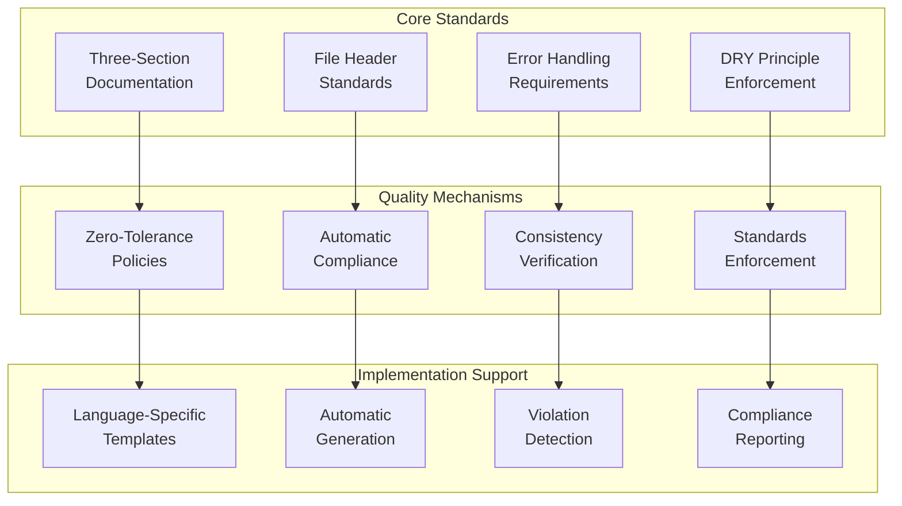

# Coding Standards Guide

Complete guide to understanding and applying the JESSE AI Best Practices Framework's coding standards, documentation requirements, and quality enforcement mechanisms.

## 📜 Coding Standards Overview

The framework enforces comprehensive coding standards designed to ensure consistency, maintainability, and AI assistant effectiveness across all code generation activities.



## 🎯 Core Coding Principles

### KISS (Keep It Simple & Stupid) Approach

**Fundamental Philosophy**: Implement exactly what the user requested - no more, no less.

#### KISS Implementation Rules
1. **Exact Requirements**: Implement only explicitly requested features
2. **Straightforward Solutions**: Choose simple implementations over clever ones
3. **Clear Components**: Break complex solutions into understandable parts
4. **Readable Code**: Prioritize readability and maintainability over brevity
5. **Default Simplicity**: When multiple options exist, choose the simplest
6. **Complexity Alerts**: Highlight when requested features might be unnecessary

#### KISS Anti-Patterns to Avoid
```python
# ❌ WRONG: Adding unrequested features
def user_requested_function():
    """User asked for basic functionality"""
    basic_functionality()
    # DON'T ADD: logging, caching, optimization, extra features
    
# ✅ CORRECT: Implementing exactly what was requested
def user_requested_function():
    """User asked for basic functionality"""
    basic_functionality()
```

### Defensive Programming Philosophy

**Core Principle**: Safe coding means finding issue root causes immediately by crashing the software rather than falling back to degraded modes.

#### Error Handling Rules
1. **Throw on Error**: Implement "throw on error" behavior for ALL error conditions
2. **No Silent Failures**: Never silently catch errors without logging and re-throwing
3. **No Null Returns**: Never return null, undefined, or empty objects for error conditions
4. **Descriptive Messages**: Construct detailed error messages specifying exact component and reason
5. **No Fallbacks**: NEVER implement fallback mechanisms without explicit user approval

#### Error Handling Examples
```python
# ✅ CORRECT: Defensive error handling
def process_data(data):
    """
    [Function intent]
    Process user data with strict validation and clear error reporting.
    
    [Design principles]
    Fail-fast approach prevents silent data corruption.
    
    [Implementation details]
    Validates input and throws descriptive exceptions on any error condition.
    """
    if not data:
        raise ValueError("process_data: Input data is None or empty - cannot proceed with processing")
    
    if not isinstance(data, dict):
        raise TypeError(f"process_data: Expected dict, got {type(data).__name__} - data must be dictionary format")
    
    # Process data...
    return processed_result

# ❌ WRONG: Silent failure with fallback
def process_data(data):
    try:
        # Process data...
        return processed_result
    except Exception:
        return {}  # Silent failure - debugging nightmare
```

### DRY Principle Implementation

**Principle**: Don't Repeat Yourself - eliminate duplication at both code and documentation levels.

#### Code-Level DRY
```python
# ✅ CORRECT: Extract common functionality
class DatabaseManager:
    """
    [Class intent]
    Centralized database operations to eliminate code duplication.
    
    [Design principles]
    Single point of truth for database connection and error handling patterns.
    
    [Implementation details]
    Provides reusable methods for common database operations.
    """
    
    def _execute_query(self, query, params=None):
        # Common database execution logic
        pass
    
    def get_user(self, user_id):
        return self._execute_query("SELECT * FROM users WHERE id = ?", [user_id])
    
    def get_product(self, product_id):
        return self._execute_query("SELECT * FROM products WHERE id = ?", [product_id])

# ❌ WRONG: Repeated database logic
def get_user(user_id):
    # Duplicate connection/error handling code
    pass

def get_product(product_id):
    # Same duplicate connection/error handling code
    pass
```

#### Documentation-Level DRY
```markdown
# ✅ CORRECT: Cross-reference instead of duplicate
## Authentication System
For complete authentication implementation details, see [Authentication Guide](../docs/AUTHENTICATION.md#implementation).

# ❌ WRONG: Duplicate information
## Authentication System
[Copy of entire authentication documentation from another file]
```

## 📝 Three-Section Documentation Pattern

**CRITICAL**: ALL functions, methods, and classes MUST include the three-section documentation pattern. **NO EXCEPTIONS PERMITTED**.

### The Three Mandatory Sections

#### Section 1: Intent
- **Label**: `[Function intent]`, `[Class method intent]`, or `[Class intent]`
- **Purpose**: Clear description of what the code element does and why it exists
- **Requirement**: Must fully capture and contextualize the purpose

#### Section 2: Design Principles
- **Label**: `[Design principles]`
- **Purpose**: Patterns, approaches, and architectural decisions
- **Requirement**: Must explain WHY the code is designed this way

#### Section 3: Implementation Details
- **Label**: `[Implementation details]`
- **Purpose**: HOW the code works internally
- **Requirement**: Key algorithms, data structures, and technical notes

### Language-Specific Templates

#### Python Function Template
```python
def calculate_user_score(user_data, scoring_criteria):
    """
    [Function intent]
    Calculate comprehensive user score based on multiple weighted criteria to enable ranking and recommendation systems.
    
    [Design principles]
    Modular scoring approach allows easy addition of new criteria without affecting existing calculations.
    Weighted system provides flexibility for different use cases and business requirements.
    
    [Implementation details]
    Iterates through scoring criteria, applies weights, and normalizes final score to 0-100 range.
    Uses floating-point arithmetic for precision in weight calculations.
    
    Args:
        user_data (dict): User information containing all necessary scoring fields
        scoring_criteria (list): List of criteria dicts with 'field', 'weight', and 'max_value' keys
        
    Returns:
        float: Normalized score between 0 and 100
        
    Raises:
        ValueError: When user_data is missing required fields for scoring
        TypeError: When scoring_criteria format is invalid
    """
    # Implementation...
```

#### JavaScript Function Template
```javascript
/**
 * [Function intent]
 * Validate and sanitize user input to prevent XSS attacks and ensure data consistency.
 *
 * [Design principles]
 * Defense-in-depth approach with multiple validation layers.
 * Whitelist-based sanitization prevents bypass attempts.
 *
 * [Implementation details]
 * Uses DOMPurify for HTML sanitization and custom regex patterns for input validation.
 *
 * @param {string} userInput - Raw user input requiring validation
 * @param {Object} validationRules - Validation criteria and sanitization options
 * @returns {string} Sanitized and validated input
 * @throws {ValidationError} When input fails validation criteria
 */
function validateUserInput(userInput, validationRules) {
    // Implementation...
}
```

#### Bash Function Template
```bash
# [Function intent]
# Deploy application to specified environment with comprehensive health checks and rollback capability.
#
# [Design principles]
# Fail-fast deployment prevents partial deployments that could cause system instability.
# Atomic deployment approach ensures consistent state across all application components.
#
# [Implementation details]
# Uses blue-green deployment strategy with health check validation before traffic switching.
# Maintains deployment artifacts for quick rollback if health checks fail.
#
# Arguments:
#   $1 - Environment name (staging, production)
#   $2 - Application version to deploy
#
# Returns:
#   0 on successful deployment
#   1 on deployment failure
#   2 on health check failure
deploy_application() {
    local environment="$1"
    local version="$2"
    
    # Implementation...
}
```

### Documentation Quality Standards

#### Quality Requirements
1. **Insightful Content**: Comments allow understanding without reading code
2. **Factual Justification**: When using adjectives (efficient, robust), provide specific technical reasons
3. **Precise Wording**: Avoid vague statements, provide concrete technical details
4. **Reusable Principles**: Design principles should enable reuse elsewhere in codebase
5. **Maintenance Support**: Implementation details aid debugging and modification

#### Quality Examples
```python
# ✅ CORRECT: Specific and factual
def optimize_database_query(query):
    """
    [Function intent]
    Optimize database query performance to reduce execution time from ~500ms to ~50ms for typical user searches.
    
    [Design principles]
    Query optimization through index utilization and subquery elimination reduces database load.
    Caching strategy prevents repeated expensive operations on frequently accessed data.
    
    [Implementation details]
    Analyzes query execution plan to identify missing indexes and suggests query restructuring.
    Implements LRU cache with 1000-item capacity for query results with 30-minute TTL.
    """

# ❌ WRONG: Vague and unhelpful
def optimize_database_query(query):
    """
    [Function intent]
    Makes database queries faster.
    
    [Design principles]
    Uses good optimization techniques.
    
    [Implementation details]
    Optimizes the query somehow.
    """
```

## 📋 File Header Standards

### Mandatory File Header Template

**CRITICAL**: All non-markdown files MUST begin with this exact header structure:

```python
###############################################################################
# IMPORTANT: This header comment is designed for GenAI code review and maintenance
# Any GenAI tool working with this file MUST preserve and update this header
###############################################################################
# [GenAI coding tool directive]
# - Maintain this header with all modifications
# - Update History section with each change
# - Keep only the 4 most recent records in the history section. Sort from newer to older.
# - Preserve Intent, Design, and Constraints sections
# - Use this header as context for code reviews and modifications
# - Ensure all changes align with the design principles
# - Respect system prompt directives at all times
###############################################################################
# [Source file intent]
# Complete description of this file's purpose within the project architecture.
# Must capture the file's role in the broader system context.
###############################################################################
# [Source file design principles]
# Key architectural and design decisions that guide this file's implementation.
# Patterns and approaches that should be maintained during modifications.
###############################################################################
# [Source file constraints]
# Technical limitations, requirements, or dependencies that affect this file.
# Performance requirements, security considerations, or integration constraints.
###############################################################################
# [Dependencies] <!-- Never reference documents in <project_root>/scratchpad/ directory -->
# codebase: src/models/user.py - User data model definitions
# codebase: src/utils/validation.py - Input validation utilities
# system: flask - Web framework for HTTP handling
# system: sqlalchemy - Database ORM for data persistence
# doc: ARCHITECTURE.md#database-design - Database schema documentation
###############################################################################
# [GenAI tool change history] <!-- Change history sorted from the newest to the oldest -->
# 2024-01-15T10:30:00Z : Added user authentication validation by CodeAssistant
# * Implemented JWT token validation middleware
# * Added rate limiting for authentication endpoints
# * Enhanced error handling for invalid credentials
###############################################################################
```

### Header Application Rules
1. **Universal Application**: Apply to ALL non-markdown files
2. **Top Placement**: Header must be at very top before any other content
3. **Complete Sections**: No sections may be omitted
4. **Accurate Content**: Header content must reflect actual file purpose and dependencies
5. **History Maintenance**: Keep only 4 most recent changes, sorted newest to oldest

### Change History Management
```python
# ✅ CORRECT: Precise timestamp and detailed changes
# 2024-01-15T10:30:00Z : Enhanced user authentication system by CodeAssistant
# * Added JWT token validation with RS256 algorithm
# * Implemented rate limiting (5 attempts per minute per IP)
# * Added comprehensive error logging for failed authentication attempts
# * Updated password hashing to use bcrypt with cost factor 12

# ❌ WRONG: Vague and imprecise
# 2024-01-15 : Updated authentication by AI
# * Made some improvements
```

## 🛡️ Quality Enforcement Mechanisms

### Zero-Tolerance Policies

#### Non-Negotiable Standards
1. **Missing Documentation**: Blocking issue requiring immediate resolution
2. **Incomplete Three-Section Pattern**: Must be completed before proceeding
3. **Missing File Headers**: File cannot be committed without proper header
4. **DRY Violations**: Duplicate code must be refactored immediately
5. **Silent Error Handling**: All errors must be properly logged and re-thrown

#### Compliance Verification
```python
# Self-verification checklist after implementing ANY function/method/class:
# ✓ Documentation includes ALL THREE required sections in exact order
# ✓ Section labels match template exactly
# ✓ Intent section fully captures purpose
# ✓ Design principles explain the "why"
# ✓ Implementation details explain the "how"
# ✓ Parameter/return documentation matches actual signature
# ✓ Exception documentation covers all error cases
# ✓ No outdated or contradictory information
```

### Automatic Compliance Checking

#### Documentation Consistency Protection
When code changes would contradict existing documentation:
1. **STOP** implementation immediately
2. **Quote** contradicting documentation exactly
3. **Present** two options:
   - **OPTION 1 - ALIGN WITH DOCS**: Code implementation following documentation
   - **OPTION 2 - UPDATE DOCS**: Exact text changes to align documentation with code

#### Example Consistency Protection
```python
# Documentation states: "Function returns user object with validated email"
# Proposed code: return None  # This contradicts documentation

# REQUIRED RESPONSE:
# Documentation states: "Function returns user object with validated email"
# 
# OPTION 1 - ALIGN WITH DOCS: 
# return User(email=validated_email, ...)
#
# OPTION 2 - UPDATE DOCS:
# Change documentation to: "Function returns user object with validated email, or None if validation fails"
```

### Virtual Environment Requirements

**CRITICAL**: When `venv/` directory exists, ALL commands must be prefixed with virtual environment activation.

#### Command Transformation
```bash
# ✅ CORRECT: With venv activation
source venv/bin/activate && pip install requests

# ❌ WRONG: Without venv activation (when venv/ exists)
pip install requests
```

#### Virtual Environment Rules
1. **Mandatory Check**: Always check for `venv/` directory existence before command execution
2. **Automatic Activation**: Prepend `source venv/bin/activate && ` to all commands
3. **Chain Commands**: Use `&&` to ensure virtual environment remains active
4. **Universal Application**: Apply to ALL commands, even non-Python related

## 🔧 Implementation Guidelines

### Code Generation Workflow

#### Pre-Implementation Checklist
```bash
# Before generating any code:
# 1. Verify alignment with project documentation
# 2. Check for existing similar implementations (DRY principle)
# 3. Confirm understanding of user requirements
# 4. Consider KISS approach options
# 5. Plan error handling strategy
```

#### During Implementation
```python
# While generating code:
# 1. Apply defensive error handling to all functions
# 2. Maintain documentation consistency with changes
# 3. Follow file modification rules and header updates
# 4. Respect virtual environment requirements
# 5. Implement three-section documentation pattern
```

#### Post-Implementation Verification
```bash
# After generating code:
# 1. Verify syntax correctness
# 2. Confirm documentation updates in file headers
# 3. Check for DRY violations requiring refactoring
# 4. Validate error handling implementation
# 5. Run consistency checks across related files
```

### Language-Specific Considerations

#### Python Standards
- Use type hints for all function parameters and return values
- Follow PEP 8 naming conventions
- Implement proper exception handling with specific exception types
- Use docstrings following three-section pattern

#### JavaScript Standards
- Use JSDoc format for documentation
- Implement proper error handling with try-catch blocks
- Follow ES6+ syntax standards
- Use meaningful variable and function names

#### Bash Standards
- Use proper shebang lines
- Implement comprehensive error checking with exit codes
- Use meaningful variable names with consistent case
- Include usage documentation in script headers

## 🚀 Best Practices for Standards Compliance

### Daily Development Practices

#### Code Review Checklist
1. **Documentation Complete**: All functions have three-section documentation
2. **Headers Current**: File headers reflect recent changes
3. **Error Handling**: All error conditions properly handled
4. **DRY Compliance**: No duplicate code patterns
5. **KISS Adherence**: Implementation matches requirements exactly

#### Quality Maintenance
1. **Regular Reviews**: Periodic compliance audits
2. **Standards Updates**: Keep templates current with project evolution
3. **Team Alignment**: Ensure consistent application across team members
4. **Tool Integration**: Use automated checking where possible

### Troubleshooting Standards Issues

#### Common Violations
1. **Incomplete Documentation**: Missing sections in function documentation
2. **Outdated Headers**: File headers not updated after changes
3. **Silent Failures**: Error conditions not properly handled
4. **Code Duplication**: Repeated logic not extracted to common functions

#### Resolution Strategies
1. **Immediate Fix**: Address violations as soon as discovered
2. **Pattern Recognition**: Identify recurring violation patterns
3. **Preventive Measures**: Implement checks to prevent future violations
4. **Documentation Updates**: Keep standards documentation current

---

## 🎉 Standards Compliance Success

Effective coding standards compliance with the JESSE AI framework:

1. **Consistency**: Uniform code quality across all project components
2. **Maintainability**: Well-documented code that's easy to understand and modify
3. **Reliability**: Robust error handling prevents silent failures
4. **Efficiency**: DRY principle reduces code duplication and maintenance overhead
5. **Quality**: Zero-tolerance policies ensure high standards maintenance

The framework's coding standards transform AI-generated code from functional to production-ready, with comprehensive documentation and robust error handling that supports long-term project success.
