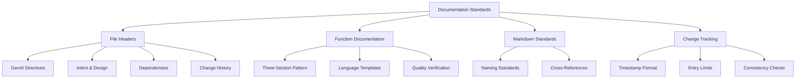
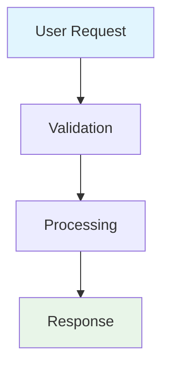

# Documentation Standards Guide

Complete guide to understanding and applying the JESSE AI Framework's documentation standards for consistent, high-quality code and markdown documentation.

## 🎯 Overview

The JESSE AI Framework enforces comprehensive documentation standards that ensure maintainability, consistency, and knowledge preservation across all project files. This guide explains how to apply these standards in practice.

### Key Documentation Components



## 📄 File Header Standards

### Mandatory File Header Template

**ALL non-markdown files** (Python, JavaScript, Shell scripts, Dockerfile, etc.) MUST include this exact header:

```bash
###############################################################################
# IMPORTANT: This header comment is designed for GenAI code review and maintenance
# Any GenAI tool working with this file MUST preserve and update this header
###############################################################################
# [GenAI coding tool directive]
# - Maintain this header with all modifications
# - Update History section with each change
# - Keep only the 4 most recent records in the history section. Sort from newer to older.
# - Preserve Intent, Design, and Constraints sections
# - Use this header as context for code reviews and modifications
# - Ensure all changes align with the design principles
# - Respect system prompt directives at all times
###############################################################################
# [Source file intent]
# <Describe the detailed purpose of this file. Intent must be fully captured and contextualized.>
###############################################################################
# [Source file design principles]
# <List key design principles guiding this implementation>
###############################################################################
# [Source file constraints]
# <Document any limitations or requirements for this file>
###############################################################################
# [Dependencies] <!-- Never reference documents in <project_root>/scratchpad/ directory -->
# <File paths of others codebase and documentation files. List also language specific libraries if any>
# <List of markdown files in doc/ that provide broader context for this file>
# <Prefix the dependency with its kind like "<codebase|system|other>:<dependency>"
#    <"codebase" kind means a reference to any artifact in the current project codebase>
#    <"system" kind means a reference toward an external artifact provided by the environement (files, librairies, modules...)>
###############################################################################
# [GenAI tool change history] <!-- Change history sorted from the newest to the oldest -->
# YYYY-MM-DDThh:mm:ssZ : <summary of change> by CodeAssistant
# * <change detail>
###############################################################################
```

### Header Section Guidelines

#### 1. Source File Intent
- **Purpose**: Fully describe what the file does and why it exists
- **Requirements**: Must be comprehensive and contextual
- **Example**: "Handles user authentication including login, logout, session management, and password reset functionality for the web application"

#### 2. Design Principles  
- **Purpose**: Explain architectural decisions and patterns used
- **Requirements**: Help future developers understand design choices
- **Example**: "Single responsibility for auth operations, stateless design, defensive error handling with explicit failures"

#### 3. Dependencies
- **Codebase**: Other project files this depends on
- **System**: External libraries, modules, environment dependencies  
- **Documentation**: Related markdown files for context
- **Restriction**: Never reference scratchpad directory files

#### 4. Change History
- **Format**: `YYYY-MM-DDThh:mm:ssZ : <summary> by CodeAssistant`
- **Limit**: Only 4 most recent entries
- **Order**: Newest to oldest
- **Details**: Include bullet points with specific changes

## 🔧 Function & Class Documentation

### The Three-Section Pattern (NON-NEGOTIABLE)

**EVERY function, method, and class** must include these three sections in exact order:

```python
def example_function(param1, param2):
    """
    [Function intent]
    Clear description of what this function does and why it exists in the system.
    
    [Design principles]
    Patterns and approaches used, rationale for design choices, when/how to use.
    
    [Implementation details]
    Key algorithms, data structures, technical notes for maintenance and debugging.
    
    Args:
        param1 (type): Description of first parameter
        param2 (type): Description of second parameter
        
    Returns:
        type: Description of return value
        
    Raises:
        ExceptionType: When and why this exception is raised
    """
    # Implementation...
```

### Language-Specific Templates

#### Python Example
```python
class DataProcessor:
    """
    [Class intent]
    Processes and validates incoming data from multiple sources for storage in the database.
    
    [Design principles]
    Single responsibility for data processing, fail-fast validation, immutable processing pipeline.
    
    [Implementation details]
    Uses strategy pattern for different data source types, validates against JSON schema, 
    maintains processing audit trail for debugging.
    """
    
    def process_data(self, raw_data, source_type):
        """
        [Class method intent]
        Validates and transforms raw data according to source-specific rules.
        
        [Design principles]
        Defensive validation with explicit error messages, stateless processing.
        
        [Implementation details]
        Applies source-specific transformation strategy, validates against schema,
        logs processing steps for audit trail.
        
        Args:
            raw_data (dict): Unprocessed data from external source
            source_type (str): Type identifier for processing strategy
            
        Returns:
            dict: Validated and transformed data ready for database storage
            
        Raises:
            ValidationError: When data fails schema validation
            ProcessingError: When transformation strategy fails
        """
        # Implementation...
```

#### JavaScript Example
```javascript
/**
 * [Class intent]
 * Manages API communication with retry logic and error handling for the frontend application.
 *
 * [Design principles]
 * Single responsibility for API calls, automatic retry with exponential backoff,
 * consistent error handling across all endpoints.
 *
 * [Implementation details]
 * Uses fetch API with custom retry wrapper, implements circuit breaker pattern,
 * maintains request/response logging for debugging.
 *
 * @class ApiManager
 */
class ApiManager {
  /**
   * [Class method intent]
   * Makes authenticated HTTP request with automatic retry and error handling.
   *
   * [Design principles]
   * Fail-fast for authentication errors, retry for transient failures,
   * consistent response format for all callers.
   *
   * [Implementation details]
   * Adds authentication headers, implements exponential backoff retry,
   * transforms all responses to consistent format.
   *
   * @param {string} endpoint - API endpoint path
   * @param {Object} options - Request configuration options
   * @returns {Promise<Object>} Standardized response object
   * @throws {AuthError} When authentication fails
   * @throws {NetworkError} When network request fails after retries
   */
  makeRequest(endpoint, options) {
    // Implementation...
  }
}
```

### Documentation Quality Standards

#### Quality Criteria Checklist
- [ ] **Completeness**: All three sections present and meaningful
- [ ] **Clarity**: Understandable without reading implementation
- [ ] **Specificity**: Concrete details, not generic statements
- [ ] **Justification**: Quality claims backed by technical reasons
- [ ] **Consistency**: Aligned with file header and project docs

#### Common Quality Issues to Avoid
- ❌ "This function handles data" (too vague)
- ❌ "Efficient implementation" (without justification)
- ❌ "TODO: Add documentation" (incomplete)
- ❌ Missing any of the three required sections

## 📝 Markdown Documentation Standards

### File Naming Requirements

**ALL markdown files** must use `UPPERCASE_SNAKE_CASE` format:
- ✅ `API_DOCUMENTATION.md`
- ✅ `DESIGN_DECISIONS.md`
- ✅ `USER_GUIDE.md`
- ❌ `api-documentation.md`
- ❌ `design_decisions.md`

### Special File Naming Patterns

#### Chat Capture Files
- **Location**: `<project_root>/.coding_assistant/captured_chats/`
- **Pattern**: `YYYYMMDD-HHmm-<topic_in_snake_case>.md`
- **Example**: `20250625-1430-authentication_implementation.md`

#### Implementation Plan Files
- **Location**: `<project_root>/scratchpad/<plan_name>/`
- **Patterns**:
  - Overview: `plan_overview.md`
  - Progress: `plan_progress.md`
  - Subtasks: `plan_{subtask_name}.md`


### Content Standards

#### Cross-References vs Duplication
- ✅ **Use cross-references**: `See [Installation Guide](INSTALLATION.md#setup)`
- ❌ **Avoid duplication**: Don't copy content between files
- ✅ **Single source of truth**: Each piece of information has one authoritative location

#### Mermaid Diagram Usage
- **Requirement**: Use mermaid diagrams extensively for clarity
- **Applications**: Architecture, flows, relationships, processes
- **Color guidelines**: High contrast colors for readability



## 📊 Change Tracking & History

### Timestamp Format Standard
- **Required format**: `YYYY-MM-DDThh:mm:ssZ`
- **Example**: `2025-06-25T15:30:45Z`
- **Usage**: File headers, changelogs, progress tracking

### Change History Best Practices

#### File Header Updates
```bash
# Good change entry
2025-06-25T15:30:00Z : Added user authentication validation by CodeAssistant
* Implemented password strength checking
* Added email format validation
* Updated error messages for clarity

# Poor change entry
2025-06-25T15:30:00Z : Updated file by CodeAssistant
* Made changes
```

#### Consistency Maintenance
- **File headers** must align with function documentation
- **Design principles** must be consistent across related functions
- **Implementation details** must match actual code behavior
- **All documentation** must use present tense, never past tense

## 🔍 Verification & Quality Assurance

### Pre-Commit Documentation Checklist

#### For Code Files
- [ ] File header complete with all required sections
- [ ] All functions/methods/classes have three-section documentation
- [ ] Change history updated with current timestamp
- [ ] Dependencies section accurate and complete
- [ ] No references to scratchpad directory

#### For Markdown Files
- [ ] Filename uses UPPERCASE_SNAKE_CASE
- [ ] Cross-references use relative paths
- [ ] Mermaid diagrams included where helpful
- [ ] Content doesn't duplicate existing documentation

### Quality Assessment Tools

#### Documentation Completeness Scoring
Rate each documentation section (1-5 scale):
- **5**: Comprehensive, clear, specific
- **4**: Good with minor gaps
- **3**: Adequate but could be improved  
- **2**: Incomplete or unclear
- **1**: Missing or inadequate

Target: All sections should score 4 or 5

#### Common Documentation Debt Indicators
- Missing three-section patterns in functions
- Outdated file header information
- Broken cross-references in markdown
- Generic or vague descriptions

## 🚀 Implementation Guidelines

### Getting Started with Documentation Standards

#### For New Files
1. **Start with header template**: Copy exact format from this guide
2. **Fill all sections completely**: Don't leave placeholders
3. **Plan function documentation**: Include three sections from the start

#### For Existing Files  
1. **Assess current state**: What documentation is missing?
2. **Add file headers**: Use template, don't skip sections
3. **Update function docs**: Add three-section pattern systematically
4. **Create change entry**: Document the documentation improvements

#### For Team Adoption
1. **Review standards together**: Ensure team understanding
2. **Use templates consistently**: Don't modify the required formats
3. **Verify in code reviews**: Check documentation completeness
4. **Monitor compliance**: Regular audits for standard adherence

### Troubleshooting Common Issues

#### "Documentation feels repetitive"
- **Solution**: Focus on different aspects in each section
- Intent = What and why
- Design principles = How and when  
- Implementation = Technical details

#### "File headers seem excessive"
- **Solution**: Headers enable AI assistance and maintenance
- Required for GenAI code review and modification
- Prevents documentation debt accumulation


### Integration with Development Workflow

#### With Git Workflows
- Documentation updates trigger commit workflow  
- Change history aligns with git commit messages
- Standards enforced through `/jesse_wip_task_commit.md`

#### With AI Assistance
- File headers enable context-aware AI modifications
- Three-section pattern provides AI with design context
- Change history helps AI understand evolution

#### With Knowledge Management
- Documentation feeds into knowledge base
- Standards ensure consistent knowledge capture
- Cross-references maintain knowledge relationships

---

## 📚 Related Resources

### Core Documentation Standards
- **File Headers**: See `JESSE_CODE_COMMENTS.md` for complete templates
- **Markdown Management**: See `JESSE_MARKDOWN.md` for detailed rules
- **Code Generation**: See `JESSE_CODE_GENERATION.md` for implementation standards

### Workflow Integration
- **Chat Capture**: `/jesse_capture_our_chat.md` for conversation documentation
- **Commit Process**: `/jesse_wip_task_commit.md` for standardized commits
- **Knowledge Capture**: `/jesse_wip_task_capture_knowledge.md` for knowledge management

### Quality Assurance
- **Consistency Checking**: `/jesse_wip_task_check_consistency.md` for verification
- **Standards Enforcement**: Built into AI assistant behavior
- **Documentation Review**: Part of code review process

---

**Remember**: Documentation standards are enforced automatically by the AI assistant. Focus on understanding the principles and applying them consistently rather than trying to memorize every detail. The framework will guide you through proper implementation.
