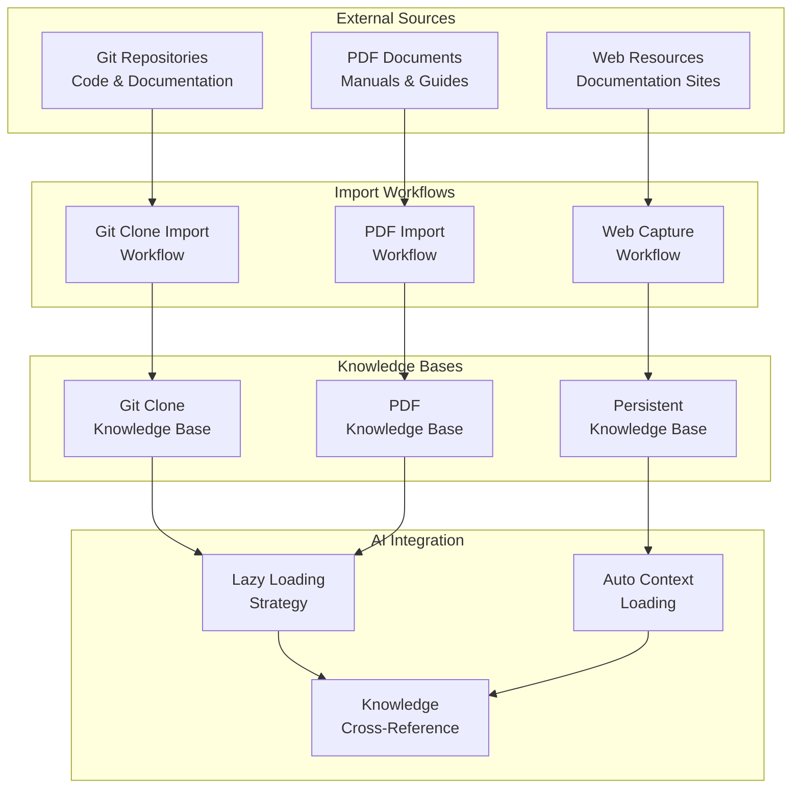
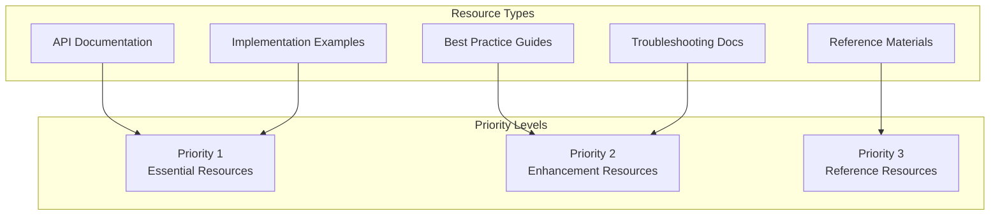
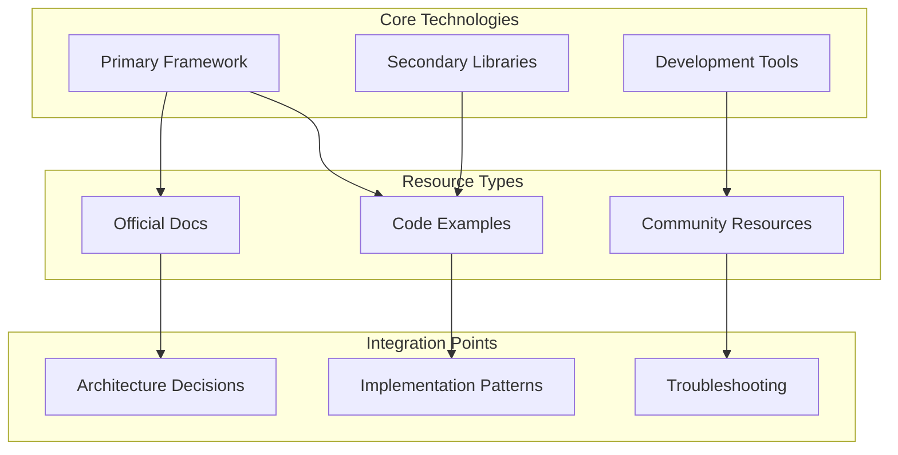

# External Resources Integration Guide

Complete guide to integrating external resources (Git repositories and PDF documents) into the JESSE AI Best Practices Framework's knowledge management system.

## 🔗 External Resource Overview

The framework provides sophisticated integration with external knowledge sources to enhance AI assistant capabilities with domain-specific expertise and reference materials.



## 🔄 Git Repository Integration

### Git Clone Import Workflow

**Command**: `/jesse_wip_kb_git_clone_import.md`

This workflow provides comprehensive integration with external Git repositories:

#### 1. Repository Selection Process
```bash
# Initiate git clone import
/jesse_wip_kb_git_clone_import.md
```

**Prompts for**:
- Repository URL (HTTPS or SSH)
- Repository purpose and focus areas
- Specific files or directories of interest
- Knowledge extraction preferences

#### 2. Automated Processing Steps
1. **Clone Repository**: To `.knowledge/git-clones/[repo-name]/`
2. **Analyze Structure**: Identify key files and directories
3. **Extract Knowledge**: Create indexed knowledge base
4. **Update .gitignore**: Ensure proper version control exclusions
5. **Register Reference**: Add to main knowledge base

#### 3. Generated Knowledge Structure
```
.knowledge/git-clones/
├── README.md                    # Git clones index
├── [repo-name]/                 # Actual repository (gitignored)
├── [repo-name]_kb.md           # Knowledge base file
└── .gitignore                  # Exclusion rules
```

### Git Clone Knowledge Base Format

#### Knowledge Base Template
```markdown
# [Repository Name] Knowledge Base
*Last Updated: YYYY-MM-DDThh:mm:ssZ*

## Repository Overview
**Purpose**: [Why this repository was imported]
**Source**: [Git repository URL]
**Focus Areas**: [Specific areas of interest]
**Clone Location**: `.knowledge/git-clones/[repo-name]/`

## Key Files and Directories
### [Directory/File Name]
**Purpose**: [What this contains]
**Key Insights**: [Important patterns or information]
**Reference Path**: `[relative-path-in-repo]`

## Implementation Patterns
### [Pattern Name]
**Pattern**: [Description of the pattern]
**Location**: `[file-path]`
**Usage**: [When and how to apply]
**Code Example**: 
```[language]
[relevant code snippet]
```

## API Documentation
### [API/Service Name]
**Endpoint**: [API endpoint or service interface]
**Purpose**: [What it provides]
**Parameters**: [Key parameters]
**Response**: [Expected response format]

## Large Files Index
### Files Exceeding 4000 Lines
- `[file-path]` - [Brief description] - **Requires processing**
- `[file-path]` - [Brief description] - **Processed on [date]**

**Processing Status**: 
- ❌ Not processed
- 🔄 In progress  
- ✅ Completed

## Integration Examples
### [Integration Name]
**Purpose**: [What this integration demonstrates]
**Implementation**: [How to implement]
**Dependencies**: [Required components]
**Notes**: [Important considerations]
```

### Advanced Git Clone Features

#### Large File Processing
When repositories contain files exceeding 4000 lines:

```bash
# Process large files from git clones
/jesse_wip_task_process_large_file.md
```

**Processing Strategy**:
1. **Identify Large Files**: Automatically flagged during import
2. **Prioritize Processing**: Mark as "before any other tasks"
3. **Dedicated Sessions**: Process in separate context window sessions
4. **Update Knowledge Base**: Document processed insights

#### Selective Repository Focus

**Focus Area Examples**:
- **API Patterns**: Authentication, error handling, response formats
- **Architecture Patterns**: Component organization, data flow
- **Testing Patterns**: Test structure, mocking, integration tests
- **Configuration Examples**: Environment setup, deployment configs
- **Documentation Patterns**: Code comments, README structures

#### Repository Update Management
```bash
# Update existing git clone (manual process)
cd .knowledge/git-clones/[repo-name]
git pull origin main

# Re-run knowledge extraction if significant changes
/jesse_wip_kb_git_clone_import.md
# Choose "Update existing repository"
```

## 📄 PDF Document Integration

### PDF Import Workflow

**Command**: `/jesse_wip_kb_pdf_import.md`

This workflow provides comprehensive PDF document processing with LLM-powered understanding:

#### 1. PDF Import Process
```bash
# Initiate PDF import
/jesse_wip_kb_pdf_import.md
```

**Prompts for**:
- PDF file path or URL
- Document purpose and focus areas
- Chunking preferences (page ranges)
- Knowledge extraction priorities

#### 2. Automated Processing Steps
1. **PDF Validation**: Verify file accessibility and format
2. **Chunking Strategy**: Divide into manageable page ranges
3. **LLM Processing**: Extract and understand content
4. **Knowledge Indexing**: Create searchable knowledge base
5. **Cross-Reference Setup**: Link chunks for deep-dive access

#### 3. Generated PDF Knowledge Structure
```
.knowledge/pdf-knowledge/[doc-name]/
├── [doc-name]_kb.md             # Main knowledge base
├── pdf_chunks/                  # Processed PDF chunks
│   ├── [doc-name]_pages_001_020.pdf
│   ├── [doc-name]_pages_021_040.pdf
│   └── [doc-name]_pages_041_060.pdf
├── metadata.json                # Processing metadata
└── extraction_log.md            # Processing log
```

### PDF Knowledge Base Format

#### Knowledge Base Template
```markdown
# [Document Name] Knowledge Base
*Last Updated: YYYY-MM-DDThh:mm:ssZ*

## Document Overview
**Title**: [Full document title]
**Source**: [PDF file path or URL]
**Purpose**: [Why this document was imported]
**Total Pages**: [Number of pages]
**Processing Date**: [When processed]

## Key Concepts
### [Concept Name]
**Definition**: [Clear definition]
**Context**: [When this concept applies]
**Page References**: Pages [X-Y] 
**PDF Chunk**: `pdf_chunks/[doc-name]_pages_[start]_[end].pdf`

## Procedures and Processes
### [Procedure Name]
**Purpose**: [What this procedure accomplishes]
**Steps**: [Key steps involved]
**Prerequisites**: [What's needed before starting]
**Page References**: Pages [X-Y]
**PDF Chunk**: `pdf_chunks/[doc-name]_pages_[start]_[end].pdf`

## Technical Specifications
### [Specification Topic]
**Details**: [Technical details]
**Requirements**: [System or technical requirements]
**Examples**: [Usage examples if available]
**Page References**: Pages [X-Y]
**PDF Chunk**: `pdf_chunks/[doc-name]_pages_[start]_[end].pdf`

## Reference Tables and Data
### [Table/Data Name]
**Purpose**: [What this data represents]
**Key Values**: [Important data points]
**Usage**: [How to use this information]
**Page References**: Pages [X-Y]
**PDF Chunk**: `pdf_chunks/[doc-name]_pages_[start]_[end].pdf`

## Implementation Guidelines
### [Guideline Topic]
**Guideline**: [What the guidance recommends]
**Rationale**: [Why this guidance exists]
**Application**: [How to apply in practice]
**Page References**: Pages [X-Y]
**PDF Chunk**: `pdf_chunks/[doc-name]_pages_[start]_[end].pdf`
```

### PDF Knowledge Usage Requirements

**CRITICAL WORKFLOW**: When using PDF knowledge, you MUST follow this process:

#### 1. Reference Knowledge Base First
```bash
# Check PDF knowledge base for topic
cat .knowledge/pdf-knowledge/[doc-name]/[doc-name]_kb.md
```

#### 2. Access Original PDF Chunks
```bash
# MANDATORY: Read corresponding PDF chunks
# Location: .knowledge/pdf-knowledge/[doc-name]/pdf_chunks/
# Pattern: [doc-name]_pages_[start]_[end].pdf
```

#### 3. Verify Complete Context
- Cross-reference knowledge base summary with original PDF content
- Ensure complete understanding from both summary and source
- Base implementation decisions on full context

**Why This Process is Required**:
- Knowledge base entries are summaries and may lack nuanced details
- PDF chunks contain complete original context
- Critical implementation details may only exist in source material
- Error prevention through comprehensive information access

## 🌐 Web Resource Integration

### Web Resource Capture

The framework automatically captures web resources accessed during AI assistant sessions:

#### Automatic Web Capture
```bash
# Automatic capture when AI assistant browses web
# No manual intervention required
# Captured to:
# - Current WIP task (if active)
# - Persistent Knowledge Base (if no active task)
```

#### Manual Web Resource Documentation
```markdown
## Web Resources
### [Resource Name]
**URL**: [Complete URL]
**Purpose**: [Why this resource is valuable]
**Key Information**: [Main takeaways]
**Access Date**: [When accessed]
**Relevance**: [How it applies to project]

**Trust Sources**:
- Web URL: [URL with specific section if applicable]
```

### Web Resource Management

#### Resource Validation
- **Link Checking**: Periodically verify web resource accessibility
- **Content Updates**: Monitor for changes in external documentation
- **Alternative Sources**: Maintain backup references when possible

#### Integration Patterns
- **API Documentation**: Official API docs and examples
- **Tutorial Resources**: Implementation guides and walkthroughs
- **Community Resources**: Stack Overflow, forums, community wikis
- **Official Documentation**: Framework and library documentation

## 🎯 External Resource Strategy

### Resource Selection Criteria

#### High-Value Resources
1. **Official Documentation**: Authoritative sources from project maintainers
2. **Implementation Examples**: Working code samples and patterns
3. **Best Practices Guides**: Recommended approaches and patterns
4. **Troubleshooting Resources**: Common issues and solutions
5. **API References**: Complete interface documentation

#### Resource Prioritization Matrix


### Maintenance Strategy

#### Regular Review Process
1. **Monthly Review**: Check resource accessibility and relevance
2. **Quarterly Assessment**: Evaluate resource usage and value
3. **Annual Cleanup**: Remove outdated or unused resources
4. **Continuous Update**: Refresh resources as projects evolve

#### Update Workflow
```bash
# Identify outdated resources
/jesse_wip_task_check_consistency.md

# Update specific resources
/jesse_wip_kb_git_clone_import.md  # For git repositories
/jesse_wip_kb_pdf_import.md        # For PDF documents

# Cleanup unused resources
# Manual removal with documentation update
```

## 🔧 Advanced Integration Patterns

### Multi-Source Knowledge Synthesis

#### Cross-Reference Integration
```markdown
## [Topic Name] - Multi-Source Analysis
**Git Repository Insights**: [Key patterns from code repositories]
**PDF Documentation**: [Official documentation guidance]
**Web Resources**: [Community best practices and examples]

**Synthesis**: [Combined understanding and recommendations]

**Trust Sources**:
- Git Clone: `.knowledge/git-clones/[repo]_kb.md`
- PDF: `.knowledge/pdf-knowledge/[doc]/[doc]_kb.md`
- Web URL: [specific web resource]
```

#### Knowledge Triangulation
1. **Official Source**: What the official documentation says
2. **Implementation Reality**: What actual code examples demonstrate
3. **Community Practice**: How practitioners actually use the technology
4. **Project Context**: How it applies to your specific project

### Custom Integration Workflows

#### Project-Specific Resource Patterns
```bash
# Create custom resource integration
# 1. Identify project-specific resource needs
# 2. Adapt standard workflows to project requirements
# 3. Document custom integration patterns
# 4. Maintain project-specific resource inventory
```

#### Resource Ecosystem Mapping


## 🚀 Best Practices

### Resource Integration Success Patterns

#### Effective Resource Selection
1. **Quality over Quantity**: Choose authoritative, well-maintained resources
2. **Relevance Focus**: Prioritize resources directly applicable to current work
3. **Maintenance Consideration**: Prefer resources with active maintenance
4. **Community Validation**: Choose resources with strong community adoption

#### Knowledge Base Organization
1. **Consistent Structure**: Use standard templates across all resource types
2. **Clear Cross-References**: Maintain links between related resources
3. **Regular Updates**: Keep knowledge bases current with source changes
4. **Context Preservation**: Maintain connection between summary and source

#### Integration Workflow Optimization
1. **Batch Processing**: Import related resources together
2. **Progressive Enhancement**: Start with essential resources, add enhancement resources over time
3. **Context-Aware Loading**: Use lazy loading to optimize context window usage
4. **Quality Assurance**: Regular consistency checks and validation

### Common Integration Challenges

#### Challenge: Context Window Overload
**Solution**: 
- Use lazy loading strategy
- Process large files in dedicated sessions
- Prioritize most relevant resources

#### Challenge: Resource Maintenance Overhead
**Solution**:
- Automate where possible
- Regular scheduled reviews
- Community-driven updates

#### Challenge: Information Duplication
**Solution**:
- Single source of truth principle
- Cross-reference instead of copying
- Consistency checking workflows

---

## 🎉 External Resource Integration Success

Effective external resource integration transforms your AI assistant into a domain expert by:

1. **Expanding Knowledge Base**: Access to authoritative external information
2. **Improving Decision Quality**: Multiple perspectives and validation sources
3. **Accelerating Development**: Ready access to patterns and examples
4. **Reducing Research Time**: Pre-processed and indexed information
5. **Maintaining Currency**: Up-to-date information from actively maintained sources

The framework's external resource integration capabilities turn your AI assistant into a comprehensive development partner with access to the broader ecosystem of knowledge and best practices.
