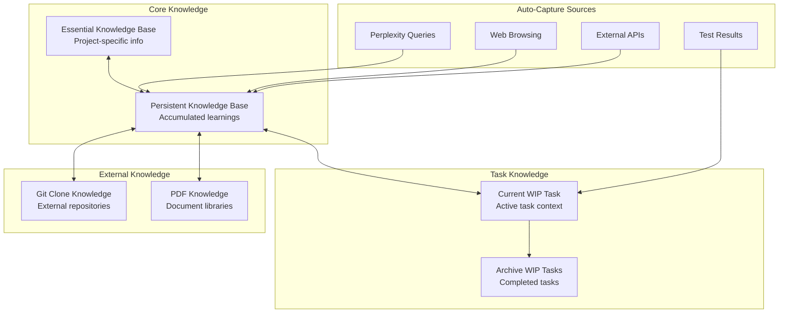

# Knowledge Management System Guide

Complete guide to using the JESSE AI Best Practices Framework's knowledge management system for persistent learning, automated capture, and intelligent context management.

## 🧠 Knowledge System Overview

The framework maintains multiple interconnected knowledge repositories that work together to provide persistent context across AI assistant sessions.



## 📍 Knowledge Base Locations

### Essential Knowledge Base
**Purpose**: Project-specific context and current task status
**Location**: 
- Global Install: `<project>/JESSE_KNOWLEDGE_MANAGEMENT.md` (Essential Knowledge Base section)
- Project Install: `<project>/.clinerules/JESSE_KNOWLEDGE_MANAGEMENT.md`

**Contains**:
- Current WIP task information
- Other active tasks list
- Recently completed tasks
- Project context and components
- Quick access links

### Persistent Knowledge Base
**Purpose**: Accumulated project learnings and patterns
**Location**: `<project>/.knowledge/persistent-knowledge/KNOWLEDGE_BASE.md`

**Contains**:
- Project purpose and architecture
- Development environment details
- External API integrations
- Patterns and solutions
- Perplexity query results
- Web resources

### WIP Task Knowledge
**Purpose**: Active task context and progress
**Location**: `<project>/.knowledge/work-in-progress/[task-name]/`

**Files**:
- `WIP_TASK.md` - Task definition and learnings
- `PROGRESS.md` - Progress tracking and test results

## 🔄 Automatic Knowledge Capture

### Auto-Capture Triggers

The framework automatically captures knowledge from these sources **without manual intervention**:

#### 1. Perplexity MCP Server Queries
```bash
# When AI assistant uses Perplexity
# Knowledge automatically captured to:
# - Current WIP task (if active)
# - Persistent Knowledge Base (if no active task)
```

#### 2. Web Browsing Results
```bash
# When AI assistant browses web resources
# Knowledge automatically captured with source URLs
```

#### 3. Test Execution Results
```bash
# When any test is executed
# Results automatically logged to current WIP task PROGRESS.md
# Format:
## Test Status: [Test Name]
**Status**: ✅ PASSED | ❌ FAILED | 🔄 RUNNING | ⏸️ SKIPPED
**Timestamp**: YYYY-MM-DDThh:mm:ssZ
**Test Command**: [exact command]
**Result Summary**: [outcome]
**Details**: [findings/errors]
**Context**: [debugging info]
```

#### 4. External API Interactions
```bash
# API calls and responses automatically documented
# Integration patterns captured for reuse
```

### Manual Knowledge Capture

#### Explicit Knowledge Commands
```bash
# Capture current session knowledge
/jesse_wip_task_capture_knowledge.md

# Remember specific information
"Remember this: [specific knowledge to capture]"
"Capture this knowledge: [information]"
```

#### Chat Conversation Capture
```bash
# Capture current conversation
/jesse_capture_our_chat.md
```

**Output Location**: `<project>/.coding_assistant/captured_chats/[YYYYMMDD-HHmm]-[topic].md`

## 📚 Knowledge Base Management

### Lazy Loading Strategy

The framework uses intelligent loading to optimize context window usage:

#### Always Loaded (Session Start)
- Essential Knowledge Base
- Current WIP task (if active)
- Core framework rules

#### On-Demand Loading
- Git clone knowledge bases
- PDF knowledge bases
- Historical WIP tasks
- Archived knowledge

#### Loading Control
```bash
# Disable WIP task auto-loading for current session
/jesse_wip_task_disable.md

# Force session reinitialization
/jesse_session_init
```

### Knowledge Base Structure

#### Persistent Knowledge Base Template
```markdown
# Project Knowledge Base

## Project Purpose
[Clear description of project goals]

## Development Environment
### Virtual Environment
**Location**: [venv path]
**Activation**: `source [path]/bin/activate`

### Dependencies
[Key project dependencies]

## External APIs
### [API Name]
**Purpose**: [What it provides]
**Authentication**: [Auth method]
**Key Endpoints**: [Main services]

## Patterns and Solutions
### [Pattern Name]
**Pattern**: [Description]
**Context**: [When to use]
**Implementation**: [How to implement]
**Benefits**: [Advantages]

## Available Knowledge Sources
### Git Clone Knowledge Bases
[List of imported repositories]

### PDF Knowledge Bases
[List of imported documents]
```

### Knowledge Entry Requirements

**MANDATORY**: All knowledge entries must include trust sources:

```markdown
## [Knowledge Topic]
[Knowledge content]

**Trust Sources**:
- Codebase: `src/services/api_service.py`
- Git Clone: `.knowledge/git-clones/framework-docs_kb.md`
- Web URL: `https://docs.example.com/api/v1/`
- Documentation: `doc/DESIGN.md#section`
```

## 🔍 Knowledge Discovery and Search

### Finding Relevant Knowledge

#### By Topic or Pattern
1. Check current WIP task knowledge first
2. Search Persistent Knowledge Base
3. Review relevant git clone knowledge bases
4. Check PDF knowledge bases if applicable

#### By Trust Source
```bash
# Find knowledge by source file
grep -r "src/services/api_service.py" .knowledge/

# Find knowledge by external source
grep -r "docs.example.com" .knowledge/
```

### Knowledge Base Exploration

#### Current Session Context
```bash
# View current WIP task
cat .knowledge/work-in-progress/[current-task]/WIP_TASK.md

# View persistent knowledge
cat .knowledge/persistent-knowledge/KNOWLEDGE_BASE.md
```

#### Historical Knowledge
```bash
# List all WIP tasks
ls .knowledge/work-in-progress/

# List git clone knowledge bases
ls .knowledge/git-clones/*.md

# List PDF knowledge bases
ls .knowledge/pdf-knowledge/*/
```

## 🎯 Knowledge Quality Management

### Consistency Maintenance

#### Automatic Consistency Checks
```bash
# Verify knowledge base integrity
/jesse_wip_task_check_consistency.md
```

**Checks Include**:
- Cross-reference validity
- Trust source accessibility
- Knowledge duplication prevention
- Format compliance
- Timestamp accuracy

#### Manual Quality Assurance
1. **Regular Review**: Periodically review knowledge entries for accuracy
2. **Source Verification**: Ensure trust sources remain valid
3. **Duplication Prevention**: Avoid repeating information across files
4. **Update Maintenance**: Keep knowledge current with project evolution

### Knowledge Organization Principles

#### Single Source of Truth
- Each piece of information has one authoritative location
- Cross-references point to single source rather than duplicating
- Updates propagate through references

#### Hierarchical Organization
```
Essential Knowledge (Project Overview)
├── Persistent Knowledge (Detailed Information)
├── WIP Task Knowledge (Active Context)
├── Git Clone Knowledge (External References)
└── PDF Knowledge (Document Libraries)
```

#### Time-Based Organization
- Newest information takes precedence
- Historical context preserved in archived tasks
- Timestamp precision for change tracking

## 🔧 Advanced Knowledge Operations

### Knowledge Base Migration

#### Project-to-Project Transfer
1. Export relevant knowledge from source project
2. Adapt to target project context
3. Update trust sources to match new project structure
4. Verify consistency after transfer

#### Knowledge Base Consolidation
```bash
# Process large files requiring consolidation
/jesse_wip_task_process_large_file.md
```

### Custom Knowledge Sources

#### Adding Custom Sources
```markdown
## Custom Knowledge Sources
### [Your Custom Source]
**Purpose**: [Description]
**Location**: [File path or URL]  
**Usage**: [When and how to use]
**Trust Sources**:
- [Source type]: [Reference]
```

#### Integration with External Tools
- API documentation systems
- Internal wikis
- Team knowledge bases
- External documentation sites

### Knowledge Analytics

#### Usage Patterns
- Track which knowledge sources are accessed most frequently
- Identify knowledge gaps in project coverage
- Monitor knowledge base growth over time

#### Quality Metrics
- Trust source validity rates
- Knowledge duplication detection
- Cross-reference accuracy
- Update frequency patterns

## 🚀 Best Practices

### Daily Knowledge Management

#### Morning Session
1. Review current WIP task knowledge
2. Check for overnight knowledge updates
3. Verify knowledge base consistency

#### During Development
1. Let auto-capture handle routine knowledge
2. Manually capture unique discoveries
3. Update WIP task progress and learnings

#### End of Day
1. Capture session learnings
2. Update task progress
3. Clean up temporary knowledge

### Knowledge Collaboration

#### Team Knowledge Sharing
1. Export relevant knowledge for team sharing
2. Standardize trust source formats
3. Maintain consistent knowledge organization

#### Knowledge Review Process
1. Regular peer review of knowledge quality
2. Validation of trust sources
3. Consensus on knowledge organization patterns

### Troubleshooting Knowledge Issues

#### Common Problems
1. **Missing Knowledge**: Check auto-capture settings
2. **Duplicate Information**: Use consistency checker
3. **Outdated References**: Verify and update trust sources
4. **Context Window Overload**: Use lazy loading strategies

#### Recovery Procedures
1. **Backup Strategies**: Regular knowledge base snapshots
2. **Recovery Commands**: Session reinitialization procedures
3. **Consistency Restoration**: Automated fixing where possible

---

## 🎉 Knowledge Management Success

Effective knowledge management with the JESSE AI framework:

1. **Reduces Context Switching**: Information persists across sessions
2. **Accelerates Learning**: Patterns and solutions accumulate over time
3. **Improves Quality**: Consistent information sources and formats
4. **Enables Collaboration**: Shareable knowledge structures
5. **Supports Growth**: Knowledge base expands with project complexity

The framework transforms your AI assistant from session-based help to a persistent development partner that grows smarter with every interaction.
