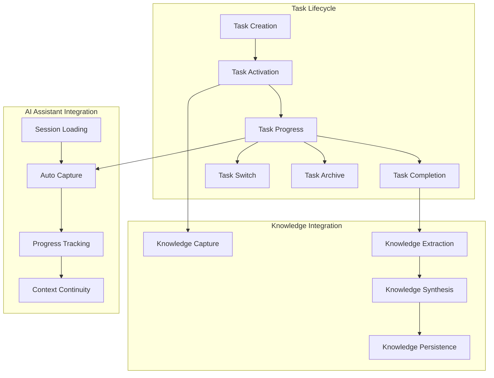
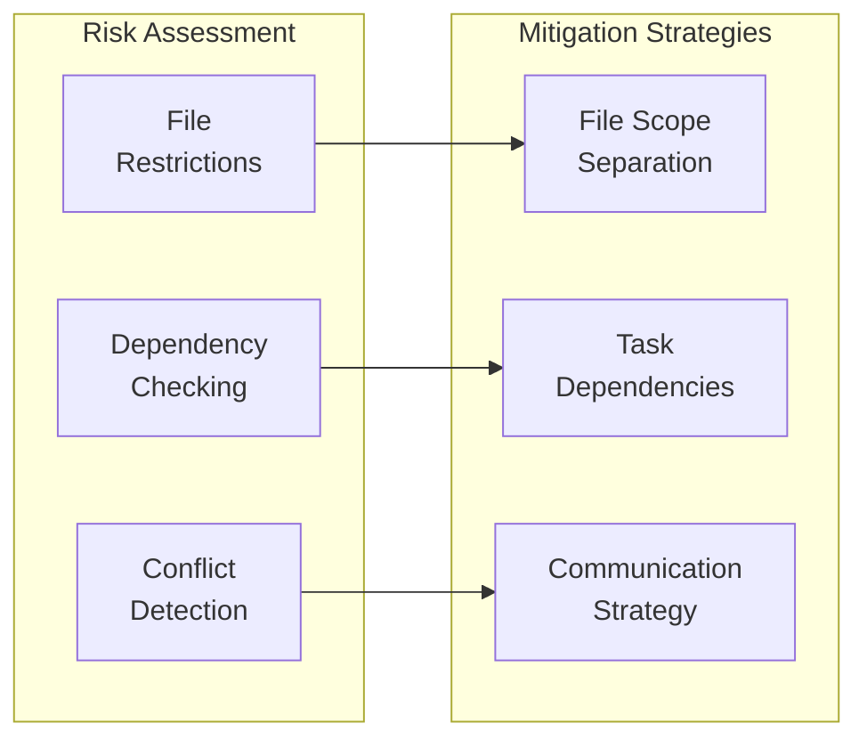

# Task Management System Guide

Complete guide to the JESSE AI Best Practices Framework's Work-in-Progress (WIP) task management system for structured development, knowledge capture, and progress tracking.

## 🎯 Task Management Overview

The WIP task system provides structured approach to development work with automatic knowledge capture, progress tracking, and seamless AI assistant integration.



## 📋 Task Lifecycle Management

### Task Creation Workflow

**Command**: `/jesse_wip_task_create.md`

#### 1. Task Information Gathering
```bash
# Create new WIP task
/jesse_wip_task_create.md
```

**Prompts Include**:
- **Task Name**: Brief descriptive name (converted to snake_case)
- **Objective**: Clear statement of what needs to be accomplished
- **Target Timeline**: Estimated completion date
- **Scope**: What is included and excluded from this task
- **Success Criteria**: Measurable outcomes
- **Dependencies**: Internal and external requirements

#### 2. Parallel Task Risk Assessment
When existing WIP tasks are detected:

```
⚠️ WARNING: Multiple WIP Tasks Detected ⚠️

You currently have [N] active WIP task(s). Working with multiple parallel WIP tasks carries significant risks:

• State Inconsistency Risk: Changes made in one task may render other tasks out of sync
• File Conflict Risk: Modifying files tracked in multiple tasks can create conflicts
• Context Confusion: Switching between tasks may lead to mixing concerns

RECOMMENDATION: Create parallel WIP tasks ONLY when working on completely different sets of files and features.

To mitigate risks, would you like to restrict this new task to specific files or directories?
[Yes/No]
```

#### 3. File Restriction Options
When user chooses to restrict task scope:
- **File-Level Restrictions**: Specific source files
- **Directory-Level Restrictions**: Entire directories or modules
- **Feature-Level Restrictions**: Functional boundaries
- **Documentation**: Restrictions documented in task scope

### Task Directory Structure

#### Generated Structure
```
.knowledge/work-in-progress/[task_name_snake_case]/
├── WIP_TASK.md                     # Task definition and learnings
└── PROGRESS.md                     # Progress tracking and test results
```

#### WIP_TASK.md Template
```markdown
# Task: [Task Name]

## Task Context

### Objective
[User-provided clear objective statement]

### Scope
- **In Scope**: [Specific features, files, or functionality included]
- **Out of Scope**: [Explicit exclusions to prevent scope creep]
- **File Restrictions**: [If task is restricted to specific files/directories]
  - [List of restricted files/directories]

### Success Criteria
- [ ] [Measurable outcome 1 with specific validation]
- [ ] [Measurable outcome 2 with clear completion definition]
- [ ] [Technical milestone with objective verification]

### Dependencies
- [External API integrations or third-party services]
- [Internal project components or modules]
- [Required knowledge or documentation]

### Timeline
- **Started**: [Creation date]
- **Target**: [User-provided target completion date]
- **Milestones**: [Key checkpoints and intermediate goals]

## Task Learnings

### Key Discoveries
*Auto-captured discoveries from development process*

### Patterns Identified
*Architectural and implementation patterns discovered*

### Challenges & Solutions
*Problems encountered and resolution strategies*

## Task Resources

### External Links
*Web resources accessed during task development*

### Reference Materials
*Documentation, tutorials, and guides consulted*

### Tools & APIs
*Development tools and external services used*
```

#### PROGRESS.md Template
```markdown
# Progress Tracking: [Task Name]

## Current Status
**Overall Progress**: 0% complete
**Current Phase**: Planning
**Last Updated**: [Current timestamp]

## Completed Milestones
*Milestones completed with timestamps*

## Upcoming Milestones
- [Target Date] - [Milestone description with success criteria]

## Blockers & Issues
*Current blockers preventing progress*

## Test Status: [Auto-Updated Section]
*Automatically updated when tests are executed*
```

### Task Activation and Context Loading

#### Session-Based Task Loading
The framework automatically loads the current task context at session start:

1. **Essential Knowledge Base**: Identifies current active task
2. **Task Context Loading**: Loads WIP_TASK.md and PROGRESS.md
3. **Knowledge Integration**: Connects task with relevant external resources
4. **Session Summary**: Displays current task status and next actions

#### Manual Task Control
```bash
# Disable task auto-loading for current session
/jesse_wip_task_disable.md

# Manually load task context
# (Task loading happens automatically at session start)
```

## 🔄 Task Operations

### Task Switching

**Command**: `/jesse_wip_task_switch.md`

#### Switch Process
1. **Current Task Capture**: Captures current session knowledge
2. **Task Selection**: Lists available WIP tasks for selection
3. **Context Switch**: Loads selected task context
4. **Session Update**: Updates Essential Knowledge Base with new current task

#### Context Preservation
```bash
# Automatic knowledge capture before switching
# Session knowledge -> Current task WIP_TASK.md
# Progress updates -> Current task PROGRESS.md
# Essential Knowledge Base -> Updated with new current task
```

### Task Progress Tracking

#### Automatic Progress Updates
The framework automatically captures progress through multiple mechanisms:

##### Test Result Auto-Update
```bash
# When ANY test is executed, PROGRESS.md is automatically updated:
## Test Status: [Test Name/Description]
**Status**: ✅ PASSED | ❌ FAILED | 🔄 RUNNING | ⏸️ SKIPPED
**Timestamp**: YYYY-MM-DDThh:mm:ssZ
**Test Command**: [exact command executed]
**Result Summary**: [brief outcome description]
**Details**: [relevant findings, error messages, or significant observations]
**Context**: [any additional context relevant to debugging or understanding]
```

##### Knowledge Auto-Capture
```bash
# External knowledge automatically captured to WIP_TASK.md:
# - Perplexity search results
# - Web browsing discoveries
# - External API learnings
# - Implementation patterns discovered
```

#### Manual Progress Updates
```bash
# Capture current session knowledge
/jesse_wip_task_capture_knowledge.md

# Manual progress tracking through task file updates
# Direct editing of PROGRESS.md for milestone completion
```

### Task Completion

**Command**: `/jesse_wip_task_complete.md`

#### Completion Process
1. **Knowledge Extraction**: Comprehensive analysis of task learnings
2. **Pattern Identification**: Architectural and implementation patterns discovered
3. **Solution Documentation**: Challenges faced and resolution strategies
4. **Knowledge Integration**: Merge task knowledge into Persistent Knowledge Base
5. **Archive Creation**: Move completed task to archive with full context
6. **Essential Knowledge Update**: Update project status and remove from active tasks

#### Knowledge Extraction Categories
```markdown
# Extracted from completed task:

## Technical Patterns
- [Architecture patterns discovered]
- [Implementation approaches validated]
- [Integration strategies proven effective]

## Problem-Solution Pairs
- [Challenge]: [Specific solution implemented]
- [Issue]: [Resolution strategy and outcome]

## External Resource Insights
- [API usage patterns]
- [Library integration approaches]
- [Third-party service optimization]

## Development Process Learnings
- [Workflow improvements discovered]
- [Tool usage optimizations]
- [Debugging strategies proven effective]
```

### Task Archiving

**Command**: `/jesse_wip_task_archive.md`

#### Archive vs. Completion
- **Task Completion**: Full knowledge extraction and integration
- **Task Archiving**: Simple archival without processing (for cancelled or deprioritized tasks)

#### Archive Process
1. **Reason Documentation**: Why task is being archived
2. **State Preservation**: Current progress and context saved
3. **Archive Location**: Move to archive directory with timestamp
4. **Knowledge Base Update**: Remove from active tasks, add to archived list

## 🧠 Knowledge Management Integration

### Task-Level Knowledge Capture

#### Automatic Capture Mechanisms
```markdown
## Task Learnings Sections (Auto-Populated)

### Key Discoveries
*Captured from:*
- Perplexity searches during task work
- Web browsing and documentation review
- External API exploration and integration

### Patterns Identified
*Captured from:*
- Code implementation approaches
- Architecture decisions and their outcomes
- Reusable solution patterns discovered

### Challenges & Solutions
*Captured from:*
- Error conditions encountered and resolved
- Performance optimization discoveries
- Integration challenges and workarounds
```

#### Knowledge Source Integration
```bash
# Task knowledge automatically references:
# - Git clone knowledge bases (when used)
# - PDF knowledge bases (when consulted)
# - Web resources (when accessed)
# - Code files (when modified)
```

### Cross-Task Knowledge Sharing

#### Pattern Reuse
```markdown
# When completing tasks, patterns are extracted to Persistent Knowledge Base:

## [Pattern Name] - From Task: [task_name]
**Pattern**: [Description of reusable approach]
**Context**: [When this pattern applies]
**Implementation**: [How to implement]
**Benefits**: [Advantages gained]
**Source Task**: [task_name] - [completion_date]

**Trust Sources**:
- WIP Task: `.knowledge/work-in-progress/[task_name]/WIP_TASK.md`
- Code Implementation: [relevant code files]
```

#### Knowledge Cross-Referencing
- **Task → Persistent Knowledge**: Completed task insights integrated
- **Persistent Knowledge → New Tasks**: Existing patterns inform new work
- **Task → Task**: Historical task knowledge accessible for reference

## 🎯 Advanced Task Management

### Multi-Task Coordination

#### Parallel Task Strategy


#### Best Practices for Parallel Tasks
1. **Clear Scope Separation**: Ensure tasks work on different files/features
2. **Dependency Management**: Document inter-task dependencies explicitly
3. **Regular Synchronization**: Frequent context switching to maintain awareness
4. **Communication Strategy**: Clear documentation of task interactions

### Task Templates and Standardization

#### Project-Specific Task Templates
```markdown
# Custom Task Template for [Project Type]

## Standard Sections for [Project Type]
### Architecture Considerations
- [Project-specific architecture requirements]

### Testing Requirements
- [Specific testing approaches for project]

### Deployment Considerations
- [Deployment-specific requirements]

### Performance Criteria
- [Performance benchmarks and requirements]
```

#### Task Classification System
```bash
# Task Types:
# - FEATURE: New functionality development
# - BUGFIX: Specific issue resolution
# - REFACTOR: Code improvement without new functionality
# - RESEARCH: Investigation and knowledge gathering
# - INTEGRATION: External service or component integration
# - DOCUMENTATION: Documentation creation or updates
```

### Task Analytics and Optimization

#### Progress Tracking Metrics
```markdown
## Task Performance Analytics

### Completion Metrics
- **Average Task Duration**: [Time from creation to completion]
- **Success Rate**: [Percentage of tasks completed vs archived]
- **Knowledge Extraction Rate**: [Amount of knowledge captured per task]

### Pattern Analysis
- **Common Challenges**: [Recurring issues across tasks]
- **Effective Strategies**: [Approaches that consistently work]
- **Resource Utilization**: [Most valuable external resources]

### Process Optimization
- **Bottleneck Identification**: [Common slowdown points]
- **Workflow Improvements**: [Process enhancements discovered]
- **Tool Effectiveness**: [Most helpful development tools]
```

## 🔧 Task Management Best Practices

### Daily Task Management

#### Morning Task Review
```bash
# Session start automatically provides:
# - Current task status and progress
# - Outstanding milestones and blockers
# - Recently captured knowledge
# - Next recommended actions
```

#### During Development
```bash
# Framework automatically handles:
# - Knowledge capture from external sources
# - Test result documentation
# - Progress tracking updates
# - Cross-reference maintenance
```

#### End-of-Day Task Maintenance
```bash
# Manual actions to consider:
# - Review progress made during session
# - Update milestone completion status
# - Capture any additional insights not auto-captured
# - Plan next session priorities
```

### Task Quality Assurance

#### Task Definition Quality
1. **Clear Objectives**: Specific, measurable outcomes
2. **Realistic Scope**: Achievable within estimated timeframe
3. **Proper Dependencies**: All requirements identified
4. **Success Criteria**: Objective validation methods

#### Progress Tracking Quality
1. **Regular Updates**: Consistent progress documentation
2. **Accurate Status**: Honest assessment of current state
3. **Blocker Documentation**: Clear identification of impediments
4. **Milestone Validation**: Objective completion verification

### Troubleshooting Task Issues

#### Common Task Management Problems

##### Problem: Task Scope Creep
**Symptoms**: Task grows beyond original scope
**Solutions**:
- Review original scope documentation
- Create separate tasks for additional requirements
- Update scope if legitimately expanded

##### Problem: Stalled Progress
**Symptoms**: No progress for extended periods
**Solutions**:
- Review blockers and impediments
- Break down large milestones into smaller components
- Seek external resources or consultation

##### Problem: Context Loss
**Symptoms**: Difficulty resuming work after breaks
**Solutions**:
- Review WIP_TASK.md for current context
- Check PROGRESS.md for recent activities
- Use knowledge capture to rebuild understanding

##### Problem: Knowledge Fragmentation
**Symptoms**: Learnings scattered across multiple sessions
**Solutions**:
- Use knowledge capture workflows regularly
- Consolidate insights in task documentation
- Cross-reference related external resources

## 🚀 Task Management Success Patterns

### Effective Task Management

#### High-Performance Task Characteristics
1. **Well-Defined Scope**: Clear boundaries and deliverables
2. **Regular Progress**: Consistent advancement toward goals
3. **Knowledge Rich**: Substantial learning and pattern discovery
4. **Resource Efficient**: Effective use of external resources
5. **Quality Output**: Meeting or exceeding success criteria

#### Success Metrics
```markdown
## Task Success Indicators

### Completion Metrics
- **On-Time Delivery**: Task completed within estimated timeframe
- **Scope Adherence**: Final deliverable matches original scope
- **Quality Standards**: Output meets or exceeds quality criteria

### Knowledge Metrics
- **Learning Capture**: Substantial insights documented
- **Pattern Discovery**: Reusable patterns identified
- **Resource Utilization**: Effective use of external knowledge

### Process Metrics
- **Blocker Resolution**: Quick identification and resolution of impediments
- **Milestone Achievement**: Regular progression through defined checkpoints
- **Context Continuity**: Smooth session-to-session continuation
```

### Long-Term Task System Evolution

#### System Improvement Through Usage
1. **Pattern Recognition**: Identify recurring successful approaches
2. **Process Refinement**: Optimize workflows based on experience
3. **Template Evolution**: Improve task templates based on project needs
4. **Knowledge Integration**: Better integration between tasks and persistent knowledge

#### Organizational Learning
```markdown
## Project-Level Task Management Insights

### Successful Task Patterns
- [Task types that consistently succeed]
- [Effective scope sizing approaches]
- [Resource utilization strategies]

### Process Optimizations
- [Workflow improvements discovered]
- [Tool integrations that enhance productivity]
- [Knowledge capture strategies that work]

### Team Coordination
- [Multi-developer task coordination strategies]
- [Knowledge sharing approaches]
- [Conflict resolution patterns]
```

---

## 🎉 Task Management Excellence

Effective task management with the JESSE AI framework provides:

1. **Structured Development**: Clear progression from concept to completion
2. **Knowledge Accumulation**: Persistent learning that compounds over time
3. **Context Continuity**: Seamless work resumption across sessions
4. **Quality Assurance**: Systematic approach to deliverable quality
5. **Process Optimization**: Continuous improvement of development workflows

The WIP task system transforms development from ad-hoc activities into structured, knowledge-generating processes that build lasting project value and accelerate future development through accumulated learnings and proven patterns.
