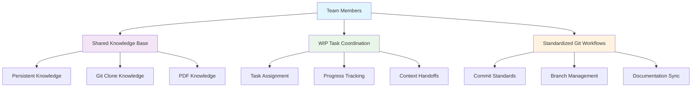
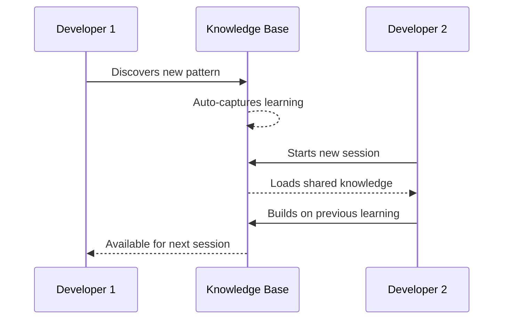
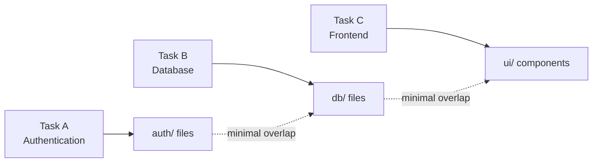
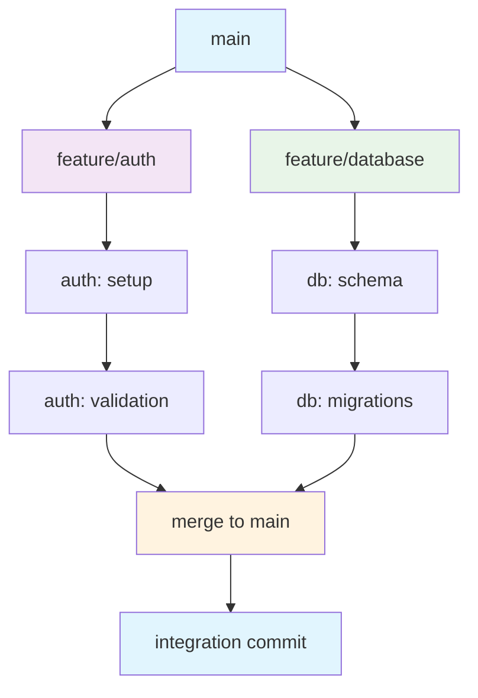
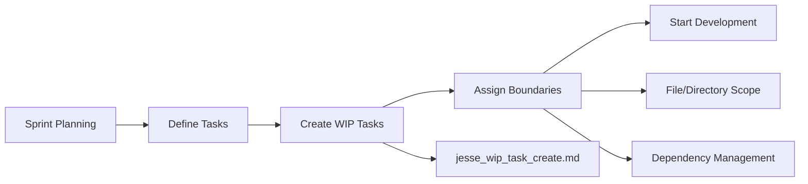
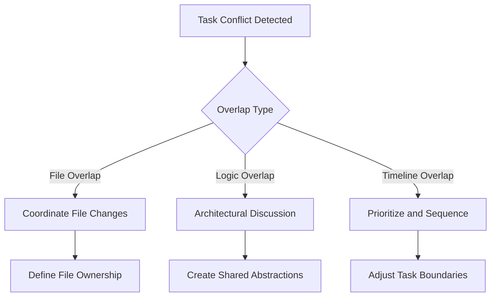
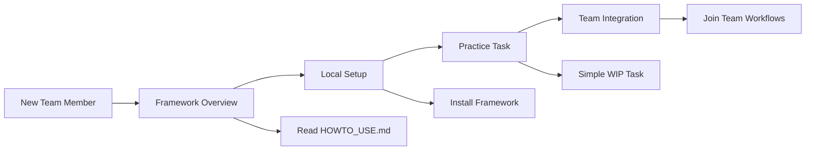
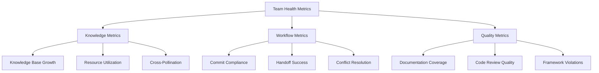

# Team Collaboration Guide

Complete guide to using the JESSE AI Framework effectively in multi-developer environments, ensuring consistent knowledge management, coordinated workflows, and seamless collaboration.

## 🎯 Overview

The JESSE AI Framework is designed to work seamlessly across development teams by providing shared knowledge management, standardized workflows, and consistent AI-assisted development practices. This guide explains how to coordinate team efforts effectively.

### Team Collaboration Architecture



## 🤝 Shared Knowledge Management

### Knowledge Base Architecture for Teams

The framework maintains knowledge that can be shared across team members:

#### Global Knowledge (Shared)
- **Location**: `.knowledge/persistent-knowledge/KNOWLEDGE_BASE.md`
- **Content**: Project-wide learnings, patterns, decisions
- **Access**: All team members read and contribute
- **Updates**: Automatic capture from any team member's work

#### Individual Knowledge (Personal)
- **Location**: `.knowledge/work-in-progress/[task_name]/`
- **Content**: Task-specific context and progress
- **Access**: Primarily individual, shared during handoffs
- **Updates**: Personal WIP task management

#### External Knowledge (Shared)
- **Git Clones**: `.knowledge/git-clones/[repo-name]_kb.md`
- **PDF Documents**: `.knowledge/pdf-knowledge/[doc-name]_kb.md`
- **Access**: Available to all team members
- **Updates**: Centrally managed, shared discoveries

### Team Knowledge Sharing Patterns



#### Automatic Knowledge Sharing
- **Perplexity Research**: Automatically shared across team
- **Web Browsing Discoveries**: Added to shared knowledge base
- **Test Results**: Captured in individual WIP tasks, extractable on completion
- **External API Learnings**: Shared in persistent knowledge base

#### Manual Knowledge Sharing
```bash
# Capture important discoveries for team
/jesse_wip_task_capture_knowledge.md

# Share completed task learnings
/jesse_wip_task_complete.md
```

## 👥 Multi-Task Coordination

### Task Assignment Strategy

#### Task Isolation Approach


**Recommended Approach**:
- **File-based isolation**: Assign tasks that work on different file sets
- **Feature-based separation**: Each task owns a complete feature area
- **Minimal overlap**: Reduce conflicts through clear boundaries

#### Parallel Task Management

**Risk Assessment for Multiple Tasks**:
```bash
# When creating second task, framework warns about risks:
/jesse_wip_task_create.md
# → Triggers multi-task risk assessment
# → Provides mitigation options
```

**Risk Mitigation Options**:
1. **File Restrictions**: Limit each task to specific directories
2. **Sequential Processing**: Complete one task before starting another
3. **Careful Coordination**: Manual communication and planning

### Task Handoff Process

#### Outgoing Handoff (Passing Work to Teammate)
```bash
# 1. Complete current progress documentation
/jesse_wip_task_capture_knowledge.md

# 2. Commit work with detailed message
/jesse_wip_task_commit.md

# 3. Create handoff documentation
# Document in WIP task: current state, next steps, blockers
```

#### Incoming Handoff (Receiving Work from Teammate)
```bash
# 1. Switch to the task
/jesse_wip_task_switch.md

# 2. Review WIP task context
# Framework auto-loads: WIP_TASK.md and PROGRESS.md

# 3. Understand current state
# Read progress, review recent changes, check blockers
```

#### Handoff Documentation Template
```markdown
## Handoff Status - [Date]
**From**: [Developer Name]  
**To**: [Developer Name]
**Task**: [Task Name]

### Current State
- **Completed**: [What's been finished]
- **In Progress**: [What's partially done]
- **Blocked**: [Any blockers or dependencies]

### Next Steps
- **Immediate**: [What should be tackled first]
- **Priority**: [High priority items]
- **Optional**: [Nice-to-have improvements]

### Context Notes
- **Design Decisions**: [Key architectural choices made]
- **Gotchas**: [Things to watch out for]
- **Resources**: [Helpful documentation or references]

### Questions for Handoff Meeting
- [Question 1]
- [Question 2]
```

## 🔄 Standardized Git Workflows

### Team Commit Standards

The framework enforces consistent commit practices across all team members:

#### Automatic Commit Workflow
```bash
# Any team member using framework gets same standards
/jesse_wip_task_commit.md
```

**Standardized Commit Message Format**:
```
[TASK-TYPE] Brief description of changes

Detailed explanation of:
- What was changed and why
- Any breaking changes or important notes
- References to documentation updates

WIP Task: [current_task_name]
Knowledge Updates: [yes/no]
Documentation: [updated/created/none]
```

#### Pre-Commit Verification
The commit workflow automatically verifies:
- [ ] Documentation standards compliance
- [ ] File header updates with change history
- [ ] Function/class documentation completeness
- [ ] Knowledge base consistency
- [ ] No references to scratchpad files in production code

### Branch Management for Team Collaboration

#### Recommended Branch Strategy


**Branch Naming Convention**:
- `feature/[task-name]` - For new features
- `fix/[issue-description]` - For bug fixes  
- `docs/[update-type]` - For documentation updates
- `refactor/[component-name]` - For refactoring work

#### Integration Process
1. **Individual Development**: Work on feature branches
2. **Framework Compliance**: Use `/jesse_wip_task_commit.md` for all commits
3. **Documentation Sync**: Framework ensures consistent documentation
4. **Knowledge Integration**: Completed tasks feed shared knowledge base

## 📋 Team Coordination Workflows

### Daily Standup Integration

#### Pre-Standup Preparation
```bash
# Review current task status
# Framework provides: WIP_TASK.md, PROGRESS.md automatically

# Check team knowledge updates
# Review .knowledge/persistent-knowledge/KNOWLEDGE_BASE.md changes
```

#### Standup Status Template
```markdown
### [Developer Name] - [Date]

**Current Task**: [Task name and objective]
**Yesterday**: [Completed work with specific achievements]
**Today**: [Planned work with specific goals]
**Blockers**: [Any impediments requiring team help]

**Knowledge Shared**:
- [New patterns or learnings discovered]
- [Documentation created or updated]
- [External resources added to knowledge base]

**Team Impact**:
- [Changes that affect other team members]
- [Shared components modified]
- [Integration points updated]
```

### Sprint Planning with Framework

#### Task Creation Process


#### Team Task Creation Session
1. **Define Task Scope**: Clear boundaries and deliverables
2. **Create Framework Task**: Use `/jesse_wip_task_create.md` for each
3. **Assign File Boundaries**: Minimize overlap between tasks
4. **Document Dependencies**: External services, shared components
5. **Plan Knowledge Sharing**: Regular sync points and handoff procedures

### Code Review Process

#### Framework-Enhanced Reviews

**Pre-Review Checklist** (Automatic via framework):
- [ ] Commit follows framework standards
- [ ] Documentation updated consistently
- [ ] Knowledge base reflects changes
- [ ] No framework violations introduced

**Review Focus Areas**:
- **Code Quality**: Logic, performance, maintainability
- **Documentation Alignment**: Headers, function docs, consistency
- **Knowledge Integration**: Proper capture of learnings
- **Team Impact**: Changes affecting shared components

#### Review Template
```markdown
## Code Review - [PR Title]
**Reviewer**: [Name]
**Date**: [Date]

### Framework Compliance ✅❌
- [ ] File headers updated with change history
- [ ] Function documentation follows three-section pattern
- [ ] Knowledge base updates appropriate
- [ ] No scratchpad references in production code

### Code Quality ✅❌
- [ ] Logic is clear and maintainable
- [ ] Error handling follows defensive programming
- [ ] DRY principle applied appropriately
- [ ] KISS approach maintained

### Team Impact ✅❌
- [ ] Changes documented for team awareness
- [ ] Shared components handled carefully
- [ ] Breaking changes clearly communicated
- [ ] Integration points considered

### Questions/Suggestions
- [Question 1]
- [Suggestion 1]

### Approval Status
- [ ] ✅ Approved
- [ ] 🔄 Needs Changes
- [ ] ❌ Blocked
```

## 🔄 Conflict Resolution

### Knowledge Base Conflicts

#### When Team Members Have Conflicting Information
```bash
# Check knowledge consistency across project
/jesse_wip_task_check_consistency.md
```

**Resolution Process**:
1. **Identify Conflict**: Framework or team member discovers inconsistency
2. **Gather Context**: Review change history and supporting evidence
3. **Team Discussion**: Discuss with involved team members
4. **Update Single Source**: Choose authoritative version
5. **Propagate Changes**: Update all related documentation

#### Merge Conflict Prevention
- **Regular Sync**: Frequent pulls and knowledge base reviews
- **Clear Boundaries**: Well-defined task scope and file ownership
- **Communication**: Proactive sharing of architectural decisions

### WIP Task Conflicts

#### Multiple People Working on Related Tasks


**Resolution Strategies**:
- **File-Level**: Divide files between tasks clearly
- **Component-Level**: Create shared interfaces and abstractions
- **Timeline-Level**: Sequence dependent work appropriately

## 🚀 Team Onboarding

### New Team Member Integration

#### Framework Introduction Process


#### Onboarding Checklist
```markdown
### New Team Member Onboarding - [Name]

#### Framework Understanding
- [ ] Read HOWTO_USE.md completely
- [ ] Understand knowledge management system
- [ ] Learn WIP task workflow
- [ ] Practice commit standards

#### Local Setup
- [ ] Install JESSE framework (global or project-level)
- [ ] Access shared knowledge base
- [ ] Configure development environment
- [ ] Test framework workflows

#### First Task
- [ ] Create first WIP task with mentor
- [ ] Follow complete development cycle
- [ ] Practice knowledge capture
- [ ] Complete task with framework standards

#### Team Integration
- [ ] Participate in standups with framework context
- [ ] Contribute to shared knowledge base
- [ ] Review teammate's code using framework standards
- [ ] Handle first task handoff
```

### Knowledge Transfer Sessions

#### Regular Team Learning
```bash
# Periodic team sessions to review:
# 1. Shared knowledge base updates
# 2. New external resources discovered
# 3. Framework improvements and patterns
# 4. Cross-pollination of task learnings
```

**Learning Session Template**:
- **Knowledge Review**: Recent additions to shared knowledge
- **Pattern Sharing**: Successful approaches discovered by individuals
- **Tool Updates**: New external resources or workflow improvements
- **Challenge Discussion**: Common problems and solutions

## 📊 Team Metrics and Health

### Framework-Enabled Metrics

#### Knowledge Growth Tracking
- **Shared Knowledge Base**: Growth rate and contribution distribution
- **External Resources**: Number and utilization of imported resources
- **Documentation Coverage**: Percentage of code with proper documentation
- **Knowledge Consistency**: Frequency of consistency check issues

#### Collaboration Effectiveness
- **Task Handoff Success**: Smooth transitions between team members
- **Conflict Resolution Time**: Speed of resolving knowledge/code conflicts
- **Framework Compliance**: Adherence to standards across team
- **Cross-Training**: Knowledge distribution across team members

### Health Indicators



#### Positive Indicators
- ✅ Growing shared knowledge base with contributions from all team members
- ✅ Successful task handoffs with minimal context loss
- ✅ High framework compliance across commits
- ✅ Proactive knowledge sharing and cross-training

#### Warning Signs
- ⚠️ Knowledge silos developing (only individual WIP tasks, no shared knowledge)
- ⚠️ Frequent framework compliance violations
- ⚠️ Task handoffs requiring excessive context rebuilding
- ⚠️ Repeated conflicts in same areas without resolution

## 🛠️ Tools and Best Practices

### Recommended Team Tools

#### Communication Integration
```markdown
### Slack/Teams Integration Patterns
- **Daily Knowledge Digest**: Automated summaries of knowledge base updates
- **WIP Task Status**: Bot notifications for task completions and handoffs  
- **Framework Alerts**: Notifications for compliance issues or conflicts
```

#### Project Management Integration
```markdown
### Jira/GitHub Issues Integration
- **WIP Task Sync**: Link framework tasks to tracking system
- **Knowledge Reference**: Include knowledge base links in tickets
- **Completion Criteria**: Framework compliance as part of definition of done
```

### Team Practices

#### Regular Rhythms
- **Daily**: Standup with framework context
- **Weekly**: Knowledge sharing session and consistency check
- **Sprint**: Framework health review and improvements
- **Monthly**: Team onboarding review and framework updates

#### Quality Gates
- **Code Review**: Framework compliance verification
- **Sprint Review**: Knowledge base growth and quality
- **Retrospective**: Framework effectiveness and team adoption
- **Release**: Documentation completeness and consistency verification

---

## 📚 Related Resources

### Team Workflow Integration
- **WIP Task Management**: See [Task Management Guide](TASK_MANAGEMENT.md)
- **Knowledge Management**: See [Knowledge Management Guide](KNOWLEDGE_MANAGEMENT.md)
- **Git Workflows**: `/jesse_wip_task_commit.md` for standardized commits

### Quality and Standards
- **Documentation Standards**: See [Documentation Standards Guide](DOCUMENTATION_STANDARDS.md)
- **Coding Standards**: See [Coding Standards Guide](CODING_STANDARDS.md)
- **Consistency Checking**: `/jesse_wip_task_check_consistency.md`

### Framework Integration
- **AI Assistant Integration**: See [AI Assistant Integration Guide](AI_ASSISTANT_INTEGRATION.md)
- **Workflow Reference**: See [Workflow Reference Guide](WORKFLOW_REFERENCE.md)
- **External Resources**: See [External Resources Guide](EXTERNAL_RESOURCES.md)

---

**Remember**: The JESSE AI Framework is designed to enhance team collaboration, not replace communication. Use the framework's structure and standards as a foundation for effective teamwork, but maintain regular human communication and coordination to ensure successful project outcomes.
