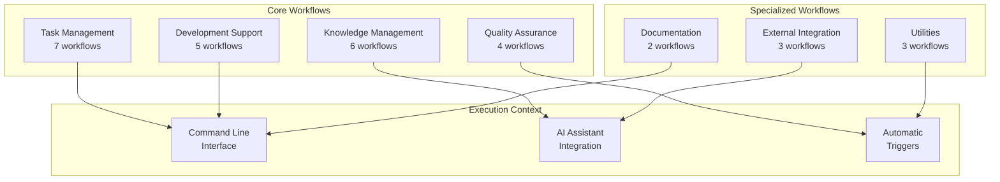
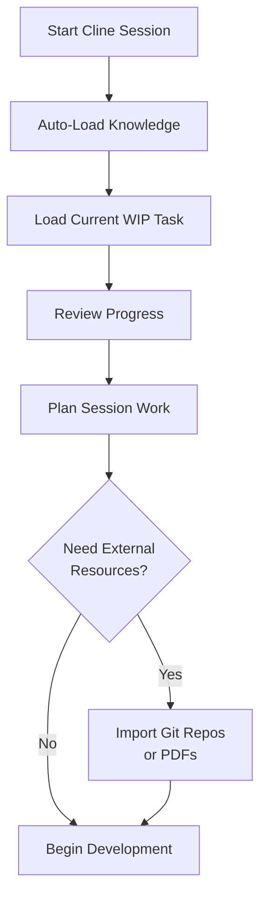

# Workflow Reference Guide

Complete catalog of all available workflows in the JESSE AI Best Practices Framework, including usage patterns, parameters, and integration strategies.

## 🔄 Workflow System Overview

The framework provides 28+ automated workflows organized into logical categories for comprehensive development lifecycle support.



## 📋 Task Management Workflows

### Core Task Operations

#### `/jesse_wip_task_create.md`
**Purpose**: Create new Work-in-Progress task with structured templates
**Usage**: Primary workflow for starting new development work
**Triggers**:
- Beginning new features or bug fixes
- Starting research or investigation tasks
- Initiating refactoring or optimization work

```bash
# Usage
/jesse_wip_task_create.md

# Prompts for:
# - Task name and objective
# - Scope and timeline
# - Success criteria
# - Dependencies
```

**Outputs**:
- Task directory in `.knowledge/work-in-progress/[task_name]/`
- WIP_TASK.md with structured template
- PROGRESS.md for tracking
- Updated Essential Knowledge Base

#### `/jesse_wip_task_switch.md`
**Purpose**: Switch between existing WIP tasks with context preservation
**Usage**: Change focus between multiple active tasks
**Triggers**:
- Need to work on different feature/bug
- Context switching for urgent priorities
- Parallel development coordination

```bash
# Usage
/jesse_wip_task_switch.md

# Process:
# 1. Captures current session knowledge
# 2. Lists available WIP tasks
# 3. Loads selected task context
# 4. Updates session knowledge base
```

**Outputs**:
- Updated current task in Essential Knowledge Base
- Session context switched to selected task
- Previous task knowledge preserved

#### `/jesse_wip_task_complete.md`
**Purpose**: Complete task with comprehensive knowledge extraction
**Usage**: Finalize task and extract learnings for future use
**Triggers**:
- All success criteria met
- Task deliverables completed
- Ready to integrate learnings into project knowledge

```bash
# Usage
/jesse_wip_task_complete.md

# Process:
# 1. Analyzes task learnings and patterns
# 2. Extracts reusable insights
# 3. Integrates knowledge into Persistent Knowledge Base
# 4. Archives task with full context
# 5. Updates project status
```

**Outputs**:
- Knowledge integrated into Persistent Knowledge Base
- Task moved to archive with timestamp
- Pattern extraction for future reuse
- Updated Essential Knowledge Base

#### `/jesse_wip_task_archive.md`
**Purpose**: Archive task without knowledge processing
**Usage**: Cancel or deprioritize tasks without full completion
**Triggers**:
- Task deprioritized or cancelled
- Requirements changed significantly
- Task superseded by other work

```bash
# Usage
/jesse_wip_task_archive.md

# Process:
# 1. Documents archival reason
# 2. Preserves current state
# 3. Moves to archive directory
# 4. Updates Essential Knowledge Base
```

**Outputs**:
- Task archived with preserved state
- Archive reason documented
- Removed from active tasks list

### Task Support Operations

#### `/jesse_wip_task_capture_knowledge.md`
**Purpose**: Manually capture session knowledge to current task
**Usage**: Consolidate insights and learnings during development
**Triggers**:
- Significant discoveries or breakthroughs
- External research findings
- Problem-solution documentation

#### `/jesse_wip_task_disable.md`
**Purpose**: Disable WIP task auto-loading for current session
**Usage**: Work without task context for exploration or troubleshooting
**Triggers**:
- Context window optimization needed
- Exploratory work outside task scope
- Troubleshooting framework issues

#### `/jesse_wip_task_new_session.md`
**Purpose**: Initialize new session with clean task context
**Usage**: Reset session state for fresh start
**Triggers**:
- Session corruption or confusion
- Need for clean context window
- Framework troubleshooting

## 🧠 Knowledge Management Workflows

### External Resource Integration

#### `/jesse_wip_kb_git_clone_import.md`
**Purpose**: Import and index external Git repositories
**Usage**: Add external codebases for reference and learning
**Triggers**:
- Need for external API examples
- Framework or library documentation
- Reference implementation patterns

```bash
# Usage
/jesse_wip_kb_git_clone_import.md

# Prompts for:
# - Repository URL
# - Focus areas for knowledge extraction
# - Specific files or directories of interest
```

**Outputs**:
- Repository cloned to `.knowledge/git-clones/[repo-name]/`
- Knowledge base file `[repo-name]_kb.md`
- Updated git clones index
- .gitignore rules updated

#### `/jesse_wip_kb_pdf_import.md`
**Purpose**: Import and process PDF documents with LLM understanding
**Usage**: Add documentation, manuals, and guides to knowledge base
**Triggers**:
- Technical documentation needs
- API reference manuals
- Best practices guides

```bash
# Usage
/jesse_wip_kb_pdf_import.md

# Prompts for:
# - PDF file path or URL
# - Document focus areas
# - Chunking preferences
```

**Outputs**:
- PDF processed into chunks in `.knowledge/pdf-knowledge/[doc-name]/`
- Knowledge base with indexed content
- Cross-referenced chunks for deep-dive access

### Knowledge Quality Assurance

#### `/jesse_wip_task_check_consistency.md`
**Purpose**: Verify knowledge base integrity and consistency
**Usage**: Ensure knowledge quality and prevent information conflicts
**Triggers**:
- Regular quality assurance
- After major knowledge updates
- Before task completion

```bash
# Usage
/jesse_wip_task_check_consistency.md

# Checks:
# - Cross-reference validity
# - Knowledge duplication
# - Format compliance
# - Trust source accessibility
```

#### `/jesse_wip_task_process_large_file.md`
**Purpose**: Process large files from git clones in dedicated sessions
**Usage**: Handle files exceeding context window limits
**Triggers**:
- Files over 4000 lines in git clones
- Complex documentation processing
- Detailed code analysis needs

### Chat and Session Management

#### `/jesse_capture_our_chat.md`
**Purpose**: Capture current conversation for documentation
**Usage**: Preserve important discussions and decision-making
**Triggers**:
- Significant technical discussions
- Architecture decisions
- Problem-solving sessions

```bash
# Usage
/jesse_capture_our_chat.md

# Output Location:
# .coding_assistant/captured_chats/[YYYYMMDD-HHmm]-[topic].md
```

## 🔧 Development Support Workflows

### Code Quality and Standards

#### `/jesse_wip_task_commit.md`
**Purpose**: Execute git commit with standards compliance checking
**Usage**: Commit code changes with framework quality assurance
**Triggers**:
- Ready to commit code changes
- Task milestone completion
- End of development session

```bash
# Usage (triggered by user saying "commit" or "git commit")
/jesse_wip_task_commit.md

# Process:
# 1. Validates coding standards compliance
# 2. Checks documentation consistency
# 3. Generates proper commit message
# 4. Updates task progress
# 5. Executes git commit with -P option
```

**Outputs**:
- Standards-compliant commit message
- Updated file headers with change timestamps
- Task progress updated
- Knowledge base consistency maintained

### Workflow Execution Support

#### `/jesse_do_your_magic.md`
**Purpose**: General-purpose workflow for complex multi-step operations
**Usage**: Execute comprehensive solutions requiring multiple coordinated actions
**Triggers**:
- Complex implementation requests
- Multi-step problem solving
- Integrated workflow needs

### Specialized Tools

#### `/jesse_amazon_prfaq_coach.md`
**Purpose**: Guide creation of Amazon-style PR/FAQ documents
**Usage**: Apply Working Backwards methodology to project planning
**Triggers**:
- Project planning and vision definition
- Stakeholder alignment needs
- Product development lifecycle

```bash
# Usage
/jesse_amazon_prfaq_coach.md

# Provides:
# - Amazon PR/FAQ methodology guidance
# - Template and examples
# - Working Backwards process
# - 5 Customer Questions framework
```

## 🎯 Workflow Usage Patterns

### Daily Development Workflow

#### Morning Session Startup


#### Development Session Flow
```bash
# Active development with automatic workflows:
# - Knowledge auto-capture (external searches, web browsing)
# - Test result auto-update
# - Progress tracking
# - Error handling and documentation

# Manual workflow triggers:
# - /jesse_wip_task_capture_knowledge.md (for significant insights)
# - /jesse_wip_task_check_consistency.md (quality assurance)
```

#### End-of-Session Workflow
```mermaid
graph TD
    A[Complete Session Work] --> B[Capture Session Knowledge]
    B --> C[Update Task Progress]
    C --> D{Ready to Commit?}
    D -->|Yes| E[/jesse_wip_task_commit.md]
    D -->|No| F[Save Session State]
    E --> G{Task Complete?}
    F --> H[End Session]
    G -->|Yes| I[/jesse_wip_task_complete.md]
    G -->|No| J[Switch Tasks or End]
    I --> H
    J --> H
```

### Knowledge Management Workflow

#### Research and Discovery
```bash
# External resource integration workflow:
1. /jesse_wip_kb_git_clone_import.md  # Import code repositories
2. /jesse_wip_kb_pdf_import.md        # Import documentation
3. Review and cross-reference knowledge bases
4. /jesse_wip_task_capture_knowledge.md  # Consolidate insights
```

#### Quality Assurance Cycle
```bash
# Regular knowledge quality maintenance:
1. /jesse_wip_task_check_consistency.md  # Verify integrity
2. Review and update trust sources
3. Clean up duplicate information
4. Update cross-references
```

### Multi-Task Development Workflow

#### Parallel Task Management
```bash
# Switching between tasks:
1. /jesse_wip_task_capture_knowledge.md  # Capture current work
2. /jesse_wip_task_switch.md            # Switch context
3. Review new task context and progress
4. Continue development

# Creating new tasks while others are active:
1. /jesse_wip_task_create.md            # Risk assessment provided
2. Consider file restrictions for conflict prevention
3. Document task dependencies
```

## 🔧 Advanced Workflow Integration

### Custom Workflow Development

#### Creating Project-Specific Workflows
```bash
# Workflow file location:
# Global: ${HOME}/Cline/Workflows/custom_workflow.md
# Project: <project>/.clinerules/workflows/custom_workflow.md

# Standard workflow structure:
# 1. Workflow Purpose
# 2. Execution Steps
# 3. Workflow Completion
# 4. Error Handling
```

#### Workflow Template Structure
```markdown
# Custom Workflow Name

## Workflow Purpose
[Clear description of workflow objective]

## Execution Steps
### 1. [Step Name]
[Detailed step instructions]

### 2. [Step Name]
[Detailed step instructions]

## Workflow Completion
[Verification and completion criteria]

## Error Handling
[Recovery procedures and troubleshooting]
```

### Workflow Automation and Triggers

#### Automatic Workflow Triggers
```bash
# Workflows triggered automatically:
# - Knowledge capture (Perplexity, web browsing)
# - Test result updates (any test execution)
# - Session initialization (new Cline session)
# - Commit processing (user says "commit")
```

#### Conditional Workflow Execution
```bash
# Context-sensitive workflow behavior:
# - Task creation checks for existing tasks
# - Knowledge capture routes to appropriate location
# - Consistency checking adapts to current knowledge structure
```

### Workflow Performance Optimization

#### Context Window Management
```bash
# Workflows designed for efficiency:
# - Lazy loading of external resources
# - Incremental knowledge processing
# - Session state optimization
# - Large file handling in dedicated sessions
```

#### Workflow Coordination
```bash
# Workflows work together seamlessly:
# - Task workflows update knowledge base
# - Knowledge workflows inform task context
# - Quality workflows maintain consistency
# - Commit workflows enforce standards
```

## 🚀 Workflow Best Practices

### Effective Workflow Usage

#### Workflow Selection Guidelines
1. **Start Simple**: Use basic workflows before advanced features
2. **Follow Patterns**: Use established workflow sequences
3. **Monitor Context**: Be aware of context window usage
4. **Quality First**: Use consistency checking regularly

#### Workflow Timing
```bash
# Daily workflow timing:
# Morning: Task review and resource import
# During work: Automatic capture and manual knowledge updates
# End of session: Commit and completion workflows
# Weekly: Consistency checking and knowledge maintenance
```

### Troubleshooting Workflow Issues

#### Common Workflow Problems

##### Problem: Workflow Not Recognized
**Symptoms**: Command not found or not executing
**Solutions**:
1. Verify installation location (global vs project-level)
2. Check workflow file naming conventions
3. Ensure proper file permissions

##### Problem: Workflow Execution Failure
**Symptoms**: Workflow starts but fails partway through
**Solutions**:
1. Check prerequisite conditions
2. Verify file system permissions
3. Review context window usage
4. Check dependency availability

##### Problem: Knowledge Integration Issues
**Symptoms**: Workflows complete but knowledge not properly integrated
**Solutions**:
1. Run consistency checking workflow
2. Verify file structure integrity
3. Check cross-reference validity
4. Review trust source accessibility

### Workflow Maintenance

#### Regular Workflow Health Checks
```bash
# Monthly workflow maintenance:
1. Review workflow usage patterns
2. Update custom workflows based on project evolution
3. Clean up unused or outdated workflows
4. Optimize workflow sequences based on experience
```

#### Workflow Evolution
```bash
# Adapt workflows to project needs:
1. Create project-specific workflow variants
2. Customize workflow templates for domain
3. Develop workflow chains for common patterns
4. Document workflow best practices for team
```

---

## 🎉 Workflow Mastery

Effective workflow usage with the JESSE AI framework provides:

1. **Automation**: Reduced manual effort through intelligent workflow automation
2. **Consistency**: Standardized processes ensure uniform quality
3. **Integration**: Seamless coordination between different development activities
4. **Knowledge Amplification**: Workflows actively contribute to growing project knowledge
5. **Quality Assurance**: Built-in quality checks maintain high standards

The comprehensive workflow system transforms development from manual, error-prone processes into automated, knowledge-generating activities that compound value over time and ensure consistent high-quality outcomes across all development activities.
