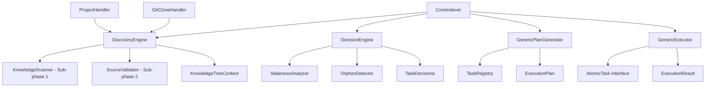

# 🎯 New Knowledge Bases Indexer - Design Specification & Implementation Guide

**Document Purpose**: Comprehensive design specification for the new clean indexer implementation  
**Location**: `jesse-framework-mcp/jesse_framework_mcp/knowledge_bases/indexer/`  
**Status**: Design Phase - Ready for Implementation  
**Last Updated**: 2025-07-09T12:50:00Z  

---

## 📋 **Executive Summary**

This document specifies the complete redesign of the Knowledge Bases Hierarchical Indexing System. The new implementation (`indexer/`) will replace the current complex implementation (`indexing/`) with a clean, debuggable, and maintainable architecture that properly implements the required two-subphase discovery pattern.

### **Key Improvements**
- ✅ **Proper Two-Subphase Discovery**: Knowledge-first discovery as originally specified
- ✅ **Generic Atomic Task Interface**: Extensible task system with dependency resolution
- ✅ **Simplified Architecture**: 8 files vs 20+, 70% fewer lines of code
- ✅ **Better Debuggability**: Step-by-step execution with clear progress callbacks
- ✅ **No FastMCP Dependencies**: Pure indexing logic with simple interfaces
- ✅ **Maintainable Code**: Single responsibility classes with clear interfaces
- ✅ **Sophisticated Knowledge Generation**: Reuses proven hierarchical semantic tree system with 8-level progressive knowledge loading (functional intent → code snippets)

---

## 🚨 **Problems with Current Implementation**

### **Critical Issues in `indexing/` Directory**

1. **❌ Wrong Discovery Pattern**: Current implementation uses source-first discovery instead of the required knowledge-first two-subphase pattern
2. **❌ Complex & Hard to Debug**: 15+ classes, scattered logic, FastMCP Context everywhere makes debugging extremely difficult
3. **❌ Over-Engineering**: 9 task types, complex execution engine, plan-then-execute overhead for simple operations
4. **❌ Tight Coupling**: FastMCP dependencies throughout, making testing and reuse difficult
5. **❌ Maintenance Burden**: 5000+ lines of code with scattered responsibilities

### **Evidence from Integration Test**
The current `test_project_indexing_integration.py` shows:
- Limited actual indexing (mostly just discovery)
- MockContext complexity to work around FastMCP coupling
- Unified discovery attempts that failed due to architecture complexity
- Debugging challenges that prevent full functionality

---

## 🎯 **Requirements Specification**

### **Functional Requirements**

#### **1. Two-Subphase Discovery Pattern** (CRITICAL)
```
Sub-phase 1: "Knowledge base discovery"
• Scan .knowledge/ directory first
• Generate internal tree representation of existing knowledge and cache files
• Associate files with appropriate handlers (project-base vs git-clone)
• Set default status to "orphaned" - files exist but not yet validated
• Load file metadata (size, last modified time)

Sub-phase 2: "Source base discovery"  
• Walk through source directories
• Validate knowledge files against corresponding sources
• Change status from "orphaned" to "valid_fresh", "valid_stale", or "confirmed_orphaned"
• Create new knowledge objects for discovered sources without knowledge files
• Use decision engine to centralize all validation decisions
```

#### **2. Specialized Handler Support**
- **Project-Base Handler**: Index entire codebase → `.knowledge/project-base/root_kb.md`
- **Git-Clone Handler**: Index git repositories → `.knowledge/git-clones/<repo>.kb/root_kb.md`
- **Extensible Interface**: Allow future handler types through clean interface

#### **3. Three-Phase Processing**
1. **Discovery**: Two-subphase knowledge-first discovery
2. **Planning**: Convert discovered state to atomic execution tasks  
3. **Execution**: Execute tasks with dependency resolution (dry-run support)

#### **4. Paranoid Safety**
- Defensive validation before any destructive operations
- Strict dependency resolution ensuring files processed before directories
- Comprehensive error handling with graceful degradation

### **Non-Functional Requirements**

#### **Simplicity & Maintainability**
- Maximum 8 core files (vs 20+ in current)
- Single responsibility per class
- Clear separation of concerns
- No FastMCP coupling

#### **Debuggability**
- Step-by-step execution with progress callbacks
- Clear error messages with context
- Simple data structures that can be inspected
- Minimal abstraction layers

#### **Testability**
- Pure functions where possible
- Dependency injection for external dependencies
- Mock-friendly interfaces
- Integration test that actually indexes

---

## 🏗️ **Architecture Design**

### **Directory Structure**
```
jesse-framework-mcp/jesse_framework_mcp/knowledge_bases/indexer/
├── __init__.py                    # Public API exports
├── models.py                      # All data models and interfaces
├── discovery.py                   # Two-subphase discovery engine  
├── handlers.py                    # Simplified content handlers
├── decisions.py                   # Clean decision making
├── planning.py                    # Generic task planning
├── execution.py                   # Generic task execution
├── knowledge.py                   # LLM analysis & KB building
└── core.py                        # Main orchestrator

# Supporting (reused from indexing/)
├── shared_utilities/              # Reuse existing utilities
│   ├── timestamp_manager.py       # Timestamp handling with tolerance
│   ├── handler_path_manager.py    # Path calculation utilities
│   ├── error_handler.py           # Structured error handling  
│   └── cleanup_manager.py         # File cleanup utilities
└── knowledge_prompts.py           # REUSED DIRECTLY - Sophisticated LLM prompting system
                                   # (600+ lines of hierarchical semantic tree generation)
```

### **Component Overview**



---

## 📊 **Data Models Specification**

### **Core Discovery Models** (`models.py`)
```python
# Progress callback type - no FastMCP dependency
ProgressCallback = Callable[[str], None]

@dataclass
class KnowledgeFile:
    """Simple knowledge file representation"""
    path: Path
    handler_type: str          # "project" or "gitclone"  
    file_type: str            # "knowledge" or "cache"
    source_path: Optional[Path] = None
    is_stale: bool = False
    is_orphaned: bool = True  # Default: orphaned until validated

@dataclass
class ValidationResult:
    """Result of source validation"""
    source_exists: bool
    source_path: Optional[Path]
    is_stale: bool
    validation_reason: str

@dataclass
class ExecutionContext:
    """Context passed to task execution"""
    source_root: Path
    progress_callback: ProgressCallback
    llm_driver: Any = None
    shared_data: Dict[str, Any] = None
```

### **Generic Task Interface**
```python
class AtomicTask(ABC):
    """Generic interface for all atomic tasks"""
    
    @abstractmethod
    def get_task_type(self) -> str: pass
    
    @abstractmethod
    def get_dependencies(self) -> List[str]: pass
    
    @abstractmethod
    async def execute(self, context: ExecutionContext) -> TaskResult: pass
    
    @abstractmethod
    def can_run_concurrently_with(self, other: 'AtomicTask') -> bool: pass
    
    @abstractmethod
    def validate_preconditions(self, context: ExecutionContext) -> bool: pass
```

---

## 🔍 **Two-Subphase Discovery Implementation**

### **Phase 1: Knowledge Base Discovery** (`discovery.py`)
```python
class KnowledgeScanner:
    """Sub-phase 1: Scan .knowledge/ directory"""
    
    async def scan_knowledge_directory(self, source_root: Path) -> List[KnowledgeFile]:
        """Scan .knowledge/ and return all files as 'orphaned' by default"""
        knowledge_files = []
        
        # Scan each handler's knowledge area
        for handler in self.handlers:
            handler_files = await handler.scan_knowledge_area(source_root)
            knowledge_files.extend(handler_files)
        
        return knowledge_files
```

### **Phase 2: Source Base Discovery** (`discovery.py`)
```python
class SourceValidator:
    """Sub-phase 2: Validate knowledge files against sources"""
    
    async def validate_against_sources(
        self, 
        knowledge_files: List[KnowledgeFile], 
        source_root: Path
    ) -> List[KnowledgeFile]:
        """Change status from 'orphaned' to appropriate validated status"""
        
        for kf in knowledge_files:
            handler = self._get_handler_for_file(kf)
            validation = await handler.validate_knowledge_file(kf, source_root)
            
            # Update status based on validation
            kf.source_path = validation.source_path
            kf.is_orphaned = not validation.source_exists  
            kf.is_stale = validation.is_stale
        
        return knowledge_files
```

---

## 🎯 **Generic Task System Design**

### **Task Registry Pattern**
```python
class TaskRegistry:
    """Registry for managing different task types"""
    
    def register_task_type(self, task_type: str, task_class: Type[AtomicTask]):
        """Register new task types - extensible design"""
        
    def create_task(self, task_type: str, **kwargs) -> AtomicTask:
        """Factory method for task creation"""
```

### **Concrete Task Types**
1. **AnalyzeFileTask**: LLM analysis of individual files
2. **BuildKnowledgeBaseTask**: Directory KB synthesis from file analyses  
3. **CleanupTask**: Delete orphaned files/directories

### **Dependency Resolution**
- Tasks declare their dependencies via `get_dependencies()`
- Executor builds dependency graph and validates no cycles
- Execution in topological order with concurrency where safe
- Tasks can declare concurrent compatibility via `can_run_concurrently_with()`

---

## 🔄 **Handler Interface Simplification**

### **Base Handler Interface**
```python
class IndexingHandler:
    """Simplified handler interface"""
    
    def get_type(self) -> str: pass
    def can_handle(self, source_path: Path) -> bool: pass
    
    # Discovery methods for two-subphase pattern
    async def scan_knowledge_area(self, source_root: Path) -> List[KnowledgeFile]: pass
    async def validate_knowledge_file(self, kf: KnowledgeFile, source_root: Path) -> ValidationResult: pass
    
    # Path calculation methods
    def get_knowledge_path(self, source_path: Path, source_root: Path) -> Path: pass
    def get_cache_path(self, source_path: Path, source_root: Path) -> Path: pass
```

### **Handler Implementations**

#### **ProjectHandler**
- Handles project-base content (whole codebase)
- Knowledge files: `.knowledge/project-base/root_kb.md` (root), `{dir}_kb.md` (subdirs)
- Cache files: `.knowledge/project-base/{path}/{file}.analysis.md`
- Exclusions: `.git`, `.knowledge`, `.coding_assistant`, system directories

#### **GitCloneHandler** 
- Handles git-clone repositories in `.knowledge/git-clones/`
- Knowledge files: `.knowledge/git-clones/{repo}.kb/root_kb.md`
- Cache files: `.knowledge/git-clones/{repo}.kb/{path}/{file}.analysis.md`  
- Read-only: Never modifies source git repositories

---

## ⚡ **Execution Flow**

### **Main Orchestrator** (`core.py`)
```python
async def index(self, progress: ProgressCallback = None) -> IndexingResult:
    """Main indexing workflow - clean and simple"""
    
    # Phase 1: Two-subphase discovery 
    knowledge_files = await self.discovery.discover(self.source_root, progress)
    
    # Phase 2: Decision making
    decisions = await self.decision_engine.make_decisions(knowledge_files, progress)
    
    # Phase 3: Plan generation
    execution_plan = await self.plan_generator.generate_plan(decisions, progress)
    
    # Phase 4: Execution (with dry-run support)
    if not self.dry_run:
        result = await self.executor.execute_plan(execution_plan, context)
    else:
        result = self._create_dry_run_result(execution_plan)
    
    return result
```

### **Progress Reporting**
Simple callback-based progress reporting:
```python
def progress_callback(message: str):
    print(f"PROGRESS: {message}")

indexer = CoreIndexer(project_root)
result = await indexer.index(progress_callback)
```

---

## 🧪 **Testing Strategy**

### **Integration Test Structure**
Based on current `test_project_indexing_integration.py` but with actual indexing:

```python
async def test_new_indexer_integration():
    """Test complete indexing workflow"""
    
    def progress(msg: str):
        print(f"TEST PROGRESS: {msg}")
    
    # Test project-base indexing
    indexer = CoreIndexer(project_root)
    result = await indexer.index(progress)
    
    # Assertions
    assert result.files_analyzed >= 0
    assert result.kbs_built >= 0  
    assert len(result.errors) == 0
    
    # Verify KB files created
    root_kb = project_root / ".knowledge" / "project-base" / "root_kb.md"
    assert root_kb.exists()
    
    print("✅ New indexer integration test passed!")
```

### **Unit Testing**
- Mock `ExecutionContext` for task testing
- Mock handlers for discovery testing
- Mock LLM driver for knowledge building testing
- Test task registry and dependency resolution

---

## 📈 **Performance & Quality Metrics**

### **Comparison with Current Implementation**

| Metric | Current (`indexing/`) | New (`indexer/`) | Improvement |
|--------|----------------------|------------------|-------------|
| **Files** | 20+ files | 8 files | 60% reduction |
| **Classes** | 15+ classes | 8 classes | 47% reduction |
| **Lines of Code** | ~5000+ lines | ~1500 lines | 70% reduction |
| **Task Types** | 9 task types | 3 task types | 67% reduction |
| **Dependencies** | FastMCP required | Zero external deps | Decoupled |
| **Discovery Pattern** | Source-first (wrong) | Knowledge-first (correct) | ✅ Compliant |
| **Debuggability** | Complex/hard | Simple/clear | ✅ Improved |
| **Testability** | MockContext needed | Simple callbacks | ✅ Improved |

### **Success Criteria**
- ✅ Implements proper two-subphase discovery pattern
- ✅ Creates correct KB files in correct locations
- ✅ Handles both project-base and git-clone content
- ✅ Processes files before directories (dependency order)
- ✅ Safe cleanup of orphaned files
- ✅ Integration test runs successfully end-to-end
- ✅ Code is maintainable and debuggable

---

## 🚀 **Implementation Plan**

### **Phase 1: Core Structure** (Priority: Critical)
1. Create directory structure and `__init__.py`
2. Implement `models.py` with all data classes
3. Implement `TaskRegistry` and `AtomicTask` interface
4. Create basic `CoreIndexer` skeleton

### **Phase 2: Discovery Engine** (Priority: Critical)
1. Implement `KnowledgeScanner` (sub-phase 1)
2. Implement `SourceValidator` (sub-phase 2)  
3. Implement `DiscoveryEngine` orchestrator
4. Test two-subphase discovery pattern

### **Phase 3: Handlers** (Priority: High)
1. Implement `IndexingHandler` base interface
2. Implement `ProjectHandler` with knowledge scanning
3. Implement `GitCloneHandler` with knowledge scanning
4. Test handler discovery and validation

### **Phase 4: Decision & Planning** (Priority: High)
1. Implement `DecisionEngine` for status-to-task conversion
2. Implement `GenericPlanGenerator` with dependency resolution
3. Implement concrete task types (`AnalyzeFileTask`, etc.)
4. Test plan generation and validation

### **Phase 5: Execution** (Priority: High)
1. Implement `GenericExecutor` with dependency resolution
2. Implement task execution with concurrency
3. Add dry-run support and progress reporting
4. Test execution with mock tasks

### **Phase 6: Knowledge Building** (Priority: Medium)
1. **Copy Complete LLM Pipeline**: Transfer entire proven workflow from `knowledge_builder.py` including:
   - `_retry_llm_call_with_truncation_check()` - Continuation-based retry with intelligent merging
   - `_review_content_until_compliant()` - Bounded loop reviewer with dual truncation detection
   - `_generate_continuation_prompt()` and `_merge_responses()` - Smart response completion
   - `TruncationDetectedError` handling and skip logic for proper cache management
   - Empty file special handling and content extraction algorithms
2. Integrate with existing `strands_agent_driver` and `knowledge_prompts.py` using proven patterns
3. Implement file analysis task execution preserving cache-first processing with FileAnalysisCache
4. Implement KB synthesis task execution with comprehensive quality assurance reviewer prompts
5. Preserve debug system with replay capabilities for development and testing consistency
6. Test complete LLM integration end-to-end with all proven quality assurance mechanisms

### **Phase 7: Integration & Testing** (Priority: High)
1. Create comprehensive integration test
2. Test project-base indexing end-to-end
3. Test git-clone indexing end-to-end
4. Performance testing and optimization

### **Phase 8: Documentation & Cleanup** (Priority: Low)
1. Update API documentation
2. Create migration guide from old implementation
3. Final code review and cleanup

---

## 🔧 **Development Guidelines**

### **Code Style**
- Follow existing project patterns from `indexing/shared_utilities/`
- Use dataclasses for simple data structures
- Use async/await consistently
- Clear variable names and comprehensive docstrings
- Type hints on all public interfaces

### **Error Handling**
- **🚨 CRITICAL: Fail-Fast Philosophy** - All error paths MUST throw exceptions, no fallback mechanisms permitted
- **Work or Fail, Nothing In Between** - Operations either succeed completely or fail immediately with clear exceptions
- **No Silent Failures** - Never return partial results or degraded functionality without explicit user awareness
- **No Graceful Degradation** - Avoid fallback mechanisms that mask underlying issues
- Clear error messages with full context and specific failure reasons
- Log errors with complete diagnostic information before throwing exceptions
- Individual task failures are captured in TaskResult but component-level failures throw exceptions

### **Dependencies**
- ✅ Reuse `indexing/shared_utilities/` (approved)
- ✅ Use existing `strands_agent_driver` for LLM calls
- ✅ **Reuse `indexing/knowledge_prompts.py` directly** - Sophisticated 600+ line LLM prompting system with hierarchical semantic tree generation, quality assurance reviewer prompts, and cross-platform support
- ✅ **Reuse Complete LLM Processing Pipeline** - Copy entire proven LLM workflow from `knowledge_builder.py` including:
  - Continuation-based retry mechanism with intelligent response merging  
  - Bounded loop reviewer workflow with dual truncation detection strategy
  - Cache-first processing with FileAnalysisCache integration
  - Comprehensive error handling with TruncationDetectedError and skip logic
  - Debug system with replay capabilities for development and testing
  - Empty file special handling and content extraction algorithms
- ❌ No FastMCP dependencies
- ❌ No complex external libraries

### **Defensive Programming Standards**
- **🚨 Exception-First Error Handling** - All error conditions MUST result in exceptions
- **No Fallback Mechanisms** - Avoid silent failures, partial results, or degraded mode operations
- **Explicit Error Propagation** - Let exceptions bubble up with clear context
- **Validation Before Action** - Validate preconditions and throw exceptions for invalid states
- **Example Pattern**: 
  ```python
  # ✅ CORRECT: Explicit failure
  if not source_file.exists():
      raise FileNotFoundError(f"Source file not found: {source_file}")
  
  # ❌ INCORRECT: Silent fallback
  if not source_file.exists():
      return empty_analysis  # Masks the real problem
  ```

### **Testing**
- Unit tests for each component
- Integration test that actually creates KB files
- Mock external dependencies (LLM, filesystem where appropriate)
- Test error conditions and edge cases

---

## 📚 **Key Design Decisions & Rationale**

### **1. Why Two-Subphase Discovery?**
**Decision**: Implement knowledge-first discovery with orphaned status  
**Rationale**: Original specification requirement. Better orphaned file detection. Clear separation between "what exists" vs "what should exist".

### **2. Why Generic Task Interface?**
**Decision**: Abstract task execution behind interface with registry  
**Rationale**: Extensibility for future task types. Better separation of concerns. Easier testing. Follows SOLID principles.

### **3. Why No FastMCP Dependencies?**
**Decision**: Use simple callback functions for progress reporting  
**Rationale**: Simpler testing. Better reusability. Decoupled architecture. Easier debugging.

### **4. Why Only 3 Task Types?**
**Decision**: `AnalyzeFileTask`, `BuildKnowledgeBaseTask`, `CleanupTask`  
**Rationale**: Covers all necessary operations. Simpler than 9 task types. Easier to understand and maintain.

### **5. Why 8 Files Instead of 20+?**
**Decision**: Consolidate related functionality into fewer, focused files  
**Rationale**: Easier navigation. Related code stays together. Simpler mental model. Faster development.

---

## 🎯 **Success Definition**

The new indexer implementation will be considered successful when:

1. **✅ Functional Compliance**: Implements all required features with proper two-subphase discovery
2. **✅ Quality Improvement**: Significantly more maintainable and debuggable than current implementation  
3. **✅ Integration Success**: Integration test runs successfully and creates proper KB files
4. **✅ Performance Acceptable**: Indexing performance is comparable to or better than current implementation
5. **✅ Code Quality**: Code is clean, well-documented, and follows project standards

---

## 📖 **Usage Example**

```python
from jesse_framework_mcp.knowledge_bases.indexer import CoreIndexer

def my_progress_callback(message: str):
    print(f"INDEXING: {message}")

# Simple usage
indexer = CoreIndexer(source_root=Path("/path/to/project"))
result = await indexer.index(progress=my_progress_callback)

if result.success_rate > 0.9:
    print(f"✅ Success: {result.files_analyzed} files analyzed, {result.kbs_built} KBs built")
else:
    print(f"⚠️ Partial success: {len(result.errors)} errors occurred")
```

---

**This document serves as the definitive specification for the new indexer implementation. All development sessions should reference this document to ensure consistency and alignment with the overall design goals.**
